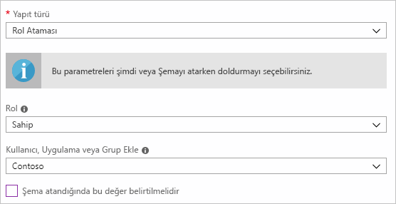
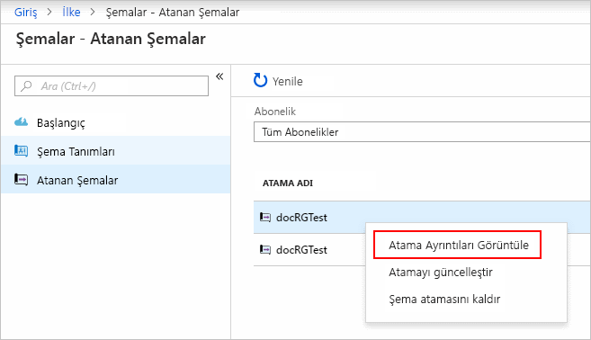

# <a name="define-and-assign-an-azure-blueprint-in-the-portal"></a>Portalda Azure Blueprint Tanımlama ve Atama

Azure'da şema oluşturma ve atama süreçlerini anlamak kuruluşların ortak tutarlılık desenleri tanımlamalarını ve Resource Manager şablonlarını, ilkelerini, güvenlik düzeyini ve daha fazlasını temel alan yeniden kullanılabilir ve hızla dağıtılabilir yapılandırmalar geliştirmesini sağlar. Bu öğreticide kuruluşunuzda aşağıdakiler gibi şema oluşturma, yayımlama ve atama konusundaki yaygın görevlerin bazılarını yerine getirmek için Azure Blueprints'i kullanmayı öğreneceksiniz:

> [!div class="checklist"]
> - Yeni bir şema oluşturma ve çeşitli desteklenen yapıtlar ekleme
> - **Taslak** durumundaki bir şemada değişiklik yapma
> - Bir şemayı **Yayımlandı** durumuna getirerek atamaya hazır hale getirme
> - Bir şemayı var olan bir aboneliğe atama
> - Atanmış bir şemanın durumunu ve ilerlemesini denetleme
> - Bir aboneliğe atanmış olan şemayı kaldırma

Azure aboneliğiniz yoksa başlamadan önce [ücretsiz bir hesap](https://azure.microsoft.com/free) oluşturun.

## <a name="create-a-blueprint"></a>Şema oluşturma

Uyumluluk için standart desen tanımlamanın ilk adımı kullanılabilir durumdaki kaynaklardan bir şema oluşturmaktır. Bu örnekte abonelik için rol ve ilke atamalarını yapılandırmak amacıyla 'MyBlueprint' adlı yeni bir şema oluşturacak, yeni bir kaynak grubu ekleyecek ve yeni kaynak grubunda Resource Manager şablonu ve rol ataması oluşturacaksınız.

1. Azure portalda **Tüm hizmetler**’e tıklayarak ve sol bölmede **İlke**'yi arayıp seçerek Azure Blueprints hizmetini başlatın. **İlke** sayfasında **Şemalar**’a tıklayın.

1. Soldaki sayfadan **Şema Tanımları**’nı seçin ve sayfanın üst kısmındaki **+ Şema Oluştur** düğmesine tıklayın.

   - Alternatif olarak, **Başlarken** sayfasında **Oluştur**’a tıklayarak doğrudan şemaya gidebilirsiniz.

   

1. Şema için 'MyBlueprint' (harfler ve rakamlar -- en fazla 48 karakter içerebilir, boşluk veya özel karakter içeremez) gibi bir **Şema Adı** belirtin, ancak **Şema Açıklaması**’nı şimdilik boş bırakın.  **Tanım Konumu** kutusunda sağ taraftaki üç noktaya tıklayın, şemayı kaydetmek istediğiniz [yönetim grubu](../management-groups/overview.md)’nu seçin ve **Seç**’e tıklayın.

   > [!NOTE]
   > Şema tanımları yalnızca yönetim gruplarına kaydedilebilir. İlk yönetim grubunuzu oluşturmak için [bu adımları](../management-groups/create.md) izleyin.

1. Bilgilerin doğruluğunu onaylayın (**Şema Adı** ve **Tanım Konumu** alanları daha sonra değiştirilemez) ve sayfanın alt kısmındaki **İleri: Yapıtlar** seçeneğine veya sayfanın üst kısmındaki **Yapıtlar** sekmesine tıklayın.

1. Abonelikte rol ataması ekleme: **Abonelik** altındaki **+ Yapıt ekle...** satırına tıkladığınızda tarayıcının sağ tarafında 'Yapıt ekle' penceresi açılır. _Yapıt türü_ olarak 'Rol Ataması' seçeneğini belirleyin. _Rol_ altında 'Katkıda Bulunan'ı seçin ve _Kullanıcı, Uygulama veya Grup Ekle_ alanını **dinamik parametre** belirtecek şekilde işaretli bırakın. Bu yapıtı şemaya eklemek için **Ekle**’ye tıklayın.

   

   > [!NOTE]
   > Çoğu _yapıt_, parametreleri destekler. Şema oluşturma sırasında değer atanan bir parametre, **statik parametredir**. Parametre şema ataması sırasında atanırsa **dinamik parametre** olur. Daha fazla bilgi için bkz. [Şema parametreleri](./concepts/parameters.md).

1. Abonelikte ilke ataması ekleme: **Abonelik** öğesinin hemen altındaki **+ Yapıt ekle...** seçeneğine sol tıklayın. _Yapıt türü_ olarak 'İlke Ataması' seçeneğini belirleyin. _Tür_’ü 'Yerleşik' olarak değiştirin ve _Ara_ alanına 'etiket' ifadesini girin. Filtrelemenin yapılması için _Ara_’ya tıklayın. 'Etiket ve varsayılan değerini kaynak gruplara uygula' öğesine tıklayarak seçin. Bu yapıtı şemaya eklemek için **Ekle**’ye tıklayın.

1. 'Etiket ve varsayılan değerini kaynak gruplara uygula' ilke ataması satırına tıklayın. Şema tanımı kapsamında yapıta parametreleri sağlayacak pencere açılır ve atama sırasında parametre ayarlamak (**dinamik parametreler**) yerine bu şemaya göre tüm atamalar için parametreleri ayarlamaya (**statik parametreler**) olanak tanır. Bu örnekte şema ataması sırasında **dinamik parametreler**’in kullanılması istenir. Bu nedenle varsayılan değerleri değiştirmeden **İptal**’e tıklayın.

1. Abonelikte kaynak grubu ekleme: **Abonelik** altındaki **+ Yapıt ekle...** satırına sol tıklayın. _Yapıt türü_ olarak 'Kaynak Grubu'nu seçin. _Kaynak Grubu Adı_ ve _Konum_ alanlarını boş bırakın, diğer yandan **dinamik parametre** yapmak için her bir özelliğin onay kutusunun işaretli olduğundan emin olun. Bu yapıtı şemaya eklemek için **Ekle**’ye tıklayın.

1. Kaynak grubu altında şablon ekleme: **ResourceGroup** girişi altındaki **+ Yapıt ekle...** satırına sol tıklayın. _Yapıt türü olarak_ 'Azure Resource Manager şablonu'nu seçin, _Yapıt görünen adı_’nı 'StorageAccount' olarak ayarlayın ve _Açıklama_ alanını boş bırakın. Düzenleyici kutusundaki **Şablon** sekmesinde aşağıdaki Resource Manager şablonunu yapıştırın. Şablonu yapıştırdıktan sonra **Parametreler** sekmesine tıklayın ve **storageAccountType** şablon parametresi ile **Standard_LRS** varsayılan değerinin otomatik olarak algılanıp doldurulduğuna, buna karşılık bir **dinamik parametre** olarak yapılandırıldığına dikkat edin. Onay kutusundaki işareti kaldırın ve açılır listenin yalnızca **allowedValues** altındaki Resource Manager şablonunda yer alan değerleri içerdiğine dikkat edin. Yeniden **dinamik parametre** olarak ayarlamak için kutuyu işaretleyin. Bu yapıtı şemaya eklemek için **Ekle**’ye tıklayın.

   > [!IMPORTANT]
   > Şablon içeri aktarılıyorsa, dosyanın yalnızca JSON biçiminde olduğundan ve HTML içermediğinden emin olun. GitHub’da bir URL’ye işaret ederken, GitHub’da görüntülenmek üzere HTML ile sarmalanmış dosyayı değil, **RAW** öğesine tıklayarak saf JSON dosyasını aldığınızdan emin olun. İçeri aktarılan şablon saf JSON değilse bir hata oluşur.

   ```json
   {
       "$schema": "https://schema.management.azure.com/schemas/2015-01-01/deploymentTemplate.json#",
       "contentVersion": "1.0.0.0",
       "parameters": {
           "storageAccountType": {
               "type": "string",
               "defaultValue": "Standard_LRS",
               "allowedValues": [
                   "Standard_LRS",
                   "Standard_GRS",
                   "Standard_ZRS",
                   "Premium_LRS"
               ],
               "metadata": {
                   "description": "Storage Account type"
               }
           }
       },
       "variables": {
           "storageAccountName": "[concat(uniquestring(resourceGroup().id), 'standardsa')]"
       },
       "resources": [{
           "type": "Microsoft.Storage/storageAccounts",
           "name": "[variables('storageAccountName')]",
           "apiVersion": "2016-01-01",
           "location": "[resourceGroup().location]",
           "sku": {
               "name": "[parameters('storageAccountType')]"
           },
           "kind": "Storage",
           "properties": {}
       }],
       "outputs": {
           "storageAccountName": {
               "type": "string",
               "value": "[variables('storageAccountName')]"
           }
       }
   }
   ```

   

1. Tamamladığınız şema aşağıdakine benzer olmalıdır. Her yapıtın _Parametreler_ sütunu altında '_y_ parametreden _x_ tanesi doldurulmuş' durumdadır. **Dinamik parametreler** şemanın her atamasında ayarlanır.

   

1. Planlanan tüm yapıtlar eklendikten sonra sayfanın alt kısmındaki **Taslağı Kaydet** seçeneğine tıklayın.

## <a name="edit-a-blueprint"></a>Şema düzenleme

[Şema oluştur](#create-a-blueprint) menüsünde bir Açıklama belirtilmemiştir ve rol ataması yeni kaynak grubuna eklenmemiştir. Her iki durum da aşağıdaki adımlar izlenerek düzeltilebilir:

1. Soldaki sayfadan **Şema Tanımları**’nı seçin.

1. Şema listesinde daha önce oluşturduğunuz şemaya sağ tıklayın ve **Şemayı Düzenle**’yi seçin.

1. **Şema Açıklaması** alanında şema ve onu oluşturan yapıtlar ile ilgili birtakım bilgiler verin.  Bu örnekte şuna benzer bir bilgi girin: "Bu şema, abonelikteki etiket ilkesini ve rol atamasını ayarlar, bir ResourceGroup oluşturur ve bu ResourceGroup’a bir kaynak şablonu ve rol ataması dağıtır."

1. Sayfanın altındaki **İleri: Yapıtlar**’a veya sayfanın üstündeki **Yapıtlar** sekmesine tıklayın.

1. Kaynak grubu altında rol ataması ekleme: **ResourceGroup** girişinin hemen altındaki **+ Yapıt ekle...** satırına sol tıklayın. _Yapıt türü_ olarak 'Rol Ataması' seçeneğini belirleyin. _Rol_ altında 'Sahip' öğesini seçin ve _Kullanıcı, Uygulama veya Grup Ekle_ alanının işaretini kaldırdıktan sonra eklenecek bir kullanıcı, uygulama veya grup arayıp seçin. Bu bir **statik parametredir** ve bu şemanın her atamasında kullanılır. Bu yapıtı şemaya eklemek için **Ekle**’ye tıklayın.

   

1. Tamamladığınız şema aşağıdakine benzer olmalıdır. Yeni eklenen rol atamasında **1 parametreden 1 tanesinin doldurulmuş** olduğuna, yani bunun bir **statik parametre** olduğuna dikkat edin.

   

1. Güncelleştirildikten sonra **Taslağı Kaydet**’e tıklayın.

## <a name="publish-a-blueprint"></a>Şemayı yayımlama

Planlanan tüm yapıtları ekledikten sonra şemayı yayımlayabilirsiniz.
Yayımladığınızda şema bir aboneliğe atanmaya hazır hale gelir.

1. Soldaki sayfadan **Şema Tanımları**’nı seçin.

1. Şema listesinde daha önce oluşturduğunuz şemaya sağ tıklayın ve **Şemayı Yayımla**’yı seçin.

1. Açılan iletişim kutusunda 'v1' gibi bir **Sürüm** belirtin (harf, sayı ve tire kullanılabilir, en fazla 20 karakter uzunluğunda olabilir) ve 'İlk yayımlama' gibi **Notları değiştirin** (isteğe bağlı).

1. Sayfanın alt kısmındaki **Yayımla** seçeneğine tıklayın.

## <a name="assign-a-blueprint"></a>Şema atama

Şema yayımlandıktan sonra bir aboneliğe atanabilir. Oluşturduğunuz şemayı yönetim grubu hiyerarşinizdeki aboneliklerden birine atayın.

1. Soldaki sayfadan **Şema Tanımları**’nı seçin.

1. Şema listesinde daha önce oluşturduğunuz şemaya sağ tıklayın (veya üç noktaya sol tıklayın) ve **Şema Ata**’yı seçin.

1. **Şema Ata** sayfasındaki **Abonelik** açılır listesinden, bu şemayı dağıtmak istediğiniz abonelikleri seçin.

   > [!NOTE]
   > Seçilen her abonelik için bir atama oluşturulur ve daha sonra seçili aboneliklerin geri kalanında değişiklikleri zorlamadan tek bir abonelik atamasında değişiklik yapılmasına izin verir.

1. **Atanan Ad** alanında bu atama için benzersiz bir ad belirtin.

1. **Konum** alanında, oluşturulacak yönetilen kimlik için bir bölge seçin. Azure Blueprint bu yönetilen kimliği kullanarak tüm yapıtları atanmış şemaya dağıtır. Daha fazla bilgi için bkz. [Azure kaynakları için yönetilen kimlikler](../../active-directory/managed-identities-azure-resources/overview.md).

1. **Yayımlanmış** sürümlerin **Şema tanımı sürümü** açılır listesini 'v1' girişinin üzerinde bırakın (en son **Yayımlanmış** sürüm varsayılandır).

1. **Atamayı Kilitle** seçeneği için varsayılan **Kilitleme** ayarını değiştirmeyin. Daha fazla bilgi için bkz. [şema kaynağı kilitleme](./concepts/resource-locking.md).

1. Abonelik düzeyinde rol ataması **[Kullanıcı grubu veya uygulama adı]:Katkıda bulunan** için bir kullanıcı, uygulama veya grup arayıp seçin.

1. Abonelik düzeyinde ilke ataması için **Etiket Adı**’nı 'CostCenter' ve **Etiket Değeri**’ni 'ContosoIT' olarak ayarlayın.

1. 'ResourceGroup' için **Ad** olarak 'StorageAccount' belirtin ve **Konum** olarak açılır listeden 'Doğu ABD 2'yi seçin.

   > [!NOTE]
   > Şema tanımı sırasında kaynak grubu altına eklenen her yapıt, kaynak grubu veya birlikte dağıtılacağı nesne ile birlikte hizalanmak üzere girintilenir. Parametre almayan veya atamada tanımlanacak parametresi olmayan yapıtlar yalnızca bağlam bilgisi için listelenir.

1. 'StorageAccount' adlı Azure Resource Manager şablonunda **storageAccountType** parametresi için 'Standard_GRS' seçeneğini belirleyin.

1. Sayfanın alt kısmındaki bilgi kutusunu okuyun ve ardından **Ata**’ya tıklayın.

## <a name="track-deployment-of-a-blueprint"></a>Şema dağıtımını izleme

Bir şema bir veya daha fazla aboneliğe atandığında iki şey gerçekleşir:

- Şema, atanan her abonelik için **Atanan Şemalar** sayfasına eklenir
- Şema tarafından tanımlanan tüm yapıtları dağıtma işlemi başlar

Şema bir aboneliğe atandıktan sonra dağıtımın ilerleme durumunu doğrulayın.

1. Soldaki sayfadan **Atanan Şemalar** öğesini seçin.

1. Şema listesinde daha önce oluşturduğunuz şemaya sağ tıklayın ve **Atama Ayrıntılarını Görüntüle**’yi seçin.

   

1. **Dağıtım Ayrıntıları** sayfasında, tüm yapıtların başarıyla dağıtıldığını ve dağıtım sırasında bir hata olmadığını doğrulayın. Hatalar oluştuysa neyin yanlış gittiğini belirleme adımları için [şema sorunlarını giderme](./troubleshoot/general.md) bölümüne bakın.

## <a name="unassign-a-blueprint"></a>Şema atamasını kaldırma

Artık gerekli olmayan veya güncel desenlere, ilkelere ve tasarımlara sahip olan daha yeni şemalarla değiştirilen şemalar abonelikten kaldırılabilir. Bir şema kaldırıldığında o şemanın bir parçası olarak atanan yapıtlar geride kalır. Şema atamasını kaldırmak için aşağıdaki adımları izleyin:

1. Soldaki sayfadan **Atanan Şemalar** öğesini seçin.

1. Şema listesinde ataması kaldırılacak şemayı seçin ve ardından sayfanın üst kısmındaki **Şema Atamasını Kaldır** düğmesine tıklayın.

1. Onay iletisini okuyun ve ardından **Tamam**’a tıklayın.

## <a name="delete-a-blueprint"></a>Şema silme

1. Soldaki sayfadan **Şema Tanımları**’nı seçin.

1. Silmek istediğiniz şemaya sağ tıklayıp **Şemayı Sil**’i seçin, ardından onay iletişim kutusundaki **Evet**’e tıklayın.

> [!NOTE]
> Bu yöntemde bir şema silindiğinde, seçili şemanın tüm **Yayımlanan sürümleri** de silinir. Tek bir sürümü silmek için şemayı açın, **Yayımlanan sürümler** sekmesine tıklayın, silmek istediğiniz sürümü seçip tıklayın, ardından **Bu Sürümü Sil**’e tıklayın. Ayrıca, atamaları olan bir şema, tüm şema atamaları silinene kadar silinemez.

## <a name="next-steps"></a>Sonraki adımlar

- [Şema yaşam döngüsü](./concepts/lifecycle.md) hakkında bilgi edinin
- [Statik ve dinamik parametreleri](./concepts/parameters.md) kullanmayı anlayın
- [Şema sıralamasını](./concepts/sequencing-order.md) özelleştirmeyi öğrenin
- [Şema kaynak kilitleme](./concepts/resource-locking.md) özelliğini kullanmayı öğrenin
- [Var olan atamaları güncelleştirmeyi](./how-to/update-existing-assignments.md) öğrenin
- [Genel sorun giderme](./troubleshoot/general.md) adımlarıyla şema atama sorunlarını giderin
