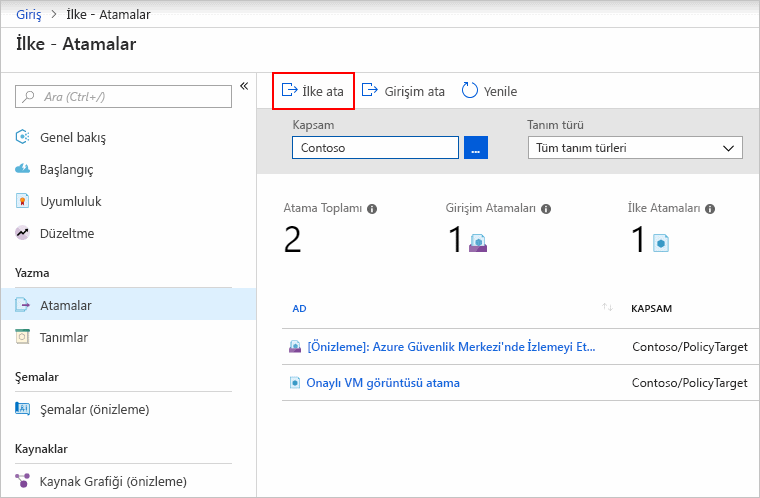
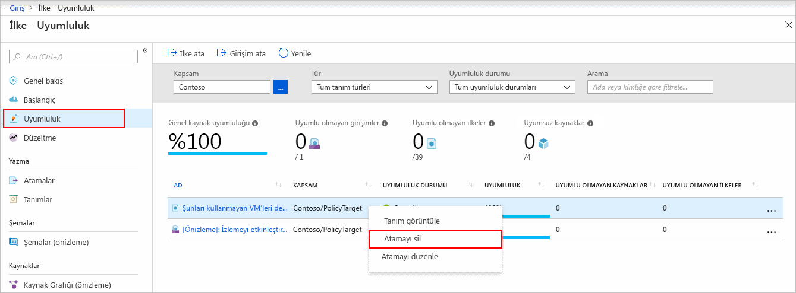

# Quickstart: Create a policy assignment to identify non-compliant resources

Azure’da uyumluluğu anlamanın ilk adımı, kaynaklarınızın durumunu belirlemektir.
Bu hızlı başlangıç, yönetilen disk kullanmayan sanal makineleri belirlemek üzere ilke ataması oluşturma işleminde size yol gösterir.

Bu işlemin sonunda, yönetilen disk kullanmayan sanal makineleri başarılı bir şekilde belirlemiş olacaksınız. Bu sanal makineler, ilke ataması ile *uyumsuzdur*.

Azure aboneliğiniz yoksa başlamadan önce [ücretsiz](https://azure.microsoft.com/free/) bir hesap oluşturun.

## İlke ataması oluşturma

In this quickstart, you create a policy assignment and assign the *Audit VMs that do not use managed disks* policy definition.

1. Azure portalında **Tüm hizmetler**’e tıkladıktan sonra **İlke**'yi arayıp seçerek Azure İlkesi hizmetini başlatın.

   

1. Azure İlkesi sayfasının sol tarafından **Atamalar**'ı seçin. Atama, belirli bir kapsamda gerçekleşmesi için atanmış olan bir ilkedir.

   

1. **İlke - Atamalar** sayfasının üst kısmından **İlke Ata**'yı seçin.

   

1. **İlke Ata** sayfasında üç noktaya tıklayıp bir yönetim grubu veya abonelik belirleyerek **Kapsam**’ı seçin. İsterseniz bir kaynak grubu seçin. Kapsam, ilke atamasının hangi kaynaklarda veya kaynak gruplarında uygulanacağını belirler. Ardından **Kapsam** sayfasının alt kısmından **Seç**’e tıklayın.

   Bu örnekte **Contoso** aboneliği kullanılır. Sizin aboneliğiniz farklı olacaktır.

1. Kaynaklar **Kapsam**’a göre dışlanabilir. **Dışlamalar**, **Kapsam**’dan bir düzey aşağıda başlatılır. **Dışlamalar** isteğe bağlıdır, bu yüzden şimdilik boş bırakın.

1. **İlke tanımı** üç nokta öğesini seçerek kullanılabilen tanımların listesini açın. Azure İlkesi, kullanabileceğiniz yerleşik ilke tanımlarıyla birlikte gelir. Aşağıdakiler gibi çok sayıda ilke mevcuttur:

   - Etiketi ve değerini zorla
   - Etiketi ve değerini uygula
   - SQL Server sürüm 12.0 gerektir

   For a partial list of available built-in policies, see [Azure Policy samples](./samples/index.md).

1. İlke tanımları listenizde *Yönetilen disk kullanmayan VM'leri denetle* tanımını arayın. Bu ilkeye tıklayın ve **Seç**'e tıklayın.

   

1. **Atama adı** otomatik olarak seçtiğiniz ilke adıyla doldurulur, ancak bunu değiştirebilirsiniz. Bu örnek için *Yönetilen disk kullanmayan VM'leri denetle* ayarını değiştirmeyin. İsteğe bağlı bir **Açıklama** da ekleyebilirsiniz. Açıklama, bu ilke atamasıyla ilgili ayrıntıları sağlar.
   **Atayan**, oturum açmış kişiye göre otomatik olarak doldurulur. Bu alan isteğe bağlı olduğu için özel değerler girilebilir.

1. **Yönetilen Kimlik Oluşturun** seçeneğini işaretsiz bırakın. This box _must_ be checked when the policy or initiative includes a policy with the [deployIfNotExists](./concepts/effects.md#deployifnotexists) effect. As the policy used for this quickstart doesn't, leave it blank. Daha fazla bilgi için [yönetilen kimlikler](../../active-directory/managed-identities-azure-resources/overview.md) ve [düzeltme güvenliğinin işleyişi](./how-to/remediate-resources.md#how-remediation-security-works) bölümlerine bakın.

1. **Ata**'ya tıklayın.

You're now ready to identify non-compliant resources to understand the compliance state of your environment.

## Uyumlu olmayan kaynakları belirleme

Select **Compliance** in the left side of the page. Then locate the **Audit VMs that do not use managed disks** policy assignment you created.

If there are any existing resources that aren't compliant with this new assignment, they appear under **Non-compliant resources**.

Bir koşul mevcut kaynaklarınıza göre değerlendirilip true sonucunu verdiğinde, bu kaynaklar ilkeyle uyumlu değil olarak işaretlenir. Aşağıdaki tabloda, elde edilen uyumluluk durumu için farklı ilke etkilerinin koşul değerlendirmesi ile nasıl çalıştığı gösterilmektedir. Although you don't see the evaluation logic in the Azure portal, the compliance state results are shown. Uyumluluk durumu sonucu uyumlu veya uyumsuz şeklindedir.

| **Kaynak Durumu** | **Etki** | **İlke Değerlendirmesi** | **Uyumluluk Durumu** |
| --- | --- | --- | --- |
| Var | Deny, Audit, Append\*, DeployIfNotExist\*, AuditIfNotExist\* | Doğru | Uyumlu Değil |
| Var | Deny, Audit, Append\*, DeployIfNotExist\*, AuditIfNotExist\* | Yanlış | Uyumlu |
| Yeni | Audit, AuditIfNotExist\* | Doğru | Uyumlu Değil |
| Yeni | Audit, AuditIfNotExist\* | Yanlış | Uyumlu |

\* Append, DeployIfNotExist ve AuditIfNotExist etkileri IF deyiminin TRUE olmasını gerektirir.
Etkiler ayrıca varlık koşulunun uyumlu olmaması için FALSE olmasını gerektirir. TRUE olduğunda, IF koşulu ilgili kaynaklar için varlık koşulunun değerlendirilmesini tetikler.

## Kaynakları temizleme

To remove the assignment created, follow these steps:

1. Azure İlkesi sayfasının sol tarafından **Uyumluluk**’u (veya **Atamalar**’ı) seçin ve oluşturduğunuz **Yönetilen disk kullanmayan VM'leri denetle** ilke atamasını bulun.

1. **Yönetilen disk kullanmayan VM'leri denetle** ilke atamasına sağ tıklayıp **Atamayı sil**’i seçin

   

## Sonraki adımlar

Bu hızlı başlangıçta bir kapsama ilke tanımı atadınız ve bunun uyumluluk raporunu değerlendirdiniz.
The policy definition validates that all the resources in the scope are compliant and identifies which ones aren't.

To learn more about assigning policies to validate that new resources are compliant, continue to the tutorial for:

> [!div class="nextstepaction"]
> [İlke oluşturma ve yönetme](./tutorials/create-and-manage.md)