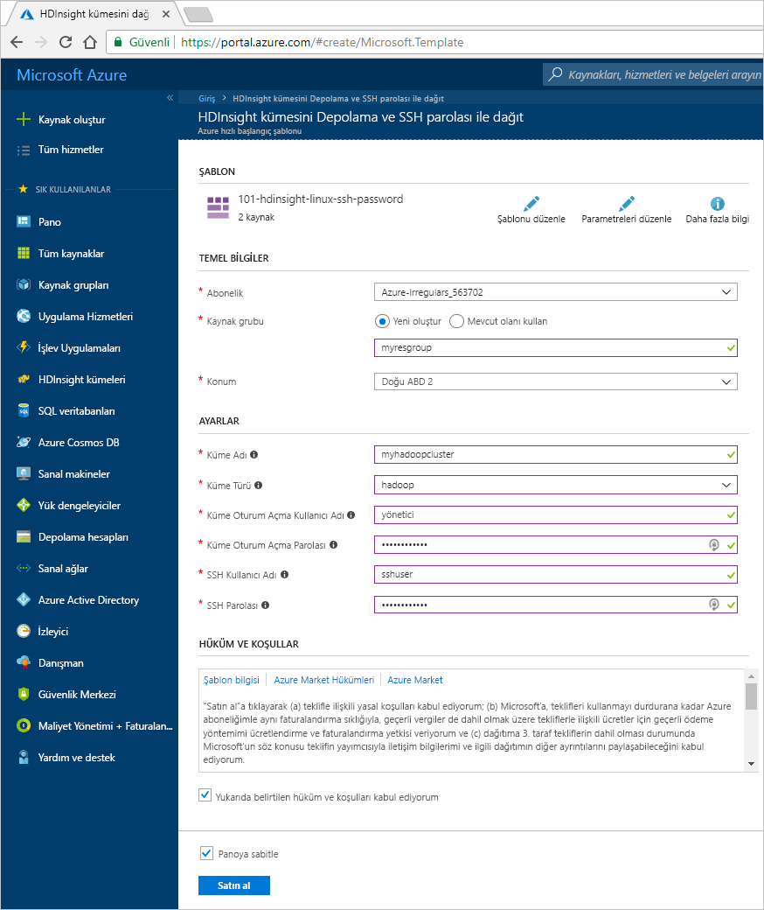

# Hızlı başlangıç: Kaynak Yöneticisi şablonu kullanarak Azure HDInsight 'ta Apache Hadoop kümesi oluşturma

Bu hızlı başlangıçta, bir Kaynak Yöneticisi şablonu kullanarak Azure HDInsight 'ta Apache Hadoop kümesi oluşturmayı öğreneceksiniz.

Benzer şablonlar, [Azure hızlı başlangıç şablonlarında](https://azure.microsoft.com/resources/templates/?resourceType=Microsoft.Hdinsight&pageNumber=1&sort=Popular)görüntülenebilir. Şablon başvurusunu [burada](https://docs.microsoft.com/azure/templates/microsoft.hdinsight/allversions)bulabilirsiniz.  Ayrıca [Azure Portal](apache-hadoop-linux-create-cluster-get-started-portal.md)kullanarak bir küme oluşturabilirsiniz.  

Şu anda HDInsight [yedi farklı küme türüyle](../hdinsight-overview.md#cluster-types-in-hdinsight) ile birlikte gelir. Her küme türü farklı bir bileşen kümesini destekler. Tüm küme türleri Hive'ı destekler. HDInsight’ta desteklenen bileşenlerin listesi için bkz. [HDInsight tarafından sağlanan Hadoop küme sürümlerindeki yenilikler nelerdir?](../hdinsight-component-versioning.md)  

Azure aboneliğiniz yoksa başlamadan önce [ücretsiz bir hesap](https://azure.microsoft.com/free/?WT.mc_id=A261C142F) oluşturun.

## Hadoop kümesi oluşturma

1. Azure 'da oturum açmak ve Azure portal Kaynak Yöneticisi şablonunu açmak için aşağıdaki **Azure 'A dağıt** düğmesini seçin.

    

2. Aşağıdaki değerleri yazın veya seçin:

    |Özellik  |Açıklama  |
    |---------|---------|
    |Abonelik|  Azure aboneliğinizi seçin. |
    |Kaynak grubu | Bir kaynak grubu oluşturun veya mevcut bir kaynak grubunu seçin.  Kaynak grubu, Azure bileşenleri için bir kapsayıcıdır.  Bu durumda, kaynak grubu HDInsight kümesini ve bağımlı Azure Depolama hesabını içermektedir. |
    |Konum | Kümenizi oluşturmak istediğiniz bir Azure konumunu seçin.  Daha iyi performans için kendinize yakın bir konum seçin. |
    |Küme Adı | Hadoop kümesi için bir ad girin. HDInsight’taki tüm kümeler aynı DNS ad alanını paylaştığından, bu adın benzersiz olması gerekir. Ad yalnızca küçük harf, sayı ve kısa çizgi içerebilir ve bir harfle başlamalıdır.  Her kısa çizginin önünde ve arkasında kısa çizgi dışında bir karakter bulunmalıdır.  Ad ayrıca 3 ila 59 karakter uzunluğunda olmalıdır. |
    |Küme Türü | **hadoop**’u seçin. |
    |Küme oturum açma adı ve parolası | Varsayılan oturum açma adı **admin**' dir. Parola en az 10 karakter uzunluğunda olmalıdır ve en az bir rakam, bir büyük harf ve bir küçük harf, bir alfasayısal olmayan karakter (' "\)' karakterleri dışında) içermelidir. " **" gibi genel parolalar** sağlamadığınızdanPass@word1 emin olun.|
    |SSH Kullanıcı adı ve parolası| Varsayılan kullanıcı adı **sshuser** şeklindedir.  SSH kullanıcı adını yeniden adlandırabilirsiniz.  SSH kullanıcı parolasının gereksinimleri, küme oturum açma parolasıyla aynıdır.|

    Şablondaki bazı özellikler sabit kodlanmış olabilir.  Bu değerleri şablondan yapılandırabilirsiniz. Bu özellikler hakkında daha fazla bilgi için bkz. [HDInsight 'ta Apache Hadoop kümeleri oluşturma](../hdinsight-hadoop-provision-linux-clusters.md).

    > [!NOTE]  
    > Sağladığınız değerler benzersiz olmalı ve adlandırma yönergelerini izlemelidir. Şablon, doğrulama denetimleri gerçekleştirmez. Sağladığınız değerler zaten kullanılıyorsa veya yönergelere uygun değilse, şablonu gönderdikten sonra bir hata alırsınız.  

    

3. **Yukarıda belirtilen hüküm ve koşulları kabul ediyorum**' u seçin ve ardından **satın al**' ı seçin. Dağıtımınızın devam ettiğini belirten bir bildirim alırsınız.  Bir küme oluşturmak yaklaşık 20 dakika sürer.

4. Küme oluşturulduktan sonra **kaynak grubuna git** bağlantısına sahip bir **dağıtım başarılı** bildirimi alırsınız.  **Kaynak grubu** sayfanız yeni HDInsight kümenizi ve kümeyle ilişkili varsayılan depolamayı listeler. Her kümenin bir [Azure depolama hesabı](../hdinsight-hadoop-use-blob-storage.md) veya [Azure Data Lake Storage hesabı](../hdinsight-hadoop-use-data-lake-store.md) bağımlılığı vardır. Bu, varsayılan depolama hesabı olarak adlandırılır. HDInsight kümesi ve varsayılan depolama hesabı aynı Azure bölgesinde birlikte bulunmalıdır. Küme silme, depolama hesabını silmez.

> [!NOTE]  
> Diğer küme oluşturma yöntemleri ve bu hızlı başlangıçta kullanılan özellikleri anlamak için bkz. [HDInsight kümeleri oluşturma](../hdinsight-hadoop-provision-linux-clusters.md).

## Kaynakları temizleme

Hızlı başlangıcı tamamladıktan sonra kümeyi silmek isteyebilirsiniz. HDInsight ile Verileriniz Azure Storage 'da depolanır, bu sayede bir kümeyi kullanımda olmadığında güvenle silebilirsiniz. Ayrıca, kullanımda olmasa bile bir HDInsight kümesi için de ücretlendirilirsiniz. Kümenin ücretleri depolama ücretinden çok daha fazla olduğundan, kullanımda olmadıkları zaman kümeleri silmek ekonomik bir anlam sağlar.

> [!NOTE]  
> HDInsight üzerinde Hadoop kullanarak ETL işlemlerinin nasıl çalıştırılacağını öğrenmek için sonraki öğreticiye *hemen* ilerliyorsanız, kümeyi çalışır durumda tutmak isteyebilirsiniz. Bunun nedeni öğreticide bir Hadoop kümesi oluşturmanız gerekir. Ancak sonraki öğreticiye hemen geçmeyecekseniz şimdi kümeyi silmeniz gerekir.

Kümeyi ve/veya varsayılan depolama hesabını silmek için:

1. Azure portalın bulunduğu tarayıcı sekmesine dönün. Kümeye genel bakış sayfasında olmalısınız. Yalnızca kümeyi silmek, ancak varsayılan depolama hesabını korumak istiyorsanız **Sil**’i seçin.

    

2. Kümeyi ve varsayılan depolama hesabını silmek istiyorsanız, kaynak grubu sayfasını açmak için kaynak grubu adını (önceki ekran görüntüsünde vurgulanan) seçin.

3. **Kaynak grubunu sil**’i seçerek, kümeyi ve varsayılan depolama hesabını içeren kaynak grubunu silin. Kaynak grubu silindiğinde depolama hesabının da silindiğini unutmayın. Depolama hesabını tutmak istiyorsanız, yalnızca küme silmeyi seçin.

## Sonraki adımlar

Bu hızlı başlangıçta, bir Kaynak Yöneticisi şablonu kullanarak HDInsight 'ta Apache Hadoop kümesi oluşturmayı öğrendiniz. Sonraki makalede, HDInsight üzerinde Hadoop kullanarak ayıklama, dönüştürme ve yükleme (ETL) işlemi gerçekleştirmeyi öğreneceksiniz.

> [!div class="nextstepaction"]
> [HDInsight üzerinde etkileşimli sorgu kullanarak verileri ayıklama, dönüştürme ve yükleme](../interactive-query/interactive-query-tutorial-analyze-flight-data.md)