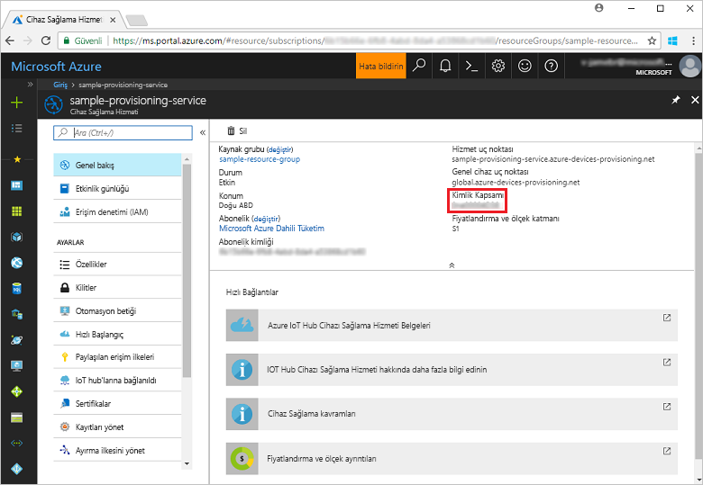

# <a name="quickstart-create-and-provision-a-simulated-tpm-device-using-c-device-sdk-for-iot-hub-device-provisioning-service"></a>Hızlı başlangıç: IoT Hub cihaz sağlama hizmeti için C# cihaz SDK 'sını kullanarak sanal bir TPM cihazı oluşturma ve sağlama

[!INCLUDE [iot-dps-selector-quick-create-simulated-device-tpm](../../includes/iot-dps-selector-quick-create-simulated-device-tpm.md)]

Bu adımlarda, Windows işletim sistemini çalıştıran bir geliştirme makinesinde TPM cihazının benzetimini yapmak için [C# için Azure IoT örnekleri](https://github.com/Azure-Samples/azure-iot-samples-csharp) 'nin nasıl kullanılacağı gösterilmektedir. Örnek ayrıca, cihaz sağlama hizmeti 'ni kullanarak sanal cihazı bir IoT Hub da bağlar. 

Örnek kodda cihazın [Donanım Güvenlik Modülü (HSM)](https://azure.microsoft.com/blog/azure-iot-supports-new-security-hardware-to-strengthen-iot-security/) olarak Windows TPM simülatörü kullanılmaktadır. 

Oto sağlama işlemini bilmiyorsanız, [sağlamaya](about-iot-dps.md#provisioning-process) genel bakış konusunu gözden geçirin. Ayrıca devam etmeden önce [IoT Hub Cihazı Sağlama Hizmetini Azure portalıyla ayarlama](./quick-setup-auto-provision.md) bölümünde bulunan adımları tamamladığınızdan emin olun. 

Azure IoT Cihaz Sağlama Hizmeti iki tür kaydı destekler:

- [Kayıt grupları](concepts-service.md#enrollment-group): Birden fazla ilgili cihazı kaydetmek için kullanılır.
- [Bireysel kayıtlar](concepts-service.md#individual-enrollment): Tek bir cihazı kaydetmek için kullanılır.

Bu makalede bireysel kayıtlar gösterilmektedir.

[!INCLUDE [IoT Device Provisioning Service basic](../../includes/iot-dps-basic.md)]

<a id="setupdevbox"></a>
## <a name="prepare-the-development-environment"></a>Geliştirme ortamını hazırlama 

1. Makinenizde [.NET Core 2,1 SDK veya sonraki bir sürümünün](https://www.microsoft.com/net/download/windows) yüklü olduğundan emin olun. 

1. `git` uygulamasının makinenizde yüklü olduğundan ve komut penceresinden erişilebilir ortam değişkenlerine eklendiğinden emin olun. Yüklenecek `git` araçlarının son sürümleri için [Software Freedom Conservancy’nin Git istemci araçlarına](https://git-scm.com/download/) bakın. Bunlara yerel Git deponuzla etkileşim kurmak için kullanabileceğiniz bir komut satırı uygulaması olan **Git Bash** dahildir. 

1. Bir komut istemi veya Git Bash’i açın. C# GitHub deposu için Azure IoT örneklerini kopyalayın:

    ```cmd
    git clone https://github.com/Azure-Samples/azure-iot-samples-csharp.git
    ```

## <a name="provision-the-simulated-device"></a>Sanal cihazı sağlama

1. Azure portalında oturum açın. Sol taraftaki menüden **tüm kaynaklar** düğmesini seçin ve cihaz sağlama hizmetinizi açın. **Genel bakış** dikey penceresinde, **_kimlik kapsamı_** değerini aklınızda bir değer.

     

1. Komut isteminde dizini TPM cihaz sağlama örneğinin proje dizini olacak şekilde değiştirin.

    ```cmd
    cd .\azure-iot-samples-csharp\provisioning\Samples\device\TpmSample
    ```

1. TPM cihaz sağlama örneğini derlemek ve çalıştırmak için aşağıdaki komutu yazın. `<IDScope>` değerinin yerine sağlama hizmetinizin Kimlik Kapsamını girin. 

    ```cmd
    dotnet run <IDScope>
    ```

    Bu komut, TPM yonga simülatörünü ayrı bir komut isteminde başlatacaktır. Windows 'da, Simulator.exe ortak ağlarda iletişim kurmasına izin vermek isteyip istemediğinizi soran bir Windows Güvenlik uyarısıyla karşılaşabilirsiniz. Bu örneğin amaçları doğrultusunda, isteği iptal edebilirsiniz.

1. Özgün komut penceresinde, cihaz kaydı için gereken **_onay anahtarı_**, **_kayıt kimliği_** ve önerilen **_cihaz kimliği_** görüntülenir. Bu değerleri bir yere göz atın. Bu değeri, cihaz sağlama hizmeti Örneğinizde tek bir kayıt oluşturmak için kullanacaksınız. 
   > [!NOTE]
   > Komut çıktısını içeren pencereyi TPM simülatörü çıktısını içeren pencereyle karıştırmayın. Ön plana getirmek için özgün komut penceresini seçmeniz gerekebilir.

     

1. Azure portal, cihaz sağlama hizmeti menüsünden kayıtları **Yönet**' i seçin. **Bireysel** kayıtlar sekmesini seçin ve üst kısımdaki **tek kayıt Ekle** düğmesini seçin. 

1. **Kayıt Ekle** panelinde, aşağıdaki bilgileri girin:
   - Kimlik onay *Mekanizması* olarak **TPM** seçeneğini belirleyin.
   - Daha önce not ettiğiniz değerlerden TPM cihazınızın *kayıt kimliği* ve *onay anahtarı* ' nı girin.
   - Sağlama hizmetinizle bağlanacak IoT hub'ını seçin.
   - İsteğe bağlı olarak, aşağıdaki bilgileri sağlayabilirsiniz:
       - Benzersiz bir *CIHAZ kimliği* girin (önerilen birini kullanabilir veya kendi kendinize sağlayabilirsiniz). Cihazınızı adlandırırken gizli veriler kullanmaktan kaçının. Bir tane sağlamadıysanız, bunun yerine cihazı tanımlamak için kayıt KIMLIĞI kullanılır.
       - **Başlangıç cihaz ikizi durumu** alanını cihaz için istenen başlangıç yapılandırmasına göre güncelleştirin.
   - Tamamlandıktan sonra **Kaydet** düğmesine basın. 

       

   Kayıt başarıyla tamamlanınca cihazınızın *Kayıt Kimliği* listenin altında *Tek Tek Kayıtlar* sekmesinde görünür. 

1. Sanal cihazı kaydetmek için komut penceresinde ( **_onay anahtarı_**, **_kayıt kimliği_** ve önerilen **_cihaz kimliği_** görüntülenen) *ENTER* tuşuna basın. IoT hub bilgilerinizi almak için cihaz önyüklemesi ve Cihaz Sağlama Hizmetine bağlanma benzetimi gerçekleştiren iletilere dikkat edin. 

1. Cihazın sağlandığını doğrulayın. Sanal cihazın, sağlama hizmetinize bağlı olan IoT Hub 'ına başarıyla sağlanması sırasında, cihaz KIMLIĞI hub 'ın **IoT cihazları** dikey penceresinde görünür. 

     

    Cihazınız için *başlangıç cihaz ikizi durumu* ayarının kayıt girişindeki varsayılan değerini değiştirdiyseniz istenen ikili durumu hub'dan çekerek ona göre hareket edebilir. Daha fazla bilgi için bkz. [IoT Hub cihaz TWINS 'ı anlama ve kullanma](../iot-hub/iot-hub-devguide-device-twins.md).

## <a name="clean-up-resources"></a>Kaynakları temizleme

Cihaz istemci örneğini üzerinde çalışmaya ve keşfetmeye devam etmeyi planlıyorsanız, bu hızlı başlangıçta oluşturulan kaynakları temizlemeyin. Devam etmeyi planlamıyorsanız, bu hızlı başlangıç tarafından oluşturulan tüm kaynakları silmek için aşağıdaki adımları kullanın.

1. Makinenizde cihaz istemci örnek çıktı penceresini kapatın.
1. Makinenizde TPM simülatörü penceresini kapatın.
1. Azure portal sol taraftaki menüden **tüm kaynaklar** ' ı seçin ve ardından cihaz sağlama hizmetinizi seçin. **Genel bakış** dikey penceresinin üst kısmında, bölmenin en üstünde bulunan **Sil** ' e basın.  
1. Azure portal sol taraftaki menüden **tüm kaynaklar** ' ı seçin ve ardından IoT Hub 'ınızı seçin. **Genel bakış** dikey penceresinin üst kısmında, bölmenin en üstünde bulunan **Sil** ' e basın.  

## <a name="next-steps"></a>Sonraki adımlar

Bu hızlı başlangıçta, makinenizde bir TPM sanal cihazı oluşturdunuz ve IoT Hub cihaz sağlama hizmetini kullanarak IoT Hub 'ınıza sağladınız. TPM cihazınızı programlı bir şekilde kaydetmeyi öğrenmek için bir TPM cihazının programlı kaydı için hızlı başlangıç 'a geçin. 

> [!div class="nextstepaction"]
> [Azure hızlı başlangıç-TPM cihazını Azure IoT Hub cihaz sağlama hizmeti 'ne kaydetme](quick-enroll-device-tpm-csharp.md)
