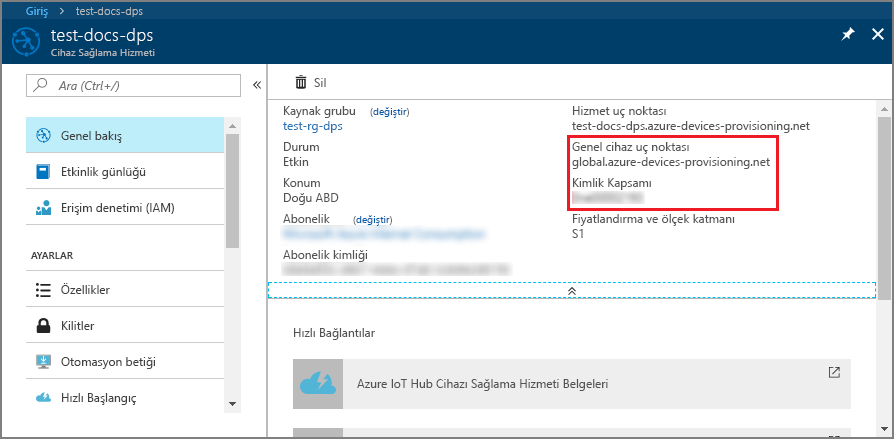

# <a name="quickstart-create-and-provision-a-simulated-tpm-device-using-python-device-sdk-for-iot-hub-device-provisioning-service"></a>Hızlı başlangıç: IoT Hub cihaz sağlama hizmeti için Python cihaz SDK 'sını kullanarak sanal bir TPM cihazı oluşturma ve sağlama

[!INCLUDE [iot-dps-selector-quick-create-simulated-device-tpm](../../includes/iot-dps-selector-quick-create-simulated-device-tpm.md)]

Bu hızlı başlangıçta, bir Windows bilgisayarda sanal bir IoT cihazı oluşturacaksınız. Sanal cihaz, donanım güvenlik modülü (HSM) olarak bir TPM simülatörü içerir. Cihaz sağlama hizmeti (DPS) ile tek bir kayıt kullanarak bu sanal cihazı IoT Hub 'ınıza bağlamak için cihaz örnek Python kodunu kullanırsınız.

## <a name="prerequisites"></a>Önkoşullar

- [Otomatik sağlama kavramlarını](concepts-auto-provisioning.md)gözden geçirme.
- [Azure Portal Ile cihaz sağlama hizmeti IoT Hub ayarlama](./quick-setup-auto-provision.md)işlemi tamamlandı.
- Etkin aboneliği olan bir Azure hesabı. [Ücretsiz bir tane oluşturun](https://azure.microsoft.com/free/?ref=microsoft.com&utm_source=microsoft.com&utm_medium=docs&utm_campaign=visualstudio).
- [Visual Studio 2015 +](https://visualstudio.microsoft.com/vs/) C++ ile masaüstü geliştirme.
- [CMake derleme sistemi](https://cmake.org/download/).
- [Git](https://git-scm.com/download/).

> [!IMPORTANT]
> Bu makale yalnızca kullanım dışı v1 Python SDK 'Sı için geçerlidir. IoT Hub cihazı sağlama hizmeti için cihaz ve hizmet istemcileri henüz v2 sürümünde kullanılamaz. Takım şu anda v2 'yi Özellik eşliği 'na getirmek için çalışıyoruz.

[!INCLUDE [IoT Device Provisioning Service basic](../../includes/iot-dps-basic.md)]

## <a name="prepare-the-environment"></a>Ortamı hazırlama 

1. Visual Studio yüklemeniz için "C++ ile masaüstü geliştirme" iş yüküne sahip [Visual studio](https://visualstudio.microsoft.com/vs/) 2015 veya üstünü yüklediğinizden emin olun.

1. [CMake derleme sistemini](https://cmake.org/download/) indirin ve yükleyin.

1. `git` uygulamasının makinenizde yüklü olduğundan ve komut penceresinden erişilebilir ortam değişkenlerine eklendiğinden emin olun. Yüklenecek `git` araçlarının son sürümleri için [Software Freedom Conservancy’nin Git istemci araçlarına](https://git-scm.com/download/) bakın. Bunlara yerel Git deponuzla etkileşim kurmak için kullanabileceğiniz bir komut satırı uygulaması olan **Git Bash** dahildir. 

1. Bir komut istemi veya Git Bash’i açın. Cihaz benzetim kod örneği için GitHub deposunu kopyalayın:
    
    ```cmd/sh
    git clone --single-branch --branch v1-deprecated https://github.com/Azure/azure-iot-sdk-python.git --recursive
    ```

1. CMake oluşturma işlemi için bu GitHub deposunun yerel kopyasında bir klasör oluşturun. 

    ```cmd/sh
    cd azure-iot-sdk-python/c
    mkdir cmake
    cd cmake
    ```

1. Kod örneği, bir Windows TPM simülatörü kullanır. SAS belirteci kimlik doğrulamasını etkinleştirmek için aşağıdaki komutu çalıştırın. Sanal cihaz için ayrıca bir Visual Studio çözümü oluşturur.

    ```cmd/sh
    cmake -Duse_prov_client:BOOL=ON -Duse_tpm_simulator:BOOL=ON ..
    ```

1. Ayrı bir komut isteminde TPM simülatörü klasörüne gidin ve sanal cihaz için [HSM](https://azure.microsoft.com/blog/azure-iot-supports-new-security-hardware-to-strengthen-iot-security/) olarak [TPM](https://docs.microsoft.com/windows/device-security/tpm/trusted-platform-module-overview) simülatörünü çalıştırın. **Erişime İzin Ver**'e tıklayın. 2321 ve 2322 bağlantı noktalarında bulunan bir yuva üzerinden dinler. Bu komut penceresini kapatmayın; Bu hızlı başlangıç kılavuzunun sonuna kadar bu simülatörü çalışır durumda tutmanız gerekecektir. 

    ```cmd/sh
    .\azure-iot-sdk-python\c\provisioning_client\deps\utpm\tools\tpm_simulator\Simulator.exe
    ```

    


## <a name="create-a-device-enrollment-entry"></a>Cihaz kaydı girişi oluşturma

Azure IoT Cihaz Sağlama Hizmeti iki tür kaydı destekler:

- [Kayıt grupları](concepts-service.md#enrollment-group): Birden fazla ilgili cihazı kaydetmek için kullanılır.
- [Bireysel](concepts-service.md#individual-enrollment)kayıtlar: tek bir cihazı kaydetmek için kullanılır.

Bu makalede, bireysel kayıtlar gösterilmektedir.

1. `azure_iot_sdks.sln` adlı *cmake* klasöründe oluşturulan çözümü açın ve Visual Studio'da derleyin.

1. **tpm_device_provision** projesine sağ tıklayın ve **Başlangıç Projesi Olarak Ayarla**’yı seçin. Çözümü çalıştırın. Çıkış penceresinde, cihaz kaydı için gereken **_onay anahtarı_** ve **_kayıt kimliği_** görüntülenir. Bu değerleri not alın. 

    

1. Azure portal oturum açın, sol taraftaki menüden **tüm kaynaklar** düğmesini seçin ve cihaz sağlama hizmetinizi açın.

1. Cihaz sağlama hizmeti menüsünden kayıtları **Yönet**' i seçin. **Bireysel** kayıtlar sekmesini seçin ve üst kısımdaki **tek kayıt Ekle** düğmesini seçin. 

1. **Kayıt Ekle** panelinde, aşağıdaki bilgileri girin:
   - Kimlik onay *Mekanizması* olarak **TPM** seçeneğini belirleyin.
   - Daha önce not ettiğiniz değerlerden TPM cihazınızın *kayıt kimliği* ve *onay anahtarı* ' nı girin.
   - Sağlama hizmetinizle bağlanacak IoT hub'ını seçin.
   - İsteğe bağlı olarak, aşağıdaki bilgileri sağlayabilirsiniz:
       - Benzersiz bir *CIHAZ kimliği*girin. Cihazınızı adlandırırken gizli veriler kullanmaktan kaçının. Bir tane sağlamadıysanız, bunun yerine cihazı tanımlamak için kayıt KIMLIĞI kullanılır.
       - **Başlangıç cihaz ikizi durumu** alanını cihaz için istenen başlangıç yapılandırmasına göre güncelleştirin.
   - Tamamlandıktan sonra **Kaydet** düğmesine basın. 

       

   Kayıt başarıyla tamamlanınca cihazınızın *Kayıt Kimliği* listenin altında *Tek Tek Kayıtlar* sekmesinde görünür. 


## <a name="simulate-the-device"></a>Cihazı benzetme

1. [Python 2.x veya 3.x](https://www.python.org/downloads/) sürümünü indirip yükleyin. Kurulumunuzun gereksinimine uygun olarak 32 bit veya 64 bit yüklemeyi kullanmaya dikkat edin. Yükleme sırasında istendiğinde, platforma özgü ortam değişkeninize Python'u eklediğinizden emin olun.
    - Windows işletim sistemi kullanıyorsanız, Python’dan yerel DLL’lerin kullanımına olanak tanımak için [Visual C++ yeniden dağıtılabilir paketi](https://support.microsoft.com/help/2977003/the-latest-supported-visual-c-downloads).

1. Python paketlerini derlemek için [bu yönergeleri](https://github.com/Azure/azure-iot-sdk-python/blob/v1-deprecated/doc/python-devbox-setup.md) uygulayın.

   > [!NOTE]
   > `build_client.cmd` çalıştırıyorsanız `--use-tpm-simulator` bayrağını kullandığınızdan emin olun.
   > 
   > [!NOTE]
   > `pip` kullanıyorsanız `azure-iot-provisioning-device-client` paketini de yüklemeyi unutmayın. Yayımlanan PIP paketlerinin simülatörü değil gerçek TPM uygulamasını kullandığına dikkat edin. Simülatörü kullanmak için `--use-tpm-simulator` işaretini kullanarak kaynaktan derlemeniz gerekir.

1. Örnekler klasörüne gidin.

    ```cmd/sh
    cd azure-iot-sdk-python/provisioning_device_client/samples
    ```

1. Python IDE'nizi kullanarak **provisioning\_device\_client\_sample.py** adlı Python betiğini düzenleyin. *GLOBAL\_PROV\_URI* ve *ID\_SCOPE* değişkenlerini önceden not ettiğiniz değerlerle değiştirin. Ayrıca *GÜVENLİK\_CİHAZ\_TÜRÜNÜN*`ProvisioningSecurityDeviceType.TPM` olarak ayarlandığından emin olun

    ```python
    GLOBAL_PROV_URI = "{globalServiceEndpoint}"
    ID_SCOPE = "{idScope}"
    SECURITY_DEVICE_TYPE = ProvisioningSecurityDeviceType.TPM
    PROTOCOL = ProvisioningTransportProvider.HTTP
    ```

    

1. Örnek uygulamayı çalıştırın. 

    ```cmd/sh
    python provisioning_device_client_sample.py
    ```

1. IoT hub bilgilerinizi almak için cihaz önyüklemesi ve Cihaz Sağlama Hizmetine bağlanma benzetimi gerçekleştiren iletilere dikkat edin. 

    

1. Sanal cihazınızın, sağlama hizmetinize bağlı olan IoT Hub 'ına başarıyla sağlanması sırasında, cihazın **IoT cihazları** dikey PENCERESINDE cihaz kimliği görüntülenir.

     

    Cihazınız için *başlangıç cihaz ikizi durumu* ayarının kayıt girişindeki varsayılan değerini değiştirdiyseniz istenen ikili durumu hub'dan çekerek ona göre hareket edebilir. Daha fazla bilgi için bkz. [IoT Hub'daki cihaz ikizlerini kavrama ve kullanma](../iot-hub/iot-hub-devguide-device-twins.md)


## <a name="clean-up-resources"></a>Kaynakları temizleme

Cihaz istemci örneğini üzerinde çalışmaya ve keşfetmeye devam etmeyi planlıyorsanız, bu hızlı başlangıçta oluşturulan kaynakları temizlemeyin. Devam etmeyi planlamıyorsanız, bu hızlı başlangıç tarafından oluşturulan tüm kaynakları silmek için aşağıdaki adımları kullanın.

1. Makinenizde cihaz istemci örnek çıktı penceresini kapatın.
1. Makinenizde TPM simülatörü penceresini kapatın.
1. Azure portal sol taraftaki menüden **tüm kaynaklar** ' ı seçin ve ardından cihaz sağlama hizmetinizi seçin. Hizmetinizin kayıtları **yönetme** dikey penceresini açın ve sonra **bireysel** kayıtlar sekmesini seçin. bu hızlı BAŞLANGıÇTA kaydettiğiniz cihazın *kayıt kimliği* ' nin yanındaki onay kutusunu işaretleyin ve bölmenin en üstündeki **Sil** düğmesine basın. 
1. Azure portal sol taraftaki menüden **tüm kaynaklar** ' ı seçin ve ardından IoT Hub 'ınızı seçin. Hub 'ınız için **IoT cihazları** dikey penceresini açın, bu hızlı başlangıçta kaydettiğiniz CIHAZıN *cihaz kimliği* ' nin yanındaki onay kutusunu işaretleyin ve ardından bölmenin en üstündeki **Sil** düğmesine basın.

## <a name="next-steps"></a>Sonraki adımlar

Bu hızlı başlangıçta, makinenizde bir TPM sanal cihazı oluşturdunuz ve IoT Hub cihaz sağlama hizmetini kullanarak IoT Hub 'ınıza sağladınız. TPM cihazınızı programlı bir şekilde kaydetmeyi öğrenmek için bir TPM cihazının programlı kaydı için hızlı başlangıç 'a geçin. 

> [!div class="nextstepaction"]
> [Azure hızlı başlangıç-TPM cihazını Azure IoT Hub cihaz sağlama hizmeti 'ne kaydetme](quick-enroll-device-tpm-python.md)
