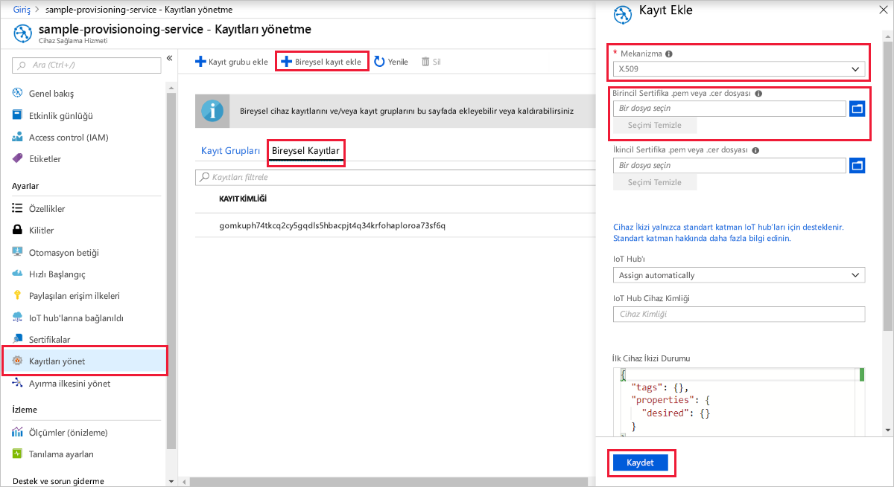
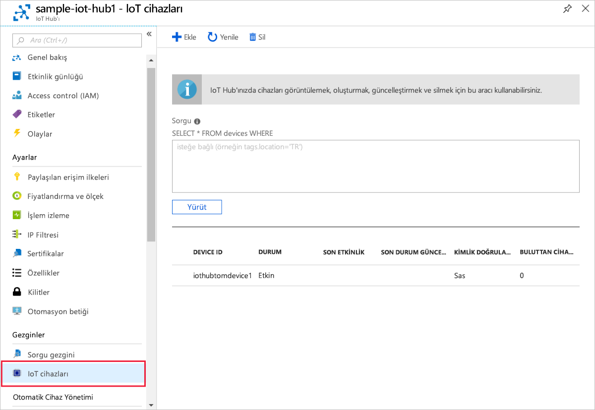

# <a name="quickstart-create-and-provision-a-simulated-x509-device-using-c-device-sdk-for-iot-hub-device-provisioning-service"></a>Quickstart: Create and provision a simulated X.509 device using C# device SDK for IoT Hub Device Provisioning Service

[!INCLUDE [iot-dps-selector-quick-create-simulated-device-x509](../../includes/iot-dps-selector-quick-create-simulated-device-x509.md)]

These steps show you how to use the [Azure IoT Samples for C#](https://github.com/Azure-Samples/azure-iot-samples-csharp) to simulate an X.509 device on a development machine running the Windows OS. The sample also connects the simulated device to an IoT Hub using the Device Provisioning Service.

Otomatik sağlama işlemini bilmiyorsanız, [Otomatik sağlama kavramlarını](concepts-auto-provisioning.md) gözden geçirdiğinizden emin olun. Ayrıca devam etmeden önce [IoT Hub Cihazı Sağlama Hizmetini Azure portalıyla ayarlama](./quick-setup-auto-provision.md) bölümünde bulunan adımları tamamladığınızdan emin olun. 

Azure IoT Cihaz Sağlama Hizmeti iki tür kaydı destekler:
- [Kayıt grupları](concepts-service.md#enrollment-group): Birden fazla ilgili cihazı kaydetmek için kullanılır.
- [Bireysel kayıtlar](concepts-service.md#individual-enrollment): Tek bir cihazı kaydetmek için kullanılır.

Bu makalede bireysel kayıtlar gösterilmektedir.

[!INCLUDE [IoT Device Provisioning Service basic](../../includes/iot-dps-basic.md)]

<a id="setupdevbox"></a>
## <a name="prepare-the-development-environment"></a>Geliştirme ortamını hazırlama 

1. Make sure you have the [.NET Core 2.1 SDK or later](https://www.microsoft.com/net/download/windows) installed on your machine. 

1. `git` uygulamasının makinenizde yüklü olduğundan ve komut penceresinden erişilebilir ortam değişkenlerine eklendiğinden emin olun. Yüklenecek `git` araçlarının son sürümleri için [Software Freedom Conservancy’nin Git istemci araçlarına](https://git-scm.com/download/) bakın. Bunlara yerel Git deponuzla etkileşim kurmak için kullanabileceğiniz bir komut satırı uygulaması olan **Git Bash** dahildir. 

1. Bir komut istemi veya Git Bash’i açın. Clone the Azure IoT Samples for C# GitHub repo:
    
    ```cmd
    git clone https://github.com/Azure-Samples/azure-iot-samples-csharp.git
    ```

## <a name="create-a-self-signed-x509-device-certificate-and-individual-enrollment-entry"></a>Otomatik olarak imzalanan X.509 cihazı sertifikası ve bireysel kayıt girişi oluşturma

Bu bölümde, otomatik olarak imzalanan X.509 sertifikası kullanacaksınız. Aşağıdaki konuları göz önünde bulundurmak önemlidir:

* Otomatik olarak imzalanan sertifikalar yalnızca test amaçlıdır ve üretimde kullanılmamalıdır.
* Otomatik olarak imzalanan sertifikanın varsayılan sona erme tarihi bir yıldır.

You will use sample code from the [Provisioning Device Client Sample - X.509 Attestation](https://github.com/Azure-Samples/azure-iot-samples-csharp/tree/master/provisioning/Samples/device/X509Sample) to create the certificate to be used with the individual enrollment entry for the simulated device.


1. Komut isteminde dizini X.509 cihaz sağlama örneğinin proje dizini olacak şekilde değiştirin.

    ```cmd
    cd .\azure-iot-samples-csharp\provisioning\Samples\device\X509Sample
    ```

2. Örnek kod parola korumalı PKCS12 biçimindeki bir dosya (certificate.pfx) içinde depolanan X.509 sertifikalarını kullanacak şekilde ayarlanmıştır. Ayrıca bu Hızlı Başlangıcın ilerleyen bölümünde bireysel kayıt oluşturmak için bir ortak anahtar sertifikasına (certificate.cer) ihtiyacınız vardır. Otomatik olarak imzalanan sertifika ile ona bağlı .cer ve .pfx dosyalarını oluşturmak için aşağıdaki komutu çalıştırın:

    ```cmd
    powershell .\GenerateTestCertificate.ps1
    ```

3. Bu betik sizden PFX parolası ister. Örneği çalıştırdığında kullanmanız gerekeceğinden bu parolayı unutmayın.

      


4. Azure portala giriş yapın, sol taraftaki menüden **Tüm kaynaklar**’a tıklayın ve sağlama hizmetinizi açın.

5. Cihaz Sağlama Hizmeti özet dikey penceresinde, **Kayıtları yönet**’i seçin. **Bireysel Kayıtlar** sekmesini seçin ve en üstteki **Bireysel kayıt ekle** düğmesine tıklayın. 

6. **Kayıt Ekle** panelinin altına aşağıdaki bilgileri girin:
   - Kimlik onay *Mekanizması* olarak **X.509**'u seçin.
   - *Birincil sertifika .pem veya .cer dosyası*'nın altında, önceki adımlarda oluşturulmuş **certificate.cer** sertifika dosyasını seçmek için *Dosya seçin*’e tıklayın.
   - **Cihaz Kimliği** alanını boş bırakın. Cihazınız, cihaz kimliği X.509 sertifikasındaki ortak ad (CN) olan **iothubx509device1** olacak şekilde sağlanır. Bu değer aynı zamanda bireysel kayıt girişi için kayıt kimliği olarak kullanılır. 
   - İsteğe bağlı olarak, aşağıdaki bilgileri sağlayabilirsiniz:
       - Sağlama hizmetinizle bağlanacak IoT hub'ını seçin.
       - **Başlangıç cihaz ikizi durumu** alanını cihaz için istenen başlangıç yapılandırmasına göre güncelleştirin.
   - Tamamlandığında **Kaydet** düğmesine tıklayın. 

     [](./media/quick-create-simulated-device-x509-csharp/device-enrollment.png#lightbox)
    
   Kayıt başarıyla tamamlandığında, X.509 kayıt girişiniz cihazınız *Bireysel Kayıtlar* sekmesindeki *Kayıt Kimliği* sütununun altında **iothubx509device1** olarak gösterilir. 

## <a name="provision-the-simulated-device"></a>Sanal cihazı sağlama

1. Sağlama hizmetinizin **Genel Bakış** dikey penceresinden **_Kimlik Kapsamı_** değerini not alın.

     


2. X.509 cihaz sağlama örneğini derlemek ve çalıştırmak için aşağıdaki komutu yazın. `<IDScope>` değerinin yerine sağlama hizmetinizin Kimlik Kapsamını girin. 

    ```cmd
    dotnet run <IDScope>
    ```

3. İstendiğinde önceden oluşturduğunuz PFX dosyasının parolasını girin. IoT hub bilgilerinizi almak için cihaz önyüklemesi ve Cihaz Sağlama Hizmetine bağlanma benzetimi gerçekleştiren iletilere dikkat edin. 

     

4. Cihazın sağlandığını doğrulayın. Sanal cihazın, sağlama hizmetinizle bağlantılı IoT hub ile başarıyla sağlanmasından sonra cihaz kimliği hub'ın **IoT Cihazları** dikey penceresinde görünür. 

     

    Cihazınız için *başlangıç cihaz ikizi durumu* ayarının kayıt girişindeki varsayılan değerini değiştirdiyseniz istenen ikili durumu hub'dan çekerek ona göre hareket edebilir. Daha fazla bilgi için bkz. [IoT Hub'daki cihaz ikizlerini kavrama ve kullanma](../iot-hub/iot-hub-devguide-device-twins.md)


## <a name="clean-up-resources"></a>Kaynakları temizleme

Cihaz istemci örneği üzerinde çalışmaya ve inceleme yapmaya devam etmeyi planlıyorsanız bu Hızlı Başlangıç’ta oluşturulan kaynakları silmeyin. Devam etmeyi planlamıyorsanız, bu hızlı başlangıç ile oluşturulan tüm kaynakları silmek için aşağıdaki adımları kullanın:

1. Makinenizde cihaz istemci örnek çıktı penceresini kapatın.
1. Makinenizde TPM simülatörü penceresini kapatın.
1. Azure portalında sol taraftaki menüden **Tüm kaynaklar**’ı ve ardından Cihaz Sağlama hizmetini seçin. **Tüm kaynaklar** dikey pencerenin en üstündeki **Sil** seçeneğine tıklayın.  
1. Azure portalında sol taraftaki menüden **Tüm kaynaklar**’ı ve ardından IoT hub’ınızı seçin. **Tüm kaynaklar** dikey pencerenin en üstündeki **Sil** seçeneğine tıklayın.  

## <a name="next-steps"></a>Sonraki adımlar

Bu Hızlı Başlangıçta, Windows makinenizde bir X.509 sanal cihazı oluşturdunuz ve portaldaki Azure IOT Hub Cihaz Sağlama Hizmeti ile IoT hub'ınıza sağladınız. X.509 cihazınızı programlı bir şekilde kaydetmeyi öğrenmek için X.509 cihazlarının programlı kaydının yer aldığı Hızlı Başlangıç adımlarına gidin. 

> [!div class="nextstepaction"]
> [Azure Hızlı Başlangıcı - X.509 cihazlarını Azure IoT Hub Cihaz Sağlama Hizmeti'ne kaydetme](quick-enroll-device-x509-csharp.md)
