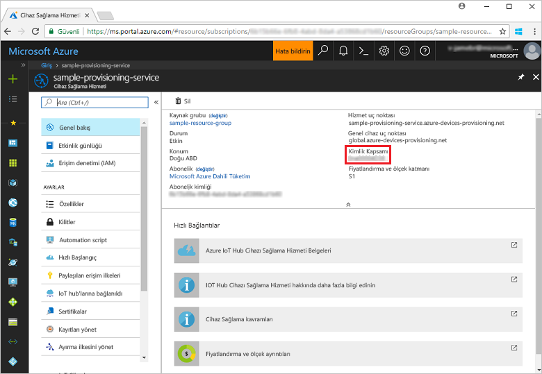

# <a name="create-and-provision-a-simulated-x509-device-using-c-device-sdk-for-iot-hub-device-provisioning-service"></a>IoT Hub Cihazı Sağlama Hizmeti için C# cihaz SDK'sını kullanarak sanal bir X.509 cihazı oluşturma ve sağlama
[!INCLUDE [iot-dps-selector-quick-create-simulated-device-x509](../../includes/iot-dps-selector-quick-create-simulated-device-x509.md)]

Bu adımlar, Windows işletim sistemi çalıştıran geliştirme makinenizde [Azure IoT Hub C# SDK'sı](https://github.com/Azure/azure-iot-sdk-csharp) sanal X.509 cihazı örneğini derlemeyi ve sanal cihazı Cihaz Sağlama Hizmeti ve IoT hub'ınızla bağlamayı gösterir.

Otomatik sağlama işlemini bilmiyorsanız, [Otomatik sağlama kavramlarını](concepts-auto-provisioning.md) gözden geçirdiğinizden emin olun. Ayrıca devam etmeden önce [IoT Hub Cihazı Sağlama Hizmetini Azure portalıyla ayarlama](./quick-setup-auto-provision.md) bölümünde bulunan adımları tamamladığınızdan emin olun. 

[!INCLUDE [IoT DPS basic](../../includes/iot-dps-basic.md)]

<a id="setupdevbox"></a>
## <a name="prepare-the-development-environment"></a>Geliştirme ortamını hazırlama 

1. Makinenizde [.NET core SDK'sının](https://www.microsoft.com/net/download/windows) yüklü olduğundan emin olun. 

1. `git` uygulamasının makinenizde yüklü olduğundan ve komut penceresinden erişilebilir ortam değişkenlerine eklendiğinden emin olun. Yüklenecek `git` araçlarının son sürümleri için [Software Freedom Conservancy’nin Git istemci araçlarına](https://git-scm.com/download/) bakın. Bunlara yerel Git deponuzla etkileşim kurmak için kullanabileceğiniz bir komut satırı uygulaması olan **Git Bash** dahildir. 

4. Bir komut istemi veya Git Bash’i açın. [Azure IoT SDK for C#](https://github.com/Azure/azure-iot-sdk-csharp) GitHub deposunu kopyalayın:
    
    ```cmd
    git clone --recursive https://github.com/Azure/azure-iot-sdk-csharp.git
    ```

## <a name="create-a-self-signed-x509-device-certificate-and-individual-enrollment-entry"></a>Otomatik olarak imzalanan X.509 cihazı sertifikası ve bireysel kayıt girişi oluşturma

1. Komut isteminde dizini X.509 cihaz sağlama örneğinin proje dizini olacak şekilde değiştirin.

    ```cmd
    cd .\azure-iot-sdk-csharp\provisioning\device\samples\ProvisioningDeviceClientX509
    ```

2. Örnek kod parola korumalı PKCS12 biçimindeki bir dosya (certificate.pfx) içinde depolanan X.509 sertifikalarını kullanacak şekilde ayarlanmıştır. Ayrıca bu Hızlı Başlangıcın ilerleyen bölümünde bireysel kayıt oluşturmak için bir ortak anahtar sertifikasına (certificate.cer) ihtiyacınız vardır. Otomatik olarak imzalanan sertifika ile ona bağlı .cer ve .pfx dosyalarını oluşturmak için aşağıdaki komutu çalıştırın:

    ```cmd
    powershell .\GenerateTestCertificate.ps1
    ```

3. Bu betik sizden PFX parolası ister. Örneği çalıştırdığında kullanmanız gerekeceğinden bu parolayı unutmayın.

      


4. Azure portalında oturum açın, sol taraftaki menüden **Tüm kaynaklar**’a tıklayın ve sağlama hizmetinizi açın.

5. Cihaz Sağlama Hizmeti özet dikey penceresinde, **Kayıtları yönet**’i seçin. **Tek Tek Kayıtlar** sekmesini seçin ve üstteki **Ekle** düğmesine tıklayın. 

6. **Kayıt ekle** panelinin altına aşağıdaki bilgileri girin:
    - Kimlik onay *Mekanizması* olarak **X.509**'u seçin.
    - *Birincil sertifika .pem veya .cer dosyası*'nın altında, önceki adımlarda oluşturulmuş **certificate.cer** sertifika dosyasını seçmek için *Dosya seçin*’e tıklayın.
    - **Cihaz Kimliği** alanını boş bırakın. Cihazınız, cihaz kimliği X.509 sertifikasındaki ortak ad (CN) olan **iothubx509device1** olacak şekilde sağlanır. Bu değer aynı zamanda bireysel kayıt girişi için kayıt kimliği olarak kullanılır. 
    - İsteğe bağlı olarak, aşağıdaki bilgileri sağlayabilirsiniz:
        - Sağlama hizmetinizle bağlanacak IoT hub'ını seçin.
        - **Başlangıç cihaz ikizi durumu** alanını cihaz için istenen başlangıç yapılandırmasına göre güncelleştirin.
    - Tamamlandığında **Kaydet** düğmesine tıklayın. 

    [](./media/quick-create-simulated-device-x509-csharp/individual-enrollment.png#lightbox)
    
   Kayıt başarıyla tamamlandığında, X.509 kayıt girişiniz cihazınız *Bireysel Kayıtlar* sekmesindeki *Kayıt Kimliği* sütununun altında **iothubx509device1** olarak gösterilir. 

## <a name="provision-the-simulated-device"></a>Sanal cihazı sağlama

1. Sağlama hizmetinizin **Genel Bakış** dikey penceresinden **_Kimlik Kapsamı_** değerini not alın.

     


2. X.509 cihaz sağlama örneğini derlemek ve çalıştırmak için aşağıdaki komutu yazın. `<IDScope>` değerinin yerine sağlama hizmetinizin Kimlik Kapsamını girin. 

    ```cmd
    dotnet run <IDScope>
    ```

3. İstendiğinde önceden oluşturduğunuz PFX dosyasının parolasını girin. IoT hub bilgilerinizi almak için cihaz önyüklemesi ve Cihaz Sağlama Hizmetine bağlanma benzetimi gerçekleştiren iletilere dikkat edin. 

     

4. Cihazın sağlandığını doğrulayın. Sanal cihazın, sağlama hizmetinizle bağlantılı IoT hub ile başarıyla sağlanmasından sonra cihaz kimliği hub'ın **IoT Cihazları** dikey penceresinde görünür. 

     

    Cihazınız için *başlangıç cihaz ikizi durumu* ayarının kayıt girişindeki varsayılan değerini değiştirdiyseniz istenen ikili durumu hub'dan çekerek ona göre hareket edebilir. Daha fazla bilgi için bkz. [IoT Hub'daki cihaz ikizlerini kavrama ve kullanma](../iot-hub/iot-hub-devguide-device-twins.md)


## <a name="clean-up-resources"></a>Kaynakları temizleme

Cihaz istemci örneği üzerinde çalışmaya ve inceleme yapmaya devam etmeyi planlıyorsanız bu Hızlı Başlangıç’ta oluşturulan kaynakları silmeyin. Devam etmeyi planlamıyorsanız, bu hızlı başlangıç ile oluşturulan tüm kaynakları silmek için aşağıdaki adımları kullanın:

1. Makinenizde cihaz istemci örnek çıktı penceresini kapatın.
1. Makinenizde TPM simülatörü penceresini kapatın.
1. Azure portalında sol taraftaki menüden **Tüm kaynaklar**’ı ve ardından Cihaz Sağlama hizmetini seçin. **Tüm kaynaklar** dikey pencerenin en üstündeki **Sil** seçeneğine tıklayın.  
1. Azure portalında sol taraftaki menüden **Tüm kaynaklar**’ı ve ardından IoT hub’ınızı seçin. **Tüm kaynaklar** dikey pencerenin en üstündeki **Sil** seçeneğine tıklayın.  

## <a name="next-steps"></a>Sonraki adımlar

Bu Hızlı Başlangıçta, Windows makinenizde bir X.509 sanal cihazı oluşturdunuz ve portaldaki Azure IOT Hub Cihaz Sağlama Hizmeti ile IoT hub'ınıza sağladınız. X.509 cihazınızı programlı bir şekilde kaydetmeyi öğrenmek için X.509 cihazlarının programlı kaydının yer aldığı Hızlı Başlangıç adımlarına gidin. 

> [!div class="nextstepaction"]
> [Azure Hızlı Başlangıcı - X.509 cihazlarını Azure IoT Hub Cihaz Sağlama Hizmeti'ne kaydetme](quick-enroll-device-x509-csharp.md)
