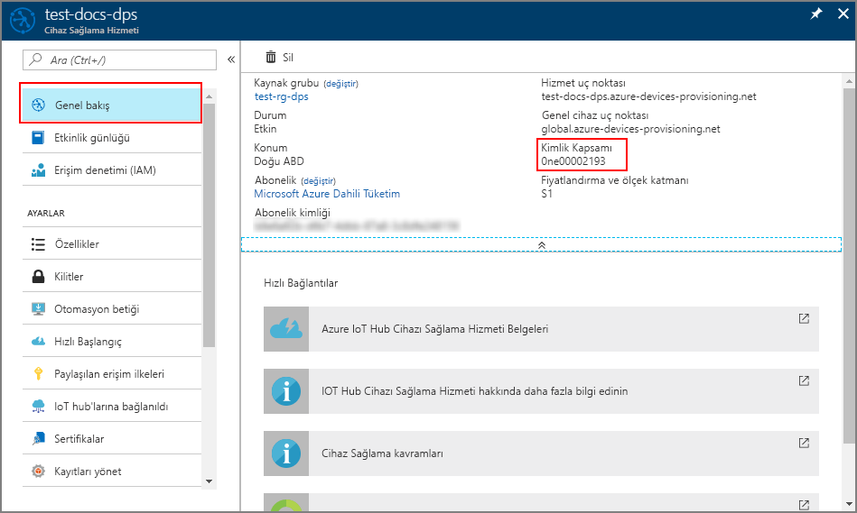

# <a name="create-and-provision-a-simulated-device-using-iot-hub-device-provisioning-services"></a>IoT Hub Cihazı Sağlama Hizmetleri kullanarak bir sanal cihaz oluşturma ve sağlama
> [!div class="op_single_selector"]
> * [TPM](quick-create-simulated-device.md)
> * [X.509](quick-create-simulated-device-x509.md)

Bu adımlar, Windows işletim sistemi çalıştıran geliştirme makinenizde sanal makine oluşturmayı, Windows TPM simülatörünü cihazın [Donanım Güvenlik Modülü (HSM)](https://azure.microsoft.com/blog/azure-iot-supports-new-security-hardware-to-strengthen-iot-security/) olarak çalıştırmayı ve örnek kodlar kullanarak bu sanal cihazı Cihaz Sağlama Hizmeti ve IoT hub’ınızla bağlamayı gösterir. 

Devam etmeden önce [IoT Hub Cihazı Sağlama Hizmetini Azure portalıyla ayarlama](./quick-setup-auto-provision.md) bölümünde bulunan adımları tamamladığınızdan emin olun.

<a id="setupdevbox"></a>
## <a name="prepare-the-development-environment"></a>Geliştirme ortamını hazırlama 

1. Makinenizde Visual Studio 2015 veya [Visual Studio 2017](https://www.visualstudio.com/vs/) olduğundan emin olun. Visual Studio yüklemenizde "C++ ile masaüstü geliştirme" iş yükünün etkinleştirilmiş olması gerekir.

2. [CMake derleme sistemini](https://cmake.org/download/) indirin ve yükleyin.

3. `git` uygulamasının makinenizde yüklü olduğundan ve komut penceresinden erişilebilir ortam değişkenlerine eklendiğinden emin olun. Yüklenecek `git` araçlarının son sürümleri için [Software Freedom Conservancy’nin Git istemci araçlarına](https://git-scm.com/download/) bakın. Bunlara yerel Git deponuzla etkileşim kurmak için kullanabileceğiniz bir komut satırı uygulaması olan **Git Bash** dahildir. 

4. Bir komut istemi veya Git Bash’i açın. Cihaz benzetim kod örneği için GitHub deposunu kopyalayın:
    
    ```cmd/sh
    git clone https://github.com/Azure/azure-iot-sdk-c.git --recursive
    ```

5. CMake oluşturma işlemi için bu GitHub deposunun yerel kopyasında bir klasör oluşturun. 

    ```cmd/sh
    cd azure-iot-sdk-c
    mkdir cmake
    cd cmake
    ```

6. Kod örneği, bir Windows TPM simülatörü kullanır. SAS belirteci kimlik doğrulamasını etkinleştirmek için aşağıdaki komutu çalıştırın. Sanal cihaz için ayrıca bir Visual Studio çözümü oluşturur.

    ```cmd/sh
    cmake -Ddps_auth_type=tpm_simulator ..
    ```

7. Ayrı bir komut isteminde, GitHub kök klasörüne gidin ve [TPM](https://docs.microsoft.com/windows/device-security/tpm/trusted-platform-module-overview) simülatörünü çalıştırın. 2321 ve 2322 bağlantı noktalarında bulunan bir yuva üzerinden dinler. Bu komut penceresini kapatmayın; Hızlı Başlangıç kılavuzu sonuna kadar simülatörü çalışır durumda tutmanız gerekir. 

    ```cmd/sh
    .\azure-iot-sdk-c\dps_client\deps\utpm\tools\tpm_simulator\Simulator.exe
    ```

## <a name="create-a-device-enrollment-entry-in-the-device-provisioning-service"></a>Cihaz sağlama hizmetinde bir cihaz kayıt girişi oluşturma

1. `azure_iot_sdks.sln` adlı *cmake* klasöründe oluşturulan çözümü açın ve Visual Studio'da derleyin.

2. **tpm_device_provision** projesine sağ tıklayın ve **Başlangıç Projesi Olarak Ayarla**’yı seçin. Çözümü çalıştırın. Çıktı penceresinde cihaz kaydı için gereken **_Onay Anahtarını_** ve **_Kayıt Kimliğini_** görüntülenir. Bu değerleri not alın. 

3. Azure portalında oturum açın, sol taraftaki menüden **Tüm kaynaklar**’a tıklayın ve Cihaz Sağlama hizmetinizi açın.

4. Cihaz Sağlama Hizmeti özet dikey penceresinde, **Kayıtları yönet**’i seçin. **Tek Tek Kayıtlar** sekmesini seçin ve üstteki **Ekle** düğmesine tıklayın. 

5. **Kayıt listesi girişi ekle** bölümüne aşağıdaki bilgileri girin:
    - Kimlik onay *Mekanizması* olarak **TPM** seçeneğini belirleyin.
    - TPM cihazınızın *Kayıt kimliği* ve *Onay anahtarı* bilgilerini girin. 
    - Sağlama hizmetinizle bağlanacak IoT hub'ını seçin.
    - Benzersiz bir cihaz kimliği girin. Cihazınızı adlandırırken gizli veriler kullanmaktan kaçının.
    - **Başlangıç cihaz ikizi durumu** alanını cihaz için istenen başlangıç yapılandırmasına göre güncelleştirin.
    - Tamamlandığında **Kaydet** düğmesine tıklayın. 

      

   Kayıt başarıyla tamamlanınca cihazınızın *Kayıt Kimliği* listenin altında *Tek Tek Kayıtlar* sekmesinde görünür. 


<a id="firstbootsequence"></a>
## <a name="simulate-first-boot-sequence-for-the-device"></a>Cihazın ilk önyükleme sırasını benzetim olarak çalıştırma

1. Azure portalında Cihaz Sağlama hizmetiniz için **Genel Bakış** dikey penceresini seçin ve  **_Genel cihaz uç noktası_** ve  **_Kimlik kapsamı_** değerlerini not alın.

     

2. Makinenizde Visual Studio'da **dps_client_sample** adlı örnek projeyi seçin ve **dps_client_sample.c** dosyasını açın.

3. `dps_scope_id` değişkenine _Kimlik kapsamı_ değerini atayın. `dps_uri` değişkeninin _Genel cihaz uç noktası_ ile aynı değere sahip olduğuna dikkat edin. 

    ```c
    static const char* dps_uri = "global.azure-devices-provisioning.net";
    static const char* dps_scope_id = "[DPS Id Scope]";
    ```

4. **dps_client_sample** projesine sağ tıklayın ve **Başlangıç Projesi Olarak Ayarla**’yı seçin. Örnek uygulamayı çalıştırın. IoT hub bilgilerinizi almak için cihaz önyüklemesi ve Cihaz Sağlama Hizmetine bağlanma benzetimi gerçekleştiren iletilere dikkat edin. Benzetimli cihazınızın, sağlama hizmetinizle bağlantılı IoT hub ile başarıyla sağlanmasından sonra cihaz kimliği hub’ın **Device Explorer** dikey penceresinde görünür. 

     

    Cihazınız için *başlangıç cihaz ikizi durumu* ayarının kayıt girişindeki varsayılan değerini değiştirdiyseniz istenen ikili durumu hub'dan çekerek ona göre hareket edebilir. Daha fazla bilgi için bkz. [IoT Hub'daki cihaz ikizlerini kavrama ve kullanma](../iot-hub/iot-hub-devguide-device-twins.md)


## <a name="clean-up-resources"></a>Kaynakları temizleme

Cihaz istemci örneği üzerinde çalışmaya ve inceleme yapmaya devam etmeyi planlıyorsanız bu Hızlı Başlangıç’ta oluşturulan kaynakları silmeyin. Devam etmeyi planlamıyorsanız, bu hızlı başlangıç ile oluşturulan tüm kaynakları silmek için aşağıdaki adımları kullanın:

1. Makinenizde cihaz istemci örnek çıktı penceresini kapatın.
1. Makinenizde TPM simülatörü penceresini kapatın.
1. Azure portalında sol taraftaki menüden **Tüm kaynaklar**’ı ve ardından Cihaz Sağlama hizmetini seçin. **Tüm kaynaklar** dikey pencerenin en üstündeki **Sil** seçeneğine tıklayın.  
1. Azure portalında sol taraftaki menüden **Tüm kaynaklar**’ı ve ardından IoT hub’ınızı seçin. **Tüm kaynaklar** dikey pencerenin en üstündeki **Sil** seçeneğine tıklayın.  

## <a name="next-steps"></a>Sonraki adımlar

Bu hızlı başlangıçta makinenizde bir TPM sanal cihazı oluşturdunuz ve Azure IOT Hub cihaz sağlama hizmeti ile IOT hub'ınıza sağladınız. Cihaz sağlama hakkında ayrıntılı bilgi edinmek için Azure portalında Cihaz Sağlama Hizmeti ayarları öğreticisine geçin. 

> [!div class="nextstepaction"]
> [Azure IoT Hub Cihazı Sağlama Hizmeti öğreticileri](./tutorial-set-up-cloud.md)
