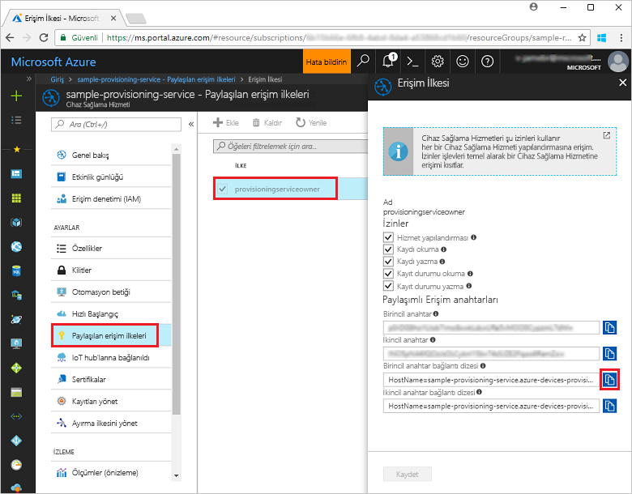
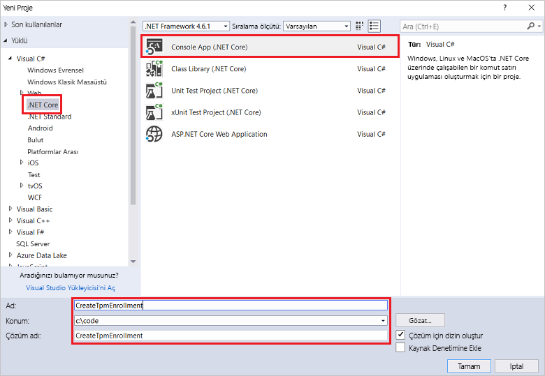

# <a name="enroll-tpm-device-to-iot-hub-device-provisioning-service-using-c-service-sdk"></a>C# hizmeti SDK'sını kullanarak TPM cihazını IoT Hub Cihazı Sağlama Hizmeti'ne kaydetme

[!INCLUDE [iot-dps-selector-quick-enroll-device-tpm](../../includes/iot-dps-selector-quick-enroll-device-tpm.md)]


Bu adımlar, [C# Hizmeti SDK'sını](https://github.com/Azure/azure-iot-sdk-csharp) ve örnek C# .NET Core uygulamasını kullanarak bir TPM cihazı için Azure IoT Hub Cihazı Sağlama Hizmeti'nde programlı bireysel kayıt oluşturmayı gösterir. İsteğe bağlı olarak bu bireysel kayıt girişini kullanarak sağlama hizmetine sanal bir TPM cihazını da kaydedebilirsiniz. Bu adımlar hem Windows hem de Linux makineler için geçerli olsa da bu makalede Windows dağıtım makinesi kullanılmaktadır.

## <a name="prepare-the-development-environment"></a>Geliştirme ortamını hazırlama

1. Makinenizde [Visual Studio 2017](https://www.visualstudio.com/vs/)'nin yüklü olduğundan emin olun. 
2. Makinenizde [.Net Core SDK'sının](https://www.microsoft.com/net/download/windows) yüklü olduğundan emin olun. 
3. Devam etmeden önce [IoT Hub Cihazı Sağlama Hizmetini Azure portalıyla ayarlama](./quick-setup-auto-provision.md) bölümünde bulunan adımları tamamladığınızdan emin olun.
4. (İsteğe bağlı) Bu Hızlı Başlangıcın sonunda bir simülasyon cihazı kaydetmek istiyorsanız, [C# cihaz SDK'sını kullanarak bir simülasyon TPM cihazı oluşturma ve sağlama](quick-create-simulated-device-tpm-csharp.md) altındaki adımların cihaz için onay anahtarı aldığınız adıma kadar olan kısmını izleyin. Onay anahtarını, kayıt kimliğini ve isteğe bağlı olarak cihaz kimliğini not alın; bu Hızlı Başlangıcın devamında bunları kullanmanız gerekecektir. **Azure portalını kullanarak bireysel kayıt oluşturma adımlarını izlemeyin.**

## <a name="get-the-connection-string-for-your-provisioning-service"></a>Sağlama hizmetinizin bağlantı dizesini alma

Bu Hızlı Başlangıç'taki örnek için sağlama hizmetinizin bağlantı dizesine ihtiyacınız vardır.
1. Azure Portal'da oturum açın, sol taraftaki menüden **Tüm kaynaklar**’a tıklayın ve Cihaz Sağlama Hizmetinizi açın. 
2. **Paylaşılan erişim ilkeleri**'ne ve ardından kullanmak istediğiniz erişim ilkesine tıklayarak özelliklerini görüntüleyin. **Erişim İlkesi** penceresinde birincil anahtar bağlantı dizesini kopyalayın ve not edin. 

    

## <a name="create-the-individual-enrollment-sample"></a>Bireysel kayıt örneğini oluşturma 

Bu bölümdeki adımlarda, sağlama hizmetinize TPM cihazı için bireysel bir kayıt ekleyen .NET Core konsol uygulamasının nasıl oluşturulduğu gösterilir. Biraz değişiklikle, bireysel kayıt eklemek üzere bir [Windows IoT Core](https://developer.microsoft.com/en-us/windows/iot) konsol uygulaması oluşturmak için de bu adımları izleyebilirsiniz. IoT Core ile geliştirme hakkında daha fazla bilgi edinmek için bkz. [Windows IoT Core geliştirici belgeleri](https://docs.microsoft.com/windows/iot-core/).
1. Visual Studio’da **Konsol Uygulaması (.NET Core)** proje şablonunu kullanarak yeni bir çözüme bir Visual C# .NET Core Konsol Uygulaması projesi ekleyin. .NET Framework sürümünün 4.5.1 veya sonraki bir sürüm olduğundan emin olun. Projeye **CreateTpmEnrollment** adını verin.

    

2. Çözüm Gezgini'nde **CreateTpmEnrollment** projesine sağ tıklayın ve ardından **NuGet Paketlerini Yönet**'e tıklayın.
3. **NuGet Paket Yöneticisi** penceresinde **Gözat**'ı seçin, **Microsoft.Azure.Devices.Provisioning.Service**'i aratın, **Microsoft.Azure.Devices.Provisioning.Service** paketini yüklemek için **Yükle**'yi seçin ve kullanım koşullarını kabul edin. Bu yordam ile [Azure IoT Sağlama Hizmeti İstemci SDK'sı](https://www.nuget.org/packages/Microsoft.Azure.Devices.Provisioning.Service/) NuGet paketi ve bağımlılıkları indirilir, yüklenir ve bu pakete bir başvuru eklenir.

    

4. Aşağıdaki `using` deyimlerini **Program.cs** dosyasının en üst kısmındaki `using` deyimlerinin arkasına ekleyin:
   
   ```csharp
   using System.Threading.Tasks;
   using Microsoft.Azure.Devices.Provisioning.Service;
   ```
    
5. **Program** sınıfına aşağıdaki alanları ekleyin.  
   - **ProvisioningConnectionString** yer tutucu değerini, kaydı oluşturmak istediğiniz sağlama hizmetinin bağlantı dizesiyle değiştirin.
   - İsteğe bağlı olarak kayıt kimliğini, onay anahtarını, cihaz kimliğini ve sağlama durumunu değiştirebilirsiniz. 
   - Bir simülasyon cihazı sağlamak için bu Hızlı Başlangıcı [C# cihaz SDK'sını kullanarak bir simülasyon TPM cihazı oluşturma ve sağlama](quick-create-simulated-device-tpm-csharp.md) Hızlı Başlangıcıyla birlikte kullanıyorsanız, onay anahtarını ve kayıt kimliğini bu Hızlı Başlangıçta not aldığınız değerlerle değiştirin. Cihaz kimliğini, bu Hızlı Başlangıçta önerilen değerle değiştirebilir, kendi değerinizi kullanabilir veya bu örnekteki varsayılan değeri kullanabilirsiniz.
        
   ```csharp
   private static string ProvisioningConnectionString = "{Your provisioning service connection string}";
   private const string RegistrationId = "sample-registrationid-csharp";
   private const string TpmEndorsementKey =
       "AToAAQALAAMAsgAgg3GXZ0SEs/gakMyNRqXXJP1S124GUgtk8qHaGzMUaaoABgCAAEMAEAgAAAAAAAEAxsj2gUS" +
       "cTk1UjuioeTlfGYZrrimExB+bScH75adUMRIi2UOMxG1kw4y+9RW/IVoMl4e620VxZad0ARX2gUqVjYO7KPVt3d" +
       "yKhZS3dkcvfBisBhP1XH9B33VqHG9SHnbnQXdBUaCgKAfxome8UmBKfe+naTsE5fkvjb/do3/dD6l4sGBwFCnKR" +
       "dln4XpM03zLpoHFao8zOwt8l/uP3qUIxmCYv9A7m69Ms+5/pCkTu/rK4mRDsfhZ0QLfbzVI6zQFOKF/rwsfBtFe" +
       "WlWtcuJMKlXdD8TXWElTzgh7JS4qhFzreL0c1mI0GCj+Aws0usZh7dLIVPnlgZcBhgy1SSDQMQ==";
       
   // Optional parameters
   private const string OptionalDeviceId = "myCSharpDevice";
   private const ProvisioningStatus OptionalProvisioningStatus = ProvisioningStatus.Enabled;
   ```
    
6. **Program** sınıfına aşağıdaki yöntemi ekleyin.  Bu kod bireysel bir kayıt girdisini oluşturur ve bireysel kaydı sağlama hizmetine eklemek için **ProvisioningServiceClient** üzerinden **CreateOrUpdateIndividualEnrollmentAsync** yöntemini çağırır.
   
   ```csharp
   public static async Task RunSample()
   {
       Console.WriteLine("Starting sample...");

       using (ProvisioningServiceClient provisioningServiceClient =
               ProvisioningServiceClient.CreateFromConnectionString(ProvisioningConnectionString))
       {
           #region Create a new individualEnrollment config
           Console.WriteLine("\nCreating a new individualEnrollment...");
           Attestation attestation = new TpmAttestation(TpmEndorsementKey);
           IndividualEnrollment individualEnrollment =
                   new IndividualEnrollment(
                           RegistrationId,
                           attestation);

           // The following parameters are optional. Remove them if you don't need them.
           individualEnrollment.DeviceId = OptionalDeviceId;
           individualEnrollment.ProvisioningStatus = OptionalProvisioningStatus;
           #endregion

           #region Create the individualEnrollment
           Console.WriteLine("\nAdding new individualEnrollment...");
           IndividualEnrollment individualEnrollmentResult =
               await provisioningServiceClient.CreateOrUpdateIndividualEnrollmentAsync(individualEnrollment).ConfigureAwait(false);
           Console.WriteLine("\nIndividualEnrollment created with success.");
           Console.WriteLine(individualEnrollmentResult);
           #endregion
        
       }
   }
   ```
       
7. Son olarak, **Main** yönteminin gövdesini aşağıdaki satırlarla değiştirin:
   
   ```csharp
   RunSample().GetAwaiter().GetResult();
   Console.WriteLine("\nHit <Enter> to exit ...");
   Console.ReadLine();
   ```
        
8. Çözümü derleyin.

## <a name="run-the-individual-enrollment-sample"></a>Bireysel kayıt örneğini çalıştırma
  
1. Örneği Visual Studio'da çalıştırarak TPM cihazınızın bireysel kaydını oluşturun.
 
2. Oluşturma başarılı olursa komut penceresinde yeni bireysel kaydın özellikleri görüntülenir.

    

3. Bireysel kaydın oluşturulduğunu doğrulamak için, Azure Portal'daki Cihaz Sağlama Hizmeti özet dikey penceresinde **Kayıtları yönet**'i ve ardından **Bireysel Kayıtlar** sekmesini seçin. Örnekte kullandığınız kayıt kimliğine karşılık gelen yeni bir kayıt girdisi görmelisiniz. Onay anahtarını ve girdinin diğer özelliklerini doğrulamak için girdiye tıklayın.

    
 
4. (İsteğe bağlı) [C# cihaz SDK'sını kullanarak bir simülasyon TPM cihazı oluşturma ve sağlama](quick-create-simulated-device-tpm-csharp.md) Hızlı Başlangıcındaki adımları izlediyseniz, bu Hızlı Başlangıçtaki kalan adımlarla devam ederek simülasyon cihazınızı kaydedebilirsiniz. Azure Portal'ı kullanarak bireysel kayıt oluşturma adımlarını atladığınızdan emin olun.

## <a name="clean-up-resources"></a>Kaynakları temizleme
C# hizmeti örneğini keşfetmeye devam etmeyi planlıyorsanız, bu Hızlı Başlangıçta oluşturulan kaynakları temizlemeyin. Devam etmeyi planlamıyorsanız, bu hızlı başlangıç ile oluşturulan tüm kaynakları silmek için aşağıdaki adımları kullanın:

1. Makinenizdeki C# örnek çıkış penceresini kapatın.
2. Azure Portal'daki Cihaz Sağlama hizmetine gidin, **Kayıtları yönetme**'ye tıklayıp **Bireysel Kayıtlar** sekmesini seçin. Bu Hızlı Başlangıç adımlarını kullanarak oluşturduğunuz kayıt girişinin *Kayıt Kimliği* değerini seçip dikey pencerenin en üstünde bulunan **Sil** düğmesine tıklayın. 
3. Simülasyon TPM cihazı oluşturmak için [C# cihaz SDK'sını kullanarak bir simülasyon TPM cihazı oluşturma ve sağlama](quick-create-simulated-device-tpm-csharp.md) Hızlı Başlangıcındaki adımları izlediyseniz: 

    1. TPM simülatör penceresini ve simülasyon cihazının örnek çıkış penceresini kapatın.
    2. Azure Portal'da, cihazınızın sağlandığı IoT Hub'ına gidin. Sol taraftaki menüde **Gezginler**'in altında **IoT Cihazları**'na tıklayın, cihazınızın yanındaki onay kutusunu seçin ve ardından pencerenin üst kısmındaki **Sil**'e tıklayın.
 
## <a name="next-steps"></a>Sonraki adımlar
Bu hızlı başlangıçta bir TPM cihazı için programlı olarak bireysel kayıt girişi ve isteğe bağlı olarak makinenizde bir TPM sanal cihazı oluşturdunuz ve Azure IOT Hub cihaz sağlama hizmeti ile IOT hub'ınıza sağladınız. Cihaz sağlama hakkında ayrıntılı bilgi edinmek için Azure portalında Cihaz Sağlama Hizmeti ayarları öğreticisine geçin. 
 
> [!div class="nextstepaction"]
> [Azure IoT Hub Cihazı Sağlama Hizmeti öğreticileri](./tutorial-set-up-cloud.md)

