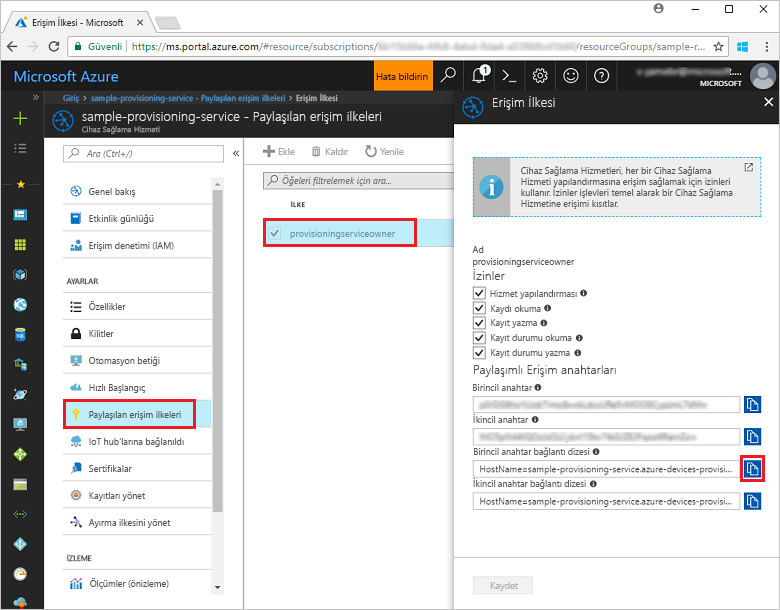

# <a name="quickstart-enroll-tpm-device-to-iot-hub-device-provisioning-service-using-nodejs-service-sdk"></a>Quickstart: Node.js hizmeti SDK kullanarak TPM cihazını IoT Hub Aygıt Sağlama Hizmetine kaydedin

[!INCLUDE [iot-dps-selector-quick-enroll-device-tpm](../../includes/iot-dps-selector-quick-enroll-device-tpm.md)]

Bu hızlı başlatmada, Node.js Service SDK ve örnek bir Düğüm.js uygulamasını kullanarak Azure IoT Hub Aygıt Sağlama Hizmeti'nde bir TPM aygıtı için programlı bir şekilde tek bir kayıt oluşturursunuz. İsteğe bağlı olarak bu bireysel kayıt girişini kullanarak sağlama hizmetine sanal bir TPM cihazını da kaydedebilirsiniz.

## <a name="prerequisites"></a>Ön koşullar

- Azure [portalı ile IoT Hub Aygıt Sağlama Hizmetini Ayarlama'nın](./quick-setup-auto-provision.md)tamamlanması.
- Etkin bir aboneliği olan bir Azure hesabı. [Ücretsiz bir tane oluşturun.](https://azure.microsoft.com/free/?ref=microsoft.com&utm_source=microsoft.com&utm_medium=docs&utm_campaign=visualstudio)
- [Düğüm.js v4.0+](https://nodejs.org). Bu quickstart [aşağıdaki Node.js Service SDK](https://github.com/Azure/azure-iot-sdk-node) yükler.
- Onay anahtarı (isteğe bağlı). Anahtarı alana kadar [benzetilene](quick-create-simulated-device.md) kadar benzetme aygıtı oluştur ve sağlama adımlarını izleyin. Azure portalını kullanarak tek bir kayıt oluşturmayın.

## <a name="create-the-individual-enrollment-sample"></a>Bireysel kayıt örneğini oluşturma 

 
1. Çalışma klasöründeki bir komut penceresinden şu komutu çalıştırın:
  
    ```cmd\sh
    npm install azure-iot-provisioning-service
    ```  

2. Bir metin düzenleyicisi kullanarak çalışma klasörünüzde **create_individual_enrollment.js** adlı bir dosya oluşturun. Dosyaya aşağıdaki kodu ekleyip kaydedin:

    ```
    'use strict';

    var provisioningServiceClient = require('azure-iot-provisioning-service').ProvisioningServiceClient;

    var serviceClient = provisioningServiceClient.fromConnectionString(process.argv[2]);
    var endorsementKey = process.argv[3];

    var enrollment = {
      registrationId: 'first',
      attestation: {
        type: 'tpm',
        tpm: {
          endorsementKey: endorsementKey
        }
      }
    };

    serviceClient.createOrUpdateIndividualEnrollment(enrollment, function(err, enrollmentResponse) {
      if (err) {
        console.log('error creating the individual enrollment: ' + err);
      } else {
        console.log("enrollment record returned: " + JSON.stringify(enrollmentResponse, null, 2));
      }
    });
    ```

## <a name="run-the-individual-enrollment-sample"></a>Bireysel kayıt örneğini çalıştırma
  
1. Örneği çalıştırmak için sağlama hizmetinizin bağlantı dizesine ihtiyacınız vardır. 
    1. Azure portalında oturum açın, sol menüdeki **Tüm kaynaklar** düğmesini seçin ve Cihaz Sağlama hizmetinizi açın. 
    2. **Paylaşılan erişim ilkelerini**seçin ve özelliklerini açmak için kullanmak istediğiniz erişim ilkesini seçin. **Erişim İlkesi** penceresinde birincil anahtar bağlantı dizesini kopyalayın ve not edin. 

        


2. Ayrıca cihazınızın onay anahtarını da almanız gerekir. [Sanal cihaz oluşturma ve sağlama](quick-create-simulated-device.md) hızlı başlangıcını izleyerek sanal bir TPM cihazı oluşturduysanız bu cihaz için oluşturulan anahtarı kullanın. Aksi takdirde, örnek bir bireysel kayıt oluşturmak için, [Node.js Service SDK](https://github.com/Azure/azure-iot-sdk-node)ile birlikte verilen aşağıdaki onay anahtarını kullanabilirsiniz:

    ```
    AToAAQALAAMAsgAgg3GXZ0SEs/gakMyNRqXXJP1S124GUgtk8qHaGzMUaaoABgCAAEMAEAgAAAAAAAEAxsj2gUScTk1UjuioeTlfGYZrrimExB+bScH75adUMRIi2UOMxG1kw4y+9RW/IVoMl4e620VxZad0ARX2gUqVjYO7KPVt3dyKhZS3dkcvfBisBhP1XH9B33VqHG9SHnbnQXdBUaCgKAfxome8UmBKfe+naTsE5fkvjb/do3/dD6l4sGBwFCnKRdln4XpM03zLpoHFao8zOwt8l/uP3qUIxmCYv9A7m69Ms+5/pCkTu/rK4mRDsfhZ0QLfbzVI6zQFOKF/rwsfBtFeWlWtcuJMKlXdD8TXWElTzgh7JS4qhFzreL0c1mI0GCj+Aws0usZh7dLIVPnlgZcBhgy1SSDQMQ==
    ```

3. TPM cihazınız için bireysel kayıt oluşturmak üzere aşağıdaki komutu çalıştırın (komut bağımsız değişkenlerinin tırnak işaretlerini kaldırmayın):
 
     ```cmd\sh
     node create_individual_enrollment.js "<the connection string for your provisioning service>" "<endorsement key>"
     ```
 
3. Oluşturma başarılı olursa komut penceresinde yeni bireysel kaydın özellikleri görüntülenir.

     

4. Bireysel kaydın oluşturulduğunu doğrulayın. Azure portalının Cihaz Sağlama Hizmeti özet dikey penceresinde, **Kayıtları yönetme**'yi seçin. Bireysel **Kayıtlar** sekmesini seçin ve girişiçin onay anahtarını ve diğer özellikleri doğrulamak için yeni kayıt girişini *(önce)* seçin.

     
 
Bir TPM cihazı için bireysel kayıt oluşturdunuz, sanal cihaz kaydetmek istiyorsanız [Sanal cihaz oluşturma ve sağlama](quick-create-simulated-device.md) bölümündeki adımlardan devam edebilirsiniz. Bu hızlı başlangıçta Azure portalını kullanarak tek bir kayıt oluşturmak için adımları atladığınızdan emin olun.

## <a name="clean-up-resources"></a>Kaynakları temizleme
Düğüm.js hizmet örneklerini keşfetmeyi planlıyorsanız, bu hızlı başlangıçta oluşturulan kaynakları temizlemeyin. Devam etmeyi planlamıyorsanız, bu hızlı başlatma tarafından oluşturulan tüm kaynakları silmek için aşağıdaki adımları kullanın.

1. Makinenizdeki Node.js örnek çıktı penceresini kapatın.
1. Sanal TPM cihazı oluşturduysanız, TPM simülatörü penceresini kapatın.
2. Azure portalında Cihaz Sağlama hizmetinize gidin, **Kayıtları Yönet'i**seçin ve ardından **Bireysel Kayıtlar** sekmesini seçin. Bu hızlı başlangıcı kullanarak oluşturduğunuz kayıt girişi için *Kayıt Kimliği'nin* yanındaki onay kutusunu seçin ve bölmenin üst kısmındaki **Sil** düğmesine basın. 
 
## <a name="next-steps"></a>Sonraki adımlar
Bu hızlı başlangıçta, bir TPM aygıtı için programlı bir şekilde tek bir kayıt girişi oluşturdunuz ve isteğe bağlı olarak makinenizde Bir TPM simüle edilmiş bir aygıt oluşturdunuz ve Azure IoT Hub Aygıt Sağlama Hizmeti'ni kullanarak IoT hub'ınıza sokuldum. Cihaz sağlama hakkında ayrıntılı bilgi edinmek için Azure portalında Cihaz Sağlama Hizmeti ayarları öğreticisine geçin. 
 
> [!div class="nextstepaction"]
> [Azure IoT Hub Cihazı Sağlama Hizmeti öğreticileri](./tutorial-set-up-cloud.md)