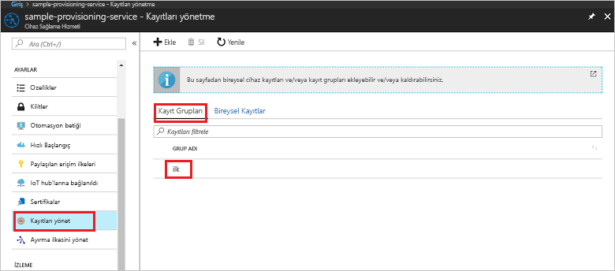

# <a name="quickstart-enroll-x509-devices-to-the-device-provisioning-service-using-nodejs"></a>Hızlı başlangıç: Node.js kullanarak X.509 cihazlarını Cihaz Sağlama Hizmeti'ne kaydetme

[!INCLUDE [iot-dps-selector-quick-enroll-device-x509](../../includes/iot-dps-selector-quick-enroll-device-x509.md)]

Bu hızlı başlangıçta Node.js programlama özelliklerini kullanarak ara veya kök CA X.509 sertifikalarını kullanan bir [Kayıt grubu](concepts-service.md#enrollment-group) oluşturmayı öğreneceksiniz. Kayıt grubu [Node.js için IoT SDK](https://github.com/Azure/azure-iot-sdk-node)'sı ve örnek Node.js uygulaması kullanılarak oluşturulur. Kayıt grubu, sertifika zincirlerinde ortak imzalama sertifikasını paylaşan cihazlar için sağlama hizmetine erişimi denetler. Daha fazla bilgi edinmek için bkz. [X.509 sertifikalarıyla sağlama hizmetine cihaz erişimini denetleme](./concepts-security.md#controlling-device-access-to-the-provisioning-service-with-x509-certificates). Azure IoT Hub ve Cihaz Sağlama Hizmeti ile X.509 sertifikası tabanlı Ortak Anahtar Altyapısı'nı (PKI) kullanma hakkında daha fazla bilgi için bkz. [X.509 CA sertifikası güvenliğine genel bakış](https://docs.microsoft.com/azure/iot-hub/iot-hub-x509ca-overview). 

Bu hızlı başlangıçta önceden bir IoT hub'ı ve Cihaz Sağlama Hizmeti örneği oluşturduğunuz kabul edilir. Bu kaynakları oluşturmadıysanız bu makaleye devam etmeden önce [IoT Hub Cihazı Sağlama Hizmetini Azure portal ile ayarlama](./quick-setup-auto-provision.md) hızlı başlangıcını tamamlayın.

Bu makaledeki adımlar hem Windows hem de Linux makineler için geçerli olsa da bu makale Windows dağıtım makinesi için geliştirilmiştir.

[!INCLUDE [quickstarts-free-trial-note](../../includes/quickstarts-free-trial-note.md)]


## <a name="prerequisites"></a>Ön koşullar

- [Node.js v4.0 veya daha yeni bir sürümü](https://nodejs.org) yükleyin.
- [Git](https://git-scm.com/download/)'i yükleyin.


## <a name="prepare-test-certificates"></a>Test sertifikalarını hazırlama

Bu hızlı başlangıç için ara veya kök CA X.509 sertifikasının ortak bölümünü içeren bir .pem veya .cer dosyasına sahip olmanız gerekir. Bu sertifikanın sağlama hizmetinize yüklenmesi ve hizmet tarafından doğrulanması gerekir. 

[Azure IoT C SDK'sı](https://github.com/Azure/azure-iot-sdk-c) X.509 sertifika zinciri oluşturmanıza, bu zincirdeki bir kök veya ara sertifikayı yüklemenize ve sertifikayı doğrulamak için hizmette sahip olma onayı gerçekleştirmenize yardımcı olabilecek test araçları içerir. SDK aracıyla oluşturulan sertifikalar **yalnızca geliştirme testi** amacıyla kullanılacak şekilde tasarlanmıştır. Bu sertifikalar **üretim ortamında kullanılmamalıdır**. Sertifikalarda 30 gün sonra süresi dolacak değiştirilemeyen parolalar ("1234") bulunur. Üretim ortamında kullanıma uygun sertifikalar almayı öğrenmek için, Azure IoT Hub belgelerinde [X.509 CA sertifikası alma](https://docs.microsoft.com/azure/iot-hub/iot-hub-x509ca-overview#how-to-get-an-x509-ca-certificate) konusuna bakın.

Bu test araçlarını kullanarak sertifika üretmek için aşağıdaki adımları izleyin: 
 
1. Komut istemi veya Git Bash kabuğu açın ve makinenizdeki çalışma klasörüne geçin. Aşağıdaki komutu yürüterek [Azure IoT C SDK'sı](https://github.com/Azure/azure-iot-sdk-c) GitHub deposunu kopyalayın:
    
  ```cmd/sh
  git clone https://github.com/Azure/azure-iot-sdk-c.git --recursive
  ```

  Bu deponun boyutu şu anda 220 MB kadardır. Bu işlemin tamamlanması için birkaç dakika beklemeniz gerekebilir.

  Test araçları kopyaladığınız deponun *azure-iot-sdk-c/tools/CACertificates* dizininde bulunur.    

2. [Örnekler ve öğreticiler için test amaçlı CA sertifikalarını yönetme](https://github.com/Azure/azure-iot-sdk-c/blob/master/tools/CACertificates/CACertificateOverview.md) adımlarını izleyin. 


## <a name="create-the-enrollment-group-sample"></a>Kayıt grubu örneğini oluşturma 

 
1. Çalışma klasöründeki bir komut penceresinden şu komutu çalıştırın:
  
     ```cmd\sh
     npm install azure-iot-provisioning-service
     ```  

2. Bir metin düzenleyicisi kullanarak çalışma klasörünüzde **create_enrollment_group.js** adlı bir dosya oluşturun. Dosyaya aşağıdaki kodu ekleyip kaydedin:

    ```
    'use strict';
    var fs = require('fs');

    var provisioningServiceClient = require('azure-iot-provisioning-service').ProvisioningServiceClient;

    var serviceClient = provisioningServiceClient.fromConnectionString(process.argv[2]);

    var enrollment = {
      enrollmentGroupId: 'first',
      attestation: {
        type: 'x509',
        x509: {
          signingCertificates: {
            primary: {
              certificate: fs.readFileSync(process.argv[3], 'utf-8').toString()
            }
          }
        }
      },
      provisioningStatus: 'disabled'
    };

    serviceClient.createOrUpdateEnrollmentGroup(enrollment, function(err, enrollmentResponse) {
      if (err) {
        console.log('error creating the group enrollment: ' + err);
      } else {
        console.log("enrollment record returned: " + JSON.stringify(enrollmentResponse, null, 2));
        enrollmentResponse.provisioningStatus = 'enabled';
        serviceClient.createOrUpdateEnrollmentGroup(enrollmentResponse, function(err, enrollmentResponse) {
          if (err) {
            console.log('error updating the group enrollment: ' + err);
          } else {
            console.log("updated enrollment record returned: " + JSON.stringify(enrollmentResponse, null, 2));
          }
        });
      }
    });
    ````

## <a name="run-the-enrollment-group-sample"></a>Kayıt grubu örneğini çalıştırma
 
1. Örneği çalıştırmak için sağlama hizmetinizin bağlantı dizesine ihtiyacınız vardır. 
    1. Azure portalında oturum açın, sol taraftaki menüden **Tüm kaynaklar** düğmesine tıklayın ve Cihaz Sağlama hizmetinizi açın. 
    2. **Paylaşılan erişim ilkeleri**'ne ve ardından kullanmak istediğiniz erişim ilkesine tıklayarak özelliklerini görüntüleyin. **Erişim İlkesi** penceresinde birincil anahtar bağlantı dizesini kopyalayın ve not edin. 

     


3. [Test sertifikalarını hazırlama](quick-enroll-device-x509-node.md#prepare-test-certificates) bölümünde belirtildiği üzere önceden sağlama hizmetinize yüklenmiş ve doğrulanmış bir X.509 ara veya kök CA sertifikasını içeren bir .pem dosyasına da ihtiyacınız vardır. Sertifikanızın yüklendiğinden ve doğrulandığından emin olmak için Azure portalındaki Cihaz Sağlama Hizmeti özet sayfasında **Sertifikalar**'a tıklayın. Grup kaydı için kullanmak istediğiniz sertifikayı bulun ve durum değerinin *doğrulandı* olduğundan emin olun.

     

1. Sertifikanız için kayıt grubu oluşturmak üzere aşağıdaki komutu çalıştırın (komut bağımsız değişkenlerinin tırnak işaretlerini kaldırmayın):
 
     ```cmd\sh
     node create_enrollment_group.js "<the connection string for your provisioning service>" "<your certificate's .pem file>"
     ```
 
3. Oluşturma başarılı olursa komut penceresinde yeni kayıt grubunun özellikleri görüntülenir.

     

4. Kayıt grubunun oluşturulduğundan emin olun. Azure portalının Cihaz Sağlama Hizmeti özet dikey penceresinde, **Kayıtları yönetme**'yi seçin. **Kayıt Grupları** sekmesini seçip yeni kayıt girişinin (*ilk sırada*) mevcut olduğundan emin olun.

     
 
## <a name="clean-up-resources"></a>Kaynakları temizleme
Node.js hizmeti örneklerini keşfetmeye devam etmeyi planlıyorsanız, bu Hızlı Başlangıçta oluşturulan kaynakları temizlemeyin. Devam etmeyi planlamıyorsanız, bu hızlı başlangıç ile oluşturulan tüm Azure kaynaklarını silmek için aşağıdaki adımları kullanın.
 
1. Makinenizdeki Node.js örnek çıktı penceresini kapatın.
2. Azure portalındaki Cihaz Sağlama hizmetine gidin, **Kayıtları yönetme**'ye tıklayıp **Kayıt Grupları** sekmesini seçin. Bu Hızlı Başlangıç adımlarını kullanarak oluşturduğunuz kayıt girişinin *Kayıt Kimliği* değerini seçip dikey pencerenin en üstünde bulunan **Sil** düğmesine tıklayın.  
3. Azure portalında Cihaz Sağlama Hizmeti'nden **Sertifikalar**'a, bu Hızlı Başlangıç için yüklediğiniz sertifikaya ve **Sertifika Ayrıntıları** penceresinin en üstünde bulunan **Sil** düğmesine tıklayın.  
 
## <a name="next-steps"></a>Sonraki adımlar
Bu Hızlı Başlangıçta Azure IoT Hub Cihaz Sağlama Hizmeti'ni kullanarak X.509 ara veya kök CA sertifikası için bir kayıt grubu oluşturdunuz. Cihaz sağlama hakkında ayrıntılı bilgi edinmek için Azure portalında Cihaz Sağlama Hizmeti ayarları öğreticisine geçin. 
 
> [!div class="nextstepaction"]
> [Azure IoT Hub Cihazı Sağlama Hizmeti öğreticileri](./tutorial-set-up-cloud.md)