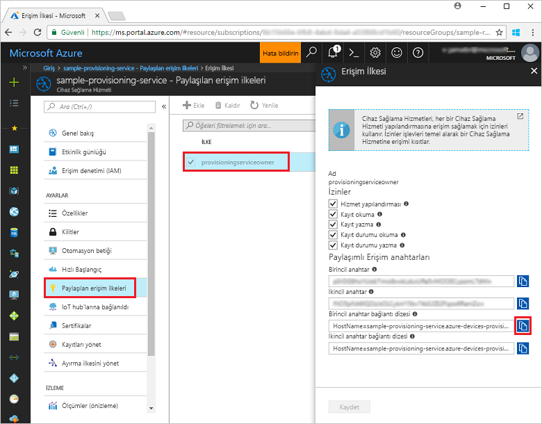

# <a name="quickstart-enroll-x509-devices-to-the-device-provisioning-service-using-nodejs"></a>Hızlı başlangıç: Node.js kullanarak X.509 cihazlarını Cihaz Sağlama Hizmeti'ne kaydetme

[!INCLUDE [iot-dps-selector-quick-enroll-device-x509](../../includes/iot-dps-selector-quick-enroll-device-x509.md)]

Bu hızlı başlangıçta, ara veya kök CA X. 509.440 sertifikaları kullanan bir kayıt grubunu programlı bir şekilde oluşturmak için Node. js ' yi kullanırsınız. Kayıt grubu, Node. js için IoT SDK ve örnek Node. js uygulaması kullanılarak oluşturulur.

## <a name="prerequisites"></a>Önkoşullar

- [IoT Hub cihaz sağlama hizmetini Azure Portal Ile ayarlama](./quick-setup-auto-provision.md)işlemi tamamlandı.
- Etkin aboneliği olan bir Azure hesabı. [Ücretsiz bir tane oluşturun](https://azure.microsoft.com/free/?ref=microsoft.com&utm_source=microsoft.com&utm_medium=docs&utm_campaign=visualstudio).
- [Node. js v 4.0 +](https://nodejs.org). Bu hızlı başlangıçta [Node. js Için ıOT SDK](https://github.com/Azure/azure-iot-sdk-node) yüklenir.
- [Git](https://git-scm.com/download/).
- [Azure IoT C SDK](https://github.com/Azure/azure-iot-sdk-c).

## <a name="prepare-test-certificates"></a>Test sertifikalarını hazırlama

Bu hızlı başlangıç için ara veya kök CA X.509 sertifikasının ortak bölümünü içeren bir .pem veya .cer dosyasına sahip olmanız gerekir. Bu sertifikanın sağlama hizmetinize yüklenmesi ve hizmet tarafından doğrulanması gerekir.

Azure IoT Hub ve Cihaz Sağlama Hizmeti ile X.509 sertifikası tabanlı Ortak Anahtar Altyapısı'nı (PKI) kullanma hakkında daha fazla bilgi için bkz. [X.509 CA sertifikası güvenliğine genel bakış](https://docs.microsoft.com/azure/iot-hub/iot-hub-x509ca-overview).

[Azure IoT C SDK'sı](https://github.com/Azure/azure-iot-sdk-c) X.509 sertifika zinciri oluşturmanıza, bu zincirdeki bir kök veya ara sertifikayı yüklemenize ve sertifikayı doğrulamak için hizmette sahip olma onayı gerçekleştirmenize yardımcı olabilecek test araçları içerir. SDK aracıyla oluşturulan sertifikalar **yalnızca geliştirme testi** amacıyla kullanılacak şekilde tasarlanmıştır. Bu sertifikalar **üretim ortamında kullanılmamalıdır**. Sertifikalarda 30 gün sonra süresi dolacak değiştirilemeyen parolalar ("1234") bulunur. Üretim ortamında kullanıma uygun sertifikalar almayı öğrenmek için, Azure IoT Hub belgelerinde [X.509 CA sertifikası alma](https://docs.microsoft.com/azure/iot-hub/iot-hub-x509ca-overview#how-to-get-an-x509-ca-certificate) konusuna bakın.

Bu test araçlarını kullanarak sertifika üretmek için aşağıdaki adımları izleyin:
 
1. Azure IoT C SDK 'sının [en son sürümü](https://github.com/Azure/azure-iot-sdk-c/releases/latest) için etiket adını bulun.

2. Komut istemi veya Git Bash kabuğu açın ve makinenizdeki çalışma klasörüne geçin. [Azure IoT C SDK](https://github.com/Azure/azure-iot-sdk-c) GitHub deposunun en son sürümünü kopyalamak için aşağıdaki komutları çalıştırın. Önceki adımda bulduğunuz etiketi `-b` parametresinin değeri olarak kullanın:

    ```cmd/sh
    git clone -b <release-tag> https://github.com/Azure/azure-iot-sdk-c.git
    cd azure-iot-sdk-c
    git submodule update --init
    ```

    Bu işlemin tamamlanması için birkaç dakika beklemeniz gerekebilir.

   Test araçları kopyaladığınız deponun *azure-iot-sdk-c/tools/CACertificates* dizininde bulunur.

3. [Örnekler ve öğreticiler için test amaçlı CA sertifikalarını yönetme](https://github.com/Azure/azure-iot-sdk-c/blob/master/tools/CACertificates/CACertificateOverview.md) adımlarını izleyin. 


## <a name="create-the-enrollment-group-sample"></a>Kayıt grubu örneğini oluşturma 

Azure IoT Cihaz Sağlama Hizmeti iki tür kaydı destekler:

- [Kayıt grupları](concepts-service.md#enrollment-group): Birden fazla ilgili cihazı kaydetmek için kullanılır.
- [Bireysel](concepts-service.md#individual-enrollment)kayıtlar: tek bir cihazı kaydetmek için kullanılır.

Kayıt grubu, sertifika zincirlerinde ortak imzalama sertifikasını paylaşan cihazlar için sağlama hizmetine erişimi denetler. Daha fazla bilgi edinmek için bkz. [X.509 sertifikalarıyla sağlama hizmetine cihaz erişimini denetleme](./concepts-security.md#controlling-device-access-to-the-provisioning-service-with-x509-certificates).
 
1. Çalışma klasöründeki bir komut penceresinden şu komutu çalıştırın:
  
     ```cmd\sh
     npm install azure-iot-provisioning-service
     ```  

2. Bir metin düzenleyicisi kullanarak çalışma klasörünüzde **create_enrollment_group.js** adlı bir dosya oluşturun. Dosyaya aşağıdaki kodu ekleyip kaydedin:

    ```
    'use strict';
    var fs = require('fs');

    var provisioningServiceClient = require('azure-iot-provisioning-service').ProvisioningServiceClient;

    var serviceClient = provisioningServiceClient.fromConnectionString(process.argv[2]);

    var enrollment = {
      enrollmentGroupId: 'first',
      attestation: {
        type: 'x509',
        x509: {
          signingCertificates: {
            primary: {
              certificate: fs.readFileSync(process.argv[3], 'utf-8').toString()
            }
          }
        }
      },
      provisioningStatus: 'disabled'
    };

    serviceClient.createOrUpdateEnrollmentGroup(enrollment, function(err, enrollmentResponse) {
      if (err) {
        console.log('error creating the group enrollment: ' + err);
      } else {
        console.log("enrollment record returned: " + JSON.stringify(enrollmentResponse, null, 2));
        enrollmentResponse.provisioningStatus = 'enabled';
        serviceClient.createOrUpdateEnrollmentGroup(enrollmentResponse, function(err, enrollmentResponse) {
          if (err) {
            console.log('error updating the group enrollment: ' + err);
          } else {
            console.log("updated enrollment record returned: " + JSON.stringify(enrollmentResponse, null, 2));
          }
        });
      }
    });
    ```

## <a name="run-the-enrollment-group-sample"></a>Kayıt grubu örneğini çalıştırma
 
1. Örneği çalıştırmak için sağlama hizmetinizin bağlantı dizesine ihtiyacınız vardır. 
    1. Azure portal oturum açın, sol taraftaki menüden **tüm kaynaklar** düğmesini seçin ve cihaz sağlama hizmetinizi açın. 
    2. **Paylaşılan erişim ilkeleri**' ne tıklayın ve ardından özelliklerini açmak için kullanmak istediğiniz erişim ilkesini seçin. **Erişim İlkesi** penceresinde birincil anahtar bağlantı dizesini kopyalayın ve not edin. 

        


3. [Test sertifikalarını hazırlama](quick-enroll-device-x509-node.md#prepare-test-certificates) bölümünde belirtildiği üzere önceden sağlama hizmetinize yüklenmiş ve doğrulanmış bir X.509 ara veya kök CA sertifikasını içeren bir .pem dosyasına da ihtiyacınız vardır. Sertifikanızın karşıya yüklenip doğrulandığını denetlemek için, Azure portal cihaz sağlama hizmeti Özeti sayfasında, **Sertifikalar**' ı seçin. Grup kaydı için kullanmak istediğiniz sertifikayı bulun ve durum değerinin *doğrulandı* olduğundan emin olun.

     

1. Sertifikanız için bir [kayıt grubu](concepts-service.md#enrollment-group) oluşturmak için aşağıdaki komutu çalıştırın (komut bağımsız değişkenlerine tırnak işareti ekleyin):
 
     ```cmd\sh
     node create_enrollment_group.js "<the connection string for your provisioning service>" "<your certificate's .pem file>"
     ```
 
3. Oluşturma başarılı olursa komut penceresinde yeni kayıt grubunun özellikleri görüntülenir.

     

4. Kayıt grubunun oluşturulduğundan emin olun. Azure portalının Cihaz Sağlama Hizmeti özet dikey penceresinde, **Kayıtları yönetme**'yi seçin. **Kayıt Grupları** sekmesini seçip yeni kayıt girişinin (*ilk sırada*) mevcut olduğundan emin olun.

     
 
## <a name="clean-up-resources"></a>Kaynakları temizleme
Node. js hizmet örneklerini keşfetmeyi planlıyorsanız, bu hızlı başlangıçta oluşturulan kaynakları temizlemeyin. Devam etmeyi planlamıyorsanız, bu hızlı başlangıç tarafından oluşturulan tüm Azure kaynaklarını silmek için aşağıdaki adımları kullanın.
 
1. Makinenizdeki Node.js örnek çıktı penceresini kapatın.
2. Azure portal cihaz sağlama hizmetine gidin, kayıtları **Yönet**' i seçin ve ardından **kayıt grupları** sekmesini seçin. bu hızlı başlangıcı kullanarak kaydettiğiniz X. 509.440 cihazları için *Grup adının* yanındaki onay kutusunu işaretleyin ve bölmenin en üstündeki **Sil** düğmesine basın.    
3. Azure portal cihaz sağlama hizmetinizden **Sertifikalar**' ı seçin, bu hızlı başlangıç için karşıya yüklediğiniz sertifikayı seçin ve **sertifika ayrıntıları** penceresinin en üstündeki **Sil** düğmesine basın.  
 
## <a name="next-steps"></a>Sonraki adımlar

Bu hızlı başlangıçta, Azure IoT Hub cihaz sağlama hizmeti 'ni kullanarak X. 509.952 ara veya kök CA sertifikası için bir grup kaydı oluşturdunuz. Cihaz sağlama hakkında ayrıntılı bilgi edinmek için Azure portalında Cihaz Sağlama Hizmeti ayarları öğreticisine geçin. 

Ayrıca bkz. [Node. js cihaz sağlama örneği](https://github.com/Azure/azure-iot-sdk-node/tree/master/provisioning/device/samples).
 
> [!div class="nextstepaction"]
> [Azure IoT Hub Cihazı Sağlama Hizmeti öğreticileri](./tutorial-set-up-cloud.md)
