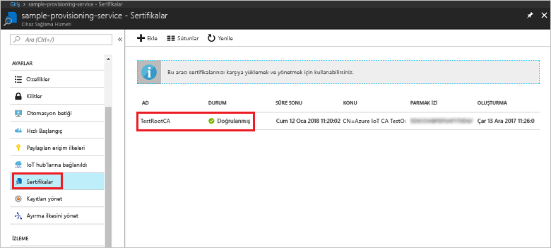

# <a name="quickstart-enroll-x509-devices-to-the-device-provisioning-service-using-nodejs"></a>Hızlı başlangıç: Node.js kullanarak X.509 cihazlarını Cihaz Sağlama Hizmeti'ne kaydetme

[!INCLUDE [iot-dps-selector-quick-enroll-device-x509](../../includes/iot-dps-selector-quick-enroll-device-x509.md)]

Bu hızlı başlatmada, programlı ca X.509 sertifikalarını kullanan bir kayıt grubu oluşturmak için Node.js kullanırsınız. Kayıt grubu Node.js için IoT SDK'sı ve örnek Node.js uygulaması kullanılarak oluşturulur.

## <a name="prerequisites"></a>Ön koşullar

- Azure [portalı ile IoT Hub Aygıt Sağlama Hizmetini Ayarlama'nın](./quick-setup-auto-provision.md)tamamlanması.
- Etkin bir aboneliği olan bir Azure hesabı. [Ücretsiz bir tane oluşturun.](https://azure.microsoft.com/free/?ref=microsoft.com&utm_source=microsoft.com&utm_medium=docs&utm_campaign=visualstudio)
- [Düğüm.js v4.0+](https://nodejs.org). Bu hızlı başlatma aşağıdaki [Düğüm.js için IoT SDK](https://github.com/Azure/azure-iot-sdk-node) yükler.
- [Git.](https://git-scm.com/download/)
- [Azure IoT C SDK](https://github.com/Azure/azure-iot-sdk-c).

## <a name="prepare-test-certificates"></a>Test sertifikalarını hazırlama

Bu hızlı başlangıç için ara veya kök CA X.509 sertifikasının ortak bölümünü içeren bir .pem veya .cer dosyasına sahip olmanız gerekir. Bu sertifikanın sağlama hizmetinize yüklenmesi ve hizmet tarafından doğrulanması gerekir.

Azure IoT Hub ve Cihaz Sağlama Hizmeti ile X.509 sertifikası tabanlı Ortak Anahtar Altyapısı'nı (PKI) kullanma hakkında daha fazla bilgi için bkz. [X.509 CA sertifikası güvenliğine genel bakış](https://docs.microsoft.com/azure/iot-hub/iot-hub-x509ca-overview).

[Azure IoT C SDK'sı](https://github.com/Azure/azure-iot-sdk-c) X.509 sertifika zinciri oluşturmanıza, bu zincirdeki bir kök veya ara sertifikayı yüklemenize ve sertifikayı doğrulamak için hizmette sahip olma onayı gerçekleştirmenize yardımcı olabilecek test araçları içerir. SDK aracıyla oluşturulan sertifikalar **yalnızca geliştirme testi** amacıyla kullanılacak şekilde tasarlanmıştır. Bu sertifikalar **üretim ortamında kullanılmamalıdır**. Sertifikalarda 30 gün sonra süresi dolacak değiştirilemeyen parolalar ("1234") bulunur. Üretim ortamında kullanıma uygun sertifikalar almayı öğrenmek için, Azure IoT Hub belgelerinde [X.509 CA sertifikası alma](https://docs.microsoft.com/azure/iot-hub/iot-hub-x509ca-overview#how-to-get-an-x509-ca-certificate) konusuna bakın.

Bu test araçlarını kullanarak sertifika üretmek için aşağıdaki adımları izleyin:
 
1. Azure IoT C SDK'nın [en son sürümü](https://github.com/Azure/azure-iot-sdk-c/releases/latest) için etiket adını bulun.

2. Komut istemi veya Git Bash kabuğu açın ve makinenizdeki çalışma klasörüne geçin. [Azure IoT C SDK](https://github.com/Azure/azure-iot-sdk-c) GitHub deposunun en son sürümünde klonlamak için aşağıdaki komutları çalıştırın. Önceki adımda bulduğunuz etiketi `-b` parametre nin değeri olarak kullanın:

    ```cmd/sh
    git clone -b <release-tag> https://github.com/Azure/azure-iot-sdk-c.git
    cd azure-iot-sdk-c
    git submodule update --init
    ```

    Bu işlemin tamamlanması için birkaç dakika beklemeniz gerekebilir.

   Test araçları kopyaladığınız deponun *azure-iot-sdk-c/tools/CACertificates* dizininde bulunur.

3. [Örnekler ve öğreticiler için test amaçlı CA sertifikalarını yönetme](https://github.com/Azure/azure-iot-sdk-c/blob/master/tools/CACertificates/CACertificateOverview.md) adımlarını izleyin. 


## <a name="create-the-enrollment-group-sample"></a>Kayıt grubu örneğini oluşturma 

Azure IoT Cihaz Sağlama Hizmeti iki tür kaydı destekler:

- [Kayıt grupları](concepts-service.md#enrollment-group): Birden fazla ilgili cihazı kaydetmek için kullanılır.
- [Tek tek kayıtlar](concepts-service.md#individual-enrollment): Tek bir cihazı kaydetmek için kullanılır.

Kayıt grubu, sertifika zincirlerinde ortak imzalama sertifikasını paylaşan cihazlar için sağlama hizmetine erişimi denetler. Daha fazla bilgi edinmek için bkz. [X.509 sertifikalarıyla sağlama hizmetine cihaz erişimini denetleme](./concepts-security.md#controlling-device-access-to-the-provisioning-service-with-x509-certificates).
 
1. Çalışma klasöründeki bir komut penceresinden şu komutu çalıştırın:
  
     ```cmd\sh
     npm install azure-iot-provisioning-service
     ```  

2. Bir metin düzenleyicisi kullanarak çalışma klasörünüzde **create_enrollment_group.js** adlı bir dosya oluşturun. Dosyaya aşağıdaki kodu ekleyip kaydedin:

    ```
    'use strict';
    var fs = require('fs');

    var provisioningServiceClient = require('azure-iot-provisioning-service').ProvisioningServiceClient;

    var serviceClient = provisioningServiceClient.fromConnectionString(process.argv[2]);

    var enrollment = {
      enrollmentGroupId: 'first',
      attestation: {
        type: 'x509',
        x509: {
          signingCertificates: {
            primary: {
              certificate: fs.readFileSync(process.argv[3], 'utf-8').toString()
            }
          }
        }
      },
      provisioningStatus: 'disabled'
    };

    serviceClient.createOrUpdateEnrollmentGroup(enrollment, function(err, enrollmentResponse) {
      if (err) {
        console.log('error creating the group enrollment: ' + err);
      } else {
        console.log("enrollment record returned: " + JSON.stringify(enrollmentResponse, null, 2));
        enrollmentResponse.provisioningStatus = 'enabled';
        serviceClient.createOrUpdateEnrollmentGroup(enrollmentResponse, function(err, enrollmentResponse) {
          if (err) {
            console.log('error updating the group enrollment: ' + err);
          } else {
            console.log("updated enrollment record returned: " + JSON.stringify(enrollmentResponse, null, 2));
          }
        });
      }
    });
    ```

## <a name="run-the-enrollment-group-sample"></a>Kayıt grubu örneğini çalıştırma
 
1. Örneği çalıştırmak için sağlama hizmetinizin bağlantı dizesine ihtiyacınız vardır. 
    1. Azure portalında oturum açın, sol menüdeki **Tüm kaynaklar** düğmesini seçin ve Cihaz Sağlama hizmetinizi açın. 
    2. **Paylaşılan erişim ilkelerini**tıklatın ve özelliklerini açmak için kullanmak istediğiniz erişim ilkesini seçin. **Erişim İlkesi** penceresinde birincil anahtar bağlantı dizesini kopyalayın ve not edin. 

        


3. [Test sertifikalarını hazırlama](quick-enroll-device-x509-node.md#prepare-test-certificates) bölümünde belirtildiği üzere önceden sağlama hizmetinize yüklenmiş ve doğrulanmış bir X.509 ara veya kök CA sertifikasını içeren bir .pem dosyasına da ihtiyacınız vardır. Sertifikanızın yüklendiğini ve doğrulandığını kontrol etmek için Azure portalındaki Aygıt Sağlama Hizmeti özet sayfasında **Sertifikalar'ı**seçin. Grup kaydı için kullanmak istediğiniz sertifikayı bulun ve durum değerinin *doğrulandı* olduğundan emin olun.

     

1. Sertifikanız için bir [kayıt grubu](concepts-service.md#enrollment-group) oluşturmak için aşağıdaki komutu çalıştırın (komut bağımsız değişkenleri etrafında tırnak ekle):
 
     ```cmd\sh
     node create_enrollment_group.js "<the connection string for your provisioning service>" "<your certificate's .pem file>"
     ```
 
3. Oluşturma başarılı olursa komut penceresinde yeni kayıt grubunun özellikleri görüntülenir.

     

4. Kayıt grubunun oluşturulduğundan emin olun. Azure portalının Cihaz Sağlama Hizmeti özet dikey penceresinde, **Kayıtları yönetme**'yi seçin. **Kayıt Grupları** sekmesini seçip yeni kayıt girişinin (*ilk sırada*) mevcut olduğundan emin olun.

     
 
## <a name="clean-up-resources"></a>Kaynakları temizleme
Düğüm.js hizmet örneklerini keşfetmeyi planlıyorsanız, bu hızlı başlangıçta oluşturulan kaynakları temizlemeyin. Devam etmeyi planlamıyorsanız, bu hızlı başlatma yla oluşturulan tüm Azure kaynaklarını silmek için aşağıdaki adımları kullanın.
 
1. Makinenizdeki Node.js örnek çıktı penceresini kapatın.
2. Azure portalında Cihaz Sağlama hizmetinize gidin, **kayıtları Yönet'i**seçin ve ardından **Kayıt Grupları** sekmesini seçin. Bu hızlı başlangıç kullanarak kaydolduğunuz X.509 aygıtları için *GROUP NAME'nin* yanındaki onay kutusunu seçin ve bölmenin üst kısmındaki **Sil** düğmesine basın.    
3. Azure portalındaki Aygıt Sağlama **hizmetinizden, Sertifikalar'ı**seçin, bu hızlı başlangıç için yüklediğiniz sertifikayı seçin ve **Sertifika Ayrıntıları** penceresinin üst kısmındaki **Sil** düğmesine basın.  
 
## <a name="next-steps"></a>Sonraki adımlar

Bu hızlı başlangıçta, Azure IoT Hub Aygıt Sağlama Hizmeti'ni kullanarak X.509 ara veya kök CA sertifikası için bir grup kaydı oluşturdunuz. Cihaz sağlama hakkında ayrıntılı bilgi edinmek için Azure portalında Cihaz Sağlama Hizmeti ayarları öğreticisine geçin. 

Ayrıca, [Node.js cihaz sağlama örneğine](https://github.com/Azure/azure-iot-sdk-node/tree/master/provisioning/device/samples)bakın.
 
> [!div class="nextstepaction"]
> [Azure IoT Hub Cihazı Sağlama Hizmeti öğreticileri](./tutorial-set-up-cloud.md)
