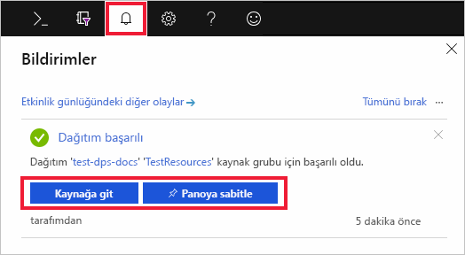

# Quickstart: Azure portalı yla IoT Hub Aygıt Sağlama Hizmetini ayarlama

IoT Hub Cihaz Sağlama Hizmeti, ioT Hub ile birlikte, insan müdahalesi gerektirmeden istenilen IoT hub'ına sıfır dokunuş, tam zamanında zamanında sağlanmasını sağlayarak müşterilerin milyonlarca IoT aygıtını güvenli ve ölçeklenebilir bir şekilde sağlamasını sağlamak için kullanılabilir. Azure IoT Hub Aygıt Sağlama Hizmeti, TPM, simetrik anahtar ve X.509 sertifika kimlik doğrulamalarına sahip IoT aygıtlarını destekler. Daha fazla bilgi için lütfen [IoT Hub Cihaz Sağlama Hizmetine genel bakış](./about-iot-dps.md)

Bu hızlı başlangıçta, aygıtlarınıza aşağıdaki adımları sağlamak için Azure Portalı'nda IoT Hub Aygıt Sağlama Hizmetini nasıl ayarlayabileceğinizi öğreneceksiniz:
> [!div class="checklist"]
> * IoT Hub'ı oluşturmak için Azure portalını kullanma
> * IoT Hub Cihazı Sağlama Hizmeti oluşturmak ve kimlik kapsamını almak için Azure portalını kullanma
> * IoT hub’ı Cihaz Sağlama Hizmeti’ne bağlama

Azure aboneliğiniz yoksa, başlamadan önce [ücretsiz](https://azure.microsoft.com/free/?WT.mc_id=A261C142F) bir hesap oluşturun.

## IoT hub oluşturma

[!INCLUDE [iot-hub-include-create-hub](../../includes/iot-hub-include-create-hub.md)]

## Yeni bir IoT Hub Cihaz Sağlama Hizmeti Oluşturma

1. + Kaynak düğmesini yeniden **oluşturun'** seçeneğini belirleyin.

2. **Aygıt Sağlama Hizmeti**için Pazar *Yeri'nde arama yapın.* **IoT Hub Aygıt Sağlama Hizmeti'ni** seçin ve **Oluştur** düğmesine basın. 

3. Yeni Cihaz Sağlama Hizmeti örneğiniz için aşağıdaki bilgileri sağlayın ve **Oluştur'a**çarptı.

    * **Ad:** Yeni Cihaz Sağlama Hizmeti örneğiniz için benzersiz bir ad girin. Girdiğiniz ad kullanılabilir durumdaysa yeşil bir onay işareti görünür.
    * **Abonelik**: Bu Cihaz Sağlama Hizmeti örneğini oluşturmak için kullanmak istediğiniz aboneliği seçin.
    * **Kaynak grubu:** Bu alan yeni örneği içerecek yeni kaynak grubunu oluşturmanızı veya mevcut bir kaynak grubunu seçmenizi sağlar. Yukarıda oluşturduğunuz IoT hub'ını içeren kaynak grubunu seçin; örneğin, **TestResources**. İlgili tüm kaynakları aynı gruba birlikte koyarak, bunları birlikte yönetebilirsiniz. Örneğin, kaynak grubunu sildiğinizde o grupta bulunan tüm kaynaklar da silinir. Daha fazla bilgi için [bkz.](../azure-resource-manager/management/manage-resource-groups-portal.md)
    * **Yer:** Aygıtlarınıza en yakın konumu seçin.

        

4. Kaynak örneğinin oluşturulmasını izlemek için bildirim düğmesini seçin. Hizmet başarıyla dağıtıldıktan **sonra, panoya Sabitle'yi**seçin ve ardından **kaynağa gidin.**

    

## IoT merkezini ve Cihaz Sağlama Hizmetinizi bağlayın

Bu bölümde, Aygıt Sağlama Hizmeti örneğine bir yapılandırma eklersiniz. Bu yapılandırma, cihazların sağlanacağı IOT hub'ı ayarlar.

1. Azure portalının sol menüsünden **Tüm kaynaklar** düğmesini seçin. Önceki bölümde oluşturduğunuz Cihaz Sağlama Hizmeti örneğini seçin. 

    Menünüz portal ayarlarında **Docked** modu yerine **Flyout** kullanılarak yapılandırılırsa, soldaki portal menüsünü açmak için sol üstteki 3 satırı tıklatmanız gerekir.  

2. Aygıt Sağlama Hizmeti'nin menüsünden **Bağlantılı IoT hub'larını**seçin. Üstte görülen **+ Ekle** düğmesine basın. 

3. **IoT hub'a bağlantı ekle** sayfasında, yeni Cihaz Sağlama Hizmeti örneğinizi IoT hub'a bağlamak için aşağıdaki bilgileri sağlayın. Sonra **Kaydet**tuşuna bas. 

    * **Abonelik:** Yeni Cihaz Sağlama Hizmeti örneğinizle bağlamak istediğiniz IoT hub'ı içeren aboneliği seçin.
    * **Iot hub'ı:** Yeni Cihaz Sağlama Hizmeti örneğinize bağlanacak IoT hub'ı seçin.
    * **Erişim İlkesi:** IoT hub'ı ile bağlantı oluşturmak için kimlik bilgileri olarak **iothubowner** öğesini seçin.  

        

3. Seçili hub’ı **Bağlantılı IoT hub'ları** dikey penceresinde görürsünüz. Ortaya çıkmak için **Yenile** tuşuna basmanız gerekebilir.

## Kaynakları temizleme

Bu koleksiyondaki diğer hızlı başlangıçlar, bu hızlı başlangıcı temel alır. Sonraki hızlı başlangıçlar veya öğreticilerle devam etmeyi planlıyorsanız, bu hızlı başlangıçta oluşturulan kaynakları temizlemeyin. Devam etmeyi planlamıyorsanız Azure portalında bu hızlı başlangıç ile oluşturulan tüm kaynakları silmek için aşağıdaki adımları kullanın.

1. Azure portalındaki sol menüden Tüm **kaynakları** seçin ve ardından Aygıt Sağlama Hizmeti'ni seçin. Aygıt ayrıntı bölmesinin üst kısmında **Sil'i**seçin.  
2. Azure portalındaki sol menüden Tüm **kaynakları** seçin ve ardından IoT hub'ınızı seçin. Hub ayrıntı bölmesinin üst kısmında **Sil'i**seçin.  

## Sonraki adımlar

Bu hızlı başlangıçta, bir IoT hub'ı ve aygıt sağlama hizmeti örneğini dağıttınız ve iki kaynağı birbirine bağladınız. Bu kurulumu niçin simüle edilmiş bir aygıt sağlamak için kullanacağınızı öğrenmek için, benzetilen bir aygıt oluşturmak için hızlı başlatmaya devam edin.

> [!div class="nextstepaction"]
> [Simüle edilmiş bir aygıt oluşturmak için hızlı başlatma](./quick-create-simulated-device-symm-key.md)
