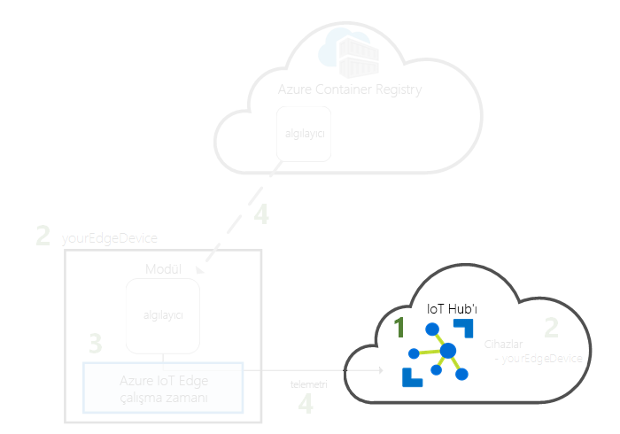
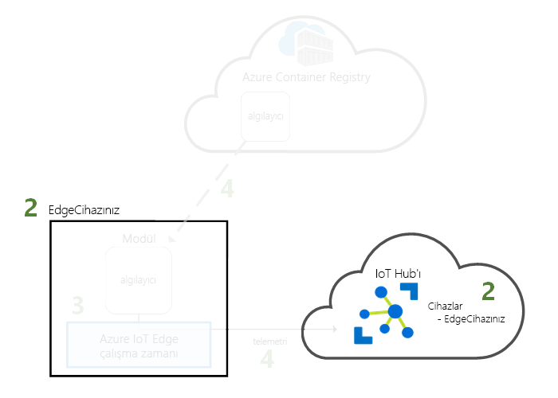
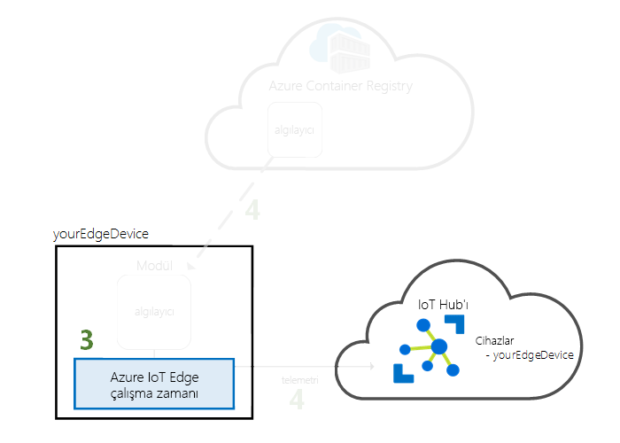

# <a name="quickstart-deploy-your-first-iot-edge-module-to-a-windows-device-preview"></a>Hızlı başlangıç: ilk IoT Edge modülünüzü bir Windows cihazına dağıtma (Önizleme)

Windows IoT Edge cihazında bir Linux 'a Kapsayıcılı kod dağıtarak bu hızlı başlangıçta Azure IoT Edge deneyin. IoT Edge, iş yüklerinizi kenarda daha fazla gönderebilmeniz için cihazlarınızda kodu uzaktan yönetmenizi sağlar. Bu hızlı başlangıçta, Windows 'da Linux için Azure IoT Edge kullanmanın ne kadar kolay olduğunu görmek için kendi cihazınızı kullanmanızı öneririz.

Bu hızlı başlangıçta şunları yapmayı öğrenirsiniz:

* IoT Hub 'ı oluşturun.
* Bir IoT Edge cihazını IoT hub'ınıza kaydetme.
* Windows çalışma zamanı üzerindeki Linux için IoT Edge cihazınıza yükleyip başlatın.
* Bir IoT Edge cihaza uzaktan bir modül dağıtın ve telemetri gönderin.


Bu hızlı başlangıçta, Windows cihazında Linux için Azure IoT Edge ayarlama işlemi adım adım gösterilmektedir. Daha sonra, Azure portal bir modülü cihazınıza dağıtırsınız. Bu hızlı başlangıçta kullanılan modül, sıcaklık, nem ve basınç verileri oluşturan bir sanal sensördür. Diğer Azure IoT Edge öğreticileri, iş öngörüleri için sanal verileri çözümleyen ek modüller dağıtarak, burada yaptığınız işi oluşturur.

Etkin bir Azure aboneliğiniz yoksa başlamadan önce [ücretsiz bir hesap](https://azure.microsoft.com/free) oluşturun.

>[!NOTE]
>Windows üzerinde Linux için IoT Edge [genel önizlemede](https://azure.microsoft.com/support/legal/preview-supplemental-terms/).

## <a name="prerequisites"></a>Önkoşullar

Ortamınızı Azure CLı için hazırlayın.

[!INCLUDE [azure-cli-prepare-your-environment-no-header.md](../../includes/azure-cli-prepare-your-environment-no-header.md)]

Bulut kaynakları:

* Bu hızlı başlangıçta kullandığınız tüm kaynakları yönetmek için kullanacağınız bir kaynak grubu.

   ```azurecli-interactive
   az group create --name IoTEdgeResources --location westus2
   ```

IoT Edge cihazı:

* Cihazınızın bir Windows bılgısayar veya sunucu, sürüm 1809 veya üzeri olması gerekir
* En az 4 GB bellek, önerilen 8 GB bellek
* 10 GB boş disk alanı

## <a name="create-an-iot-hub"></a>IoT hub oluşturma

Azure CLı ile IoT Hub 'ı oluşturarak hızlı başlangıcı başlatın.



IoT Hub’ın ücretsiz düzeyi bu hızlı başlangıç için kullanılabilir. Geçmişte IoT Hub kullandıysanız ve zaten oluşturulmuş bir hub 'ınız varsa, bu IoT Hub 'ını kullanabilirsiniz.

Aşağıdaki kod, kaynak grubunda ücretsiz bir **F1** hub oluşturur `IoTEdgeResources` . `{hub_name}`IoT Hub 'ınız için benzersiz bir adla değiştirin. IoT Hub oluşturmak birkaç dakika sürebilir.

   ```azurecli-interactive
   az iot hub create --resource-group IoTEdgeResources --name {hub_name} --sku F1 --partition-count 2
   ```

   Aboneliğinizde zaten bir ücretsiz hub olduğu için hata alırsanız, SKU değerini **S1** olarak değiştirin. IoT Hub adının kullanılamadığı bir hata alırsanız, başka birinin zaten bu adı taşıyan bir hub 'ı olduğu anlamına gelir. Yeni bir ad deneyin.

## <a name="register-an-iot-edge-device"></a>IoT Edge cihazı kaydetme

Yeni oluşturulan IoT hub'ına bir IoT Edge cihazı kaydedin.



IoT hub'ınızla iletişim kurabilmesi amacıyla simülasyon cihazınız için bir cihaz kimliği oluşturun. Cihaz kimliği bulutta kalır ve fiziksel cihazla cihaz kimliği arasında bağlantı kurmak için benzersiz bir bağlantı dizesi kullanmanız gerekir.

IoT Edge cihazlar sıradan IoT cihazlarından farklı şekilde yönetilemediğinden, bu kimliği bayrağıyla IoT Edge bir cihaz için olacak şekilde bildirin `--edge-enabled` .

1. Azure Cloud Shell, hub 'ınızdaki **Myedgedevice** adlı bir cihaz oluşturmak için aşağıdaki komutu girin.

   ```azurecli-interactive
   az iot hub device-identity create --device-id myEdgeDevice --edge-enabled --hub-name {hub_name}
   ```

   İothubowner ilke anahtarları hakkında bir hata alırsanız, Cloud Shell Azure-IoT uzantısının en son sürümünü çalıştırdığından emin olun.

2. Fiziksel cihazınızı IoT Hub içindeki kimliğiyle bağlayan cihazınız için bağlantı dizesini görüntüleyin. IoT Hub 'ınızın adını, cihazınızın adını ve iki arasındaki bağlantıların kimliğini doğrulayan paylaşılan bir anahtarı içerir.

   ```azurecli-interactive
   az iot hub device-identity connection-string show --device-id myEdgeDevice --hub-name {hub_name}
   ```

3. JSON çıktısındaki `connectionString` anahtarının değerini kopyalayıp kaydedin. Bu değer, cihaz bağlantı dizesidir. Bu bağlantı dizesini bir sonraki bölümde IoT Edge çalışma zamanını yapılandırmak için kullanacaksınız.

   

## <a name="install-and-start-the-iot-edge-runtime"></a>IoT Edge çalışma zamanını yükleme ve başlatma

Cihazınıza Windows üzerinde Linux için IoT Edge yükleyip cihazı bir cihaz bağlantı dizesiyle yapılandırın.



1. [Windows yönetici merkezini indirin](https://aka.ms/WACDownloadEFLOW).
2. Cihazınızda Windows yönetici merkezini ayarlamak için Yükleme Sihirbazı ' nı izleyin.
3. Windows Yönetim Merkezi 'nde, ekranın sağ üst kısmında bulunan **Ayarlar dişli simgesini** seçin.  
4. Ayarlar menüsünde, ağ geçidi altında, **Uzantılar** ' ı seçin.
5. **Kullanılabilir uzantılar** listesinden **Azure IoT Edge** seçin
6. Uzantıyı **yükler**

7. Uzantı yüklendikten sonra, ekranın sol üst köşesindeki **Windows Yönetim Merkezi** ' ni seçerek ana pano sayfasına gidin.

8. Windows Yönetim Merkezi 'Ni çalıştırdığınız BILGISAYARı temsil eden yerel ana bilgisayar bağlantısını görürsünüz.

   :::image type="content" source="media/quickstart/windows-admin-center-start-page.png" alt-text="Ekran görüntüsü-Windows Yöneticisi başlangıç sayfası":::

9. **Ekle**’yi seçin.

   :::image type="content" source="media/quickstart/windows-admin-center-start-page-add.png" alt-text="Ekran görüntüsü-Windows Yöneticisi başlangıç sayfası Ekle düğmesi":::

10. Azure IoT Edge kutucuğunu bulun ve **Yeni oluştur**' u seçin. Bu, Yükleme Sihirbazı 'nı başlatacak.

    :::image type="content" source="media/quickstart/select-tile-screen.png" alt-text="Ekran görüntüsü-Windows kutucuğunda Linux Için Azure IoT Edge":::

11. EULA 'yı kabul etmek için Yükleme Sihirbazı 'nda ilerleyin ve **İleri ' yi** seçin.

    :::image type="content" source="media/quickstart/wizard-welcome-screen.png" alt-text="Ekran görüntüsü-sihirbaza hoş geldiniz":::

12. Microsoft 'un hizmet kalitesini izlemelerine ve korumasına yardımcı olan genişletilmiş Tanılama verileri sağlamak için **Isteğe bağlı tanılama verilerini** seçin ve ileri ' ye tıklayın **: dağıt**

    :::image type="content" source="media/quickstart/diagnostic-data-screen.png" alt-text="Ekran görüntüsü-Tanılama verileri":::

13. **Hedef cihaz Seç** ekranında, istenen hedef cihazınızı seçerek en düşük gereksinimleri karşıladığını doğrulayın. Bu hızlı başlangıç için yerel cihaza IoT Edge yüklüyorsunuz, bu nedenle localhost bağlantısını seçiyoruz. Onaylandıktan sonra devam etmek için **İleri** 'yi seçin

    :::image type="content" source="media/quickstart/wizard-select-target-device-screen.png" alt-text="Ekran görüntüsü-hedef cihaz Seç":::

14. **İleri**'yi seçerek varsayılan ayarları kabul edin.

15. Dağıtım ekranında, paketi yükleme, paketi yükleme, ana bilgisayarı yapılandırma ve Linux VM 'yi son ayarlama işlemi gösterilir.  Başarılı bir dağıtım şöyle görünür:

    :::image type="content" source="media/quickstart/wizard-deploy-success-screen.png" alt-text="Ekran görüntüsü-sihirbaz dağıtımı başarılı":::

16. Ileri ' ye tıklayın: Azure IoT Edge cihazınızı IoT Hub örneğiniz için cihaz KIMLIĞIYLE sağlamak üzere son adıma devam etmek için **Bağlan** ' a tıklayın.

17. Bağlantı dizesini cihazınızdan Azure IoT Hub kopyalayın ve cihaz bağlantı dizesi alanına yapıştırın. Ardından **Seçili yöntemle sağlamayı** seçin.

    > [!NOTE]
    > Bağlantı dizenizi almak için önceki bölümde 3. adıma bakın, [bir IoT Edge cihazı kaydedin](#register-an-iot-edge-device).

    :::image type="content" source="media/quickstart/wizard-provision.png" alt-text="Ekran görüntüsü-sihirbaz sağlama":::

18. Sağlama tamamlandıktan sonra **, Tamam ' ı seçin ve** Windows Yönetim Merkezi Başlangıç ekranına geri dönün. Artık cihazınızı IoT Edge bir cihaz olarak listelenmiş görebilmeniz gerekir.

    :::image type="content" source="media/quickstart/windows-admin-center-device-screen.png" alt-text="Ekran görüntüsü-Windows Yönetim Merkezi Azure IoT Edge cihaz":::

19. Panosunu görüntülemek için Azure IoT Edge cihazınızı seçin. Azure IoT Hub 'deki cihaz ikizi iş yüklerinin dağıtıldığını görmeniz gerekir. **IoT Edge modül listesinde** , **edgeagent** çalıştıran bir modül ve **IoT Edge durumunun** **etkin (çalışıyor)** gösterilmesi gerekir.

Artık IoT Edge cihazınız yapılandırıldı. Bulutta dağıtılan modülleri çalıştırmak için hazır.

## <a name="deploy-a-module"></a>Modül dağıtma

IoT Hub 'ye telemetri verileri gönderen bir modül dağıtmak için Azure IoT Edge cihazınızı buluttan yönetin.


[!INCLUDE [iot-edge-deploy-module](../../includes/iot-edge-deploy-module.md)]

## <a name="view-generated-data"></a>Oluşturulan verileri görüntüleme

Bu hızlı başlangıçta, yeni bir IoT Edge cihazı oluşturdunuz ve üzerine IoT Edge çalışma zamanını yüklediniz. Ardından, cihazın kendisinde değişiklik yapmak zorunda kalmadan cihazda çalıştırmak üzere bir IoT Edge modülünü dağıtmak için Azure portal kullandınız.

Bu durumda, gönderdiğiniz modül daha sonra test etmek için kullanabileceğiniz örnek ortam verileri oluşturur. Sanal algılayıcı hem makinenin hem de makinenin bulunduğu ortamın izlenmesini izler. Örneğin bu sensör bir sunucu odasında, fabrika sahasında veya rüzgar türbininde olabilir. İletide ortam sıcaklığı ve nemi, makine sıcaklığı ve basıncı ile bir zaman damgası bulunur. IoT Edge öğreticileri, bu modülle oluşturulan verileri analiz için test verileri olarak kullanır.

Buluttan dağıtılan modülün, Windows Yönetim Merkezi 'nde komut kabuğuna giderek IoT Edge cihazınızda çalıştığından emin olun.

1. Yeni oluşturulan IoT Edge cihazınıza bağlanın

   :::image type="content" source="media/quickstart/connect-edge-screen.png" alt-text="Ekran görüntüsü-cihazı bağlama":::

2. **Genel bakış** sayfasında, cihaz durumunun yanı sıra dağıtılan çeşitli modülleri görebileceğiniz **IoT Edge modül listesi** ve **IoT Edge durumu** görüntülenir.  

3. **Araçlar** altında **komut kabuğu**' nu seçin. Komut kabuğu, Windows BILGISAYARıNıZDAKI Azure IoT Edge cihazınızın Linux sanal makinesine bağlanmak için SSH (Secure Shell) otomatik olarak kullanan bir PowerShell terminalsidir.

   :::image type="content" source="media/quickstart/command-shell-screen.png" alt-text="Ekran görüntüsü-komut kabuğu":::

4. Cihazınızdaki üç modülü doğrulamak için aşağıdaki **Bash komutunu** çalıştırın:

   ```bash
   sudo iotedge list
   ```

   :::image type="content" source="media/quickstart/iotedge-list-screen.png" alt-text="Ekran görüntüsü-komut kabuğu listesi":::

5. Sıcaklık algılayıcısı modülünden buluta gönderilen iletileri görüntüleyin.

   ```bash
   iotedge logs SimulatedTemperatureSensor -f
   ```

   >[!TIP]
   >IoT Edge komutlar modül adlarına başvururken büyük/küçük harfe duyarlıdır.

   :::image type="content" source="media/quickstart/temperature-sensor-screen.png" alt-text="Ekran görüntüsü-sıcaklık algılayıcısı":::

Ayrıca, [Visual Studio Code Için Azure IoT Hub uzantısını](https://marketplace.visualstudio.com/items?itemName=vsciot-vscode.azure-iot-toolkit)kullanarak IoT Hub 'ınıza gelen iletileri izleyebilirsiniz.

## <a name="clean-up-resources"></a>Kaynakları temizleme

IoT Edge öğreticilerine devam etmek istiyorsanız bu hızlı başlangıçta kaydettiğiniz ve ayarladığınız cihazı kullanabilirsiniz. Aksi takdirde, ücretlendirmemek için oluşturduğunuz Azure kaynaklarını silebilirsiniz.

Sanal makinenizi ve IoT hub’ınızı yeni bir kaynak grubunda oluşturduysanız, bu grubu ve ilişkili tüm kaynaklarını silebilirsiniz. Tutmak istediğiniz bir şey olduğundan emin olmak için kaynak grubunun içeriğini iki kez kontrol edin. Tüm grubu silmek istemiyorsanız, bunun yerine tek tek kaynakları silebilirsiniz.

> [!IMPORTANT]
> Silinen kaynak grupları geri alınamaz.

**IoTEdgeResources** grubunu kaldırın. Bir kaynak grubunun silinmesi birkaç dakika sürebilir.

```azurecli-interactive
az group delete --name IoTEdgeResources
```

Kaynak gruplarının listesini görüntüleyerek, kaynak grubunun kaldırıldığını doğrulayabilirsiniz.

```azurecli-interactive
az group list
```

### <a name="clean-removal-of-azure-iot-edge-for-linux-on-windows"></a>Windows 'da Linux için Azure IoT Edge kaldırmayı Temizleme

Windows Yönetim Merkezi 'ndeki Pano uzantısı aracılığıyla IoT Edge cihazınızdan Linux için Azure IoT Edge yüklemesini kaldırabilirsiniz.

1. Windows Yönetim Merkezi 'nde Windows cihaz bağlantısı ' nda Linux için Azure IoT Edge bağlanın. Azure Pano aracı uzantısı yüklenir.
2. **Kaldır**'ı seçin. Windows üzerinde Linux için Azure IoT Edge kaldırıldıktan sonra, Windows Yönetim Merkezi Başlangıç sayfasına gidip Azure IoT Edge cihaz bağlantı girişini listeden kaldırır.

Windows sisteminizden Azure IoT Edge kaldırmanın bir diğer yolu da,   >    >    >    >  IoT Edge cihazınızda **kaldırma** Azure IoT Edge Başlat ayarları uygulamalarına gitmenin bir yoludur. Bu işlem IoT Edge cihazınızdan Azure IoT Edge kaldıracak, ancak Windows Yönetim Merkezi 'nde bağlantıyı geride bırakacaktır. Windows Yönetim Merkezi, Ayarlar menüsünden de kaldırılabilir.

## <a name="next-steps"></a>Sonraki adımlar

Bu hızlı başlangıçta bir IoT Edge cihaz oluşturdunuz ve cihaza kod dağıtmak için Azure IoT Edge bulut arabirimini kullandınız. Artık ortamı hakkında ham veri üreten bir test cihazınız var.

Bir sonraki adım, iş mantığınızı çalıştıran IoT Edge modüller oluşturmaya başlayabilmeniz için yerel geliştirme ortamınızı ayarlamanıza olanak sağlar.

> [!div class="nextstepaction"]
> [IoT Edge modülleri geliştirmeye başlama](tutorial-develop-for-linux.md)
