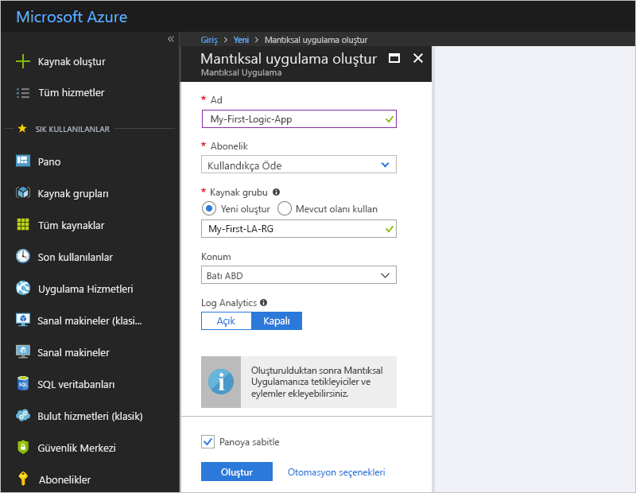
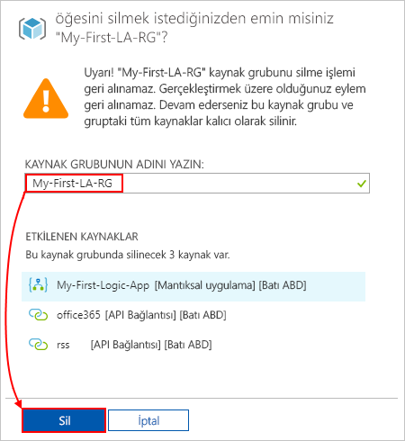

# Hızlı başlangıç: Azure Logic Apps - Azure portalını kullanarak ilk iş akışınızı oluşturun

Bu hızlı başlangıç, boş bir mantık uygulaması oluşturma, tetikleyici ve eylem ekleme ve ardından mantık uygulamanızı test etme gibi [Azure Mantık Uygulamaları'nı](../logic-apps/logic-apps-overview.md)kullanarak ilk iş akışınızı oluşturmanın arkasındaki temel genel kavramları tanır. Bu hızlı başlangıçta, yeni öğeler için bir web sitesinin RSS akışını düzenli olarak kontrol eden bir mantık uygulaması oluşturursunuz. Yeni öğeler varsa, mantıksal uygulama her öğe için bir e-posta gönderir. İşlemi tamamladığınızda, mantıksal uygulamanız bu yüksek düzeyli iş akışı gibi görünür:

Bu senaryo için, Office 365 Outlook, Outlook.com veya Gmail gibi Azure Mantık Uygulamaları tarafından desteklenen bir hizmetten bir e-posta hesabına ihtiyacınız vardır. Desteklenen diğer e-posta hizmetleri için [bağlayıcılar listesini buradan inceleyin.](https://docs.microsoft.com/connectors/) Bu örnekte, mantık uygulaması Office 365 Outlook kullanır. Farklı bir e-posta hizmeti kullanıyorsanız, genel genel adımlar aynıdır, ancak kullanıcı arabiriminiz biraz farklı olabilir.

Ayrıca, Azure aboneliğiniz yoksa [ücretsiz bir Azure hesabı için kaydolun](https://azure.microsoft.com/free/).

## Azure portalında oturum açın

Azure hesabınızın kimlik bilgileriyle [Azure portalında](https://portal.azure.com) oturum açın.

## Mantıksal uygulamanızı oluşturma

1. Azure giriş sayfasından, arama **kutusunda, Logic Apps'ı**bulun ve seçin.

   

1. Mantık **Uygulamaları** sayfasında **Ekle'yi**seçin.

   

1. Mantık **Uygulaması** bölmesinde, mantık uygulamanız hakkında aşağıda gösterildiği gibi ayrıntılı bilgi sağlayın. İşin bittikten sonra **Oluştur'u**seçin.

   

   | Özellik | Değer | Açıklama |
   |----------|-------|-------------|
   | **Adı** | <*mantık-uygulama adı*> | Yalnızca harfler, sayılar,`-`tireler ( ), alt çizer (`_`), parantez`(`( `)`, ),`.`ve dönemleri içerebilen mantık uygulama adınız ( ). Bu örnekte "My-First-Logic-App" kullan›l›r. |
   | **Abonelik** | <*Azure abonelik adı*> | Azure abonelik adınız |
   | **Kaynak grubu** | <*Azure-kaynak grubu adı*> | İlgili kaynakları düzenlemek için kullanılan [Azure kaynak grubunun](../azure-resource-manager/management/overview.md) adı. Bu örnekte "My-First-LA-RG" kullanışıktır. |
   | **Konum** | <*Azure bölgesi*> | Mantık uygulama bilgilerinizi depolayabilmek için bölge. Bu örnekte "Batı ABD" kullanılıyor. |
   | **Log Analytics** | Kapalı | Tanılama günlüğüne kaydetme ayarını **Kapalı** durumda bırakın. |
   ||||

1. Azure uygulamanızı dağıttıktan sonra, Azure araç çubuğunda, dağıtılan mantık uygulamanız için **Bildirimler** > **Git'i seçin.**

   

   Veya, arama kutusuna adını yazarak mantık uygulamanızı bulabilir ve seçebilirsiniz.

   Logic Apps Tasarımcısı açılır ve bir tanıtım videosu ile sık kullanılan tetikleyicilerin bulunduğu bir sayfa görüntülenir. **Şablonlar** altında **Boş Mantıksal Uygulama**'yı seçin.

   

Sonra, yeni bir RSS akışı öğesi göründüğünde tetiklenen bir [tetikleyici](../logic-apps/logic-apps-overview.md#logic-app-concepts) ekleyin. Her mantıksal uygulama, belirli bir olay gerçekleştiğinde ya da belirli bir koşul karşılandığında tetiklenen bir tetikleyiciyle başlamalıdır. Tetikleyici her çalıştığında, Azure Logic Apps motoru iş akışınızı başlatan ve çalıştıran bir mantık uygulaması örneği oluşturur.

## RSS tetikleyicisini ekleyin

1. Mantık **App Designer**, arama kutusunun altında, **Tümünü**seçin.

1. Arama kutusuna RSS konektörünü bulmak için girin. `rss` Tetikleyiciler listesinden, **ne zaman bir akış öğesi tetikleyicisi yayımlanır'ı** seçin.

   

1. Burada gösterildiği ve açıklandığı şekilde tetikleyiciniz için bu bilgileri sağlayın:

   

   | Özellik | Değer | Açıklama |
   |----------|-------|-------------|
   | **RSS akışının URL'si** | `http://feeds.reuters.com/reuters/topNews` | İzlemek istediğiniz RSS akışının bağlantısı |
   | **Interval** | 1 | Denetimler arasında beklenecek aralık sayısı |
   | **Frequency** | Dakika | Denetimler arası her aralık için zaman birimi  |
   ||||

   Aralık ve sıklık özelliği, mantıksal uygulamanızın tetikleyicisi için zamanlamayı tanımlar. Bu mantıksal uygulama, akışı dakika başı denetler.

1. Şimdilik tetikleyici ayrıntılarını daraltmak için, tetikleyicinin başlık çubuğunun içini tıklatın.

   

1. Mantıksal uygulamanızı kaydedin. Tasarımcı araç çubuğunda **Kaydet'i**seçin.

Mantıksal uygulamanız çalışıyor ancak RSS akışını kontrol etme dışında bir işlem gerçekleştirmiyor. Şimdi, tetikleyici etkinleştirildiğinde gerçekleştirilecek bir eylem ekleyin.

## "E-posta gönder" eylemini ekleyin

Şimdi, RSS akışında yeni bir öğe göründüğünde e-posta gönderen bir [eylem](../logic-apps/logic-apps-overview.md#logic-app-concepts) ekleyin.

1. Ne **zaman bir besleme öğesi yayımlanır** stetik altında, **Yeni adım**seçin.

   

1. Bir eylem ve arama kutusunu **seçin** **altında, Tümü'nü**seçin.

1. Arama kutusuna, `send an email` bu eylemi sunan bağlayıcıları bulmak için girin. Eylemler listesinden, kullanmak istediğiniz e-posta hizmeti için "e-posta gönder" eylemini seçin. Bu örnek, **e-posta gönder** eylemi olan Office 365 Outlook bağlayıcısını kullanır.

   

   Eylem listesini belirli bir uygulama veya hizmeti içerek şekilde filtrelemek için önce uygulama ya da hizmeti seçebilirsiniz:

   * Azure iş veya okul hesapları için Office 365 Outlook girişini seçin.
   * Kişisel Microsoft hesapları için Outlook.com girişini seçin.

1. Seçili e-posta bağlayıcınız kimliğinizi doğrulamanızı isterse, mantık uygulamanızla e-posta hizmetiniz arasında bir bağlantı oluşturmak için bu adımı şimdi tamamlayın.

   > [!NOTE]
   > Bu özel örnekte, kimliğinizi el ile doğrularsınız. Ancak, kimlik doğrulaması gerektiren bağlayıcılar destekledikleri kimlik doğrulama türlerinde farklılık gösterir. Kimlik doğrulamayı işlemek istediğiniz şekilde ayarlamak için seçenekleriniz de vardır. Örneğin, dağıtım için Azure Kaynak Yöneticisi şablonlarını kullandığınızda, bağlantı bilgileri gibi sık sık veya kolayca değiştirmek istediğiniz girişlerde güvenliği parametrenize alabilir ve geliştirebilirsiniz. Daha fazla bilgi için şu konulara bakın:
   >
   > * [Dağıtım için şablon parametreleri](../logic-apps/logic-apps-azure-resource-manager-templates-overview.md#template-parameters)
   > * [OAuth bağlantılarını yetkilendirme](../logic-apps/logic-apps-deploy-azure-resource-manager-templates.md#authorize-oauth-connections)
   > * [Yönetilen kimliklerle erişimi doğrulama](../logic-apps/create-managed-service-identity.md)
   > * [Mantık uygulaması dağıtımı için bağlantıları doğrula](../logic-apps/logic-apps-azure-resource-manager-templates-overview.md#authenticate-connections)

1. **E-posta gönderme** eyleminde, e-postanızın içermesini istediğiniz verileri belirtin.

   1. **Alıcı** kutusuna alıcının e-posta adresini girin. Test amacıyla e-posta adresinizi kullanabilirsiniz.

      Görüntülenen **Dinamik içerik ekle** listesini şimdilik yoksayın. Bazı düzenleme kutularının içine tıkladığınızda bu liste görünür ve önceki adımdan iş akışınıza girdi olarak ekleyebileceğiniz tüm kullanılabilir parametreleri gösterir.

   1. **Konu** kutusuna, sonuna bir boşluk koyarak şu metni girin: `New RSS item: `

      

   1. RSS öğesinin başlığını eklemek için **Dinamik içerik ekle** listesinden **Akış başlığı**’nı seçin.

      

      İşlem tamamlandığında e-posta konusu şu örnekteki gibi görünür:

      

      Tasarımcıda bir "For each" döngüsü görünüyorsa, dizi için belirteç (örneğin, **categories-item** belirteci) seçmişsiniz demektir. Bu tür belirteçler için tasarımcı otomatik olarak ilgili belirtece başvuran eylemin etrafına bu döngüyü ekler. Bu şekilde mantıksal uygulamanız dizideki tüm öğeler için aynı eylemi gerçekleştirir. Döngüyü kaldırmak için, döngünün başlık çubuğundaki **elipsleri** (**...**) seçin ve sonra **Sil'i**seçin.

   1. **Gövde** kutusuna bu metni girin ve e-posta gövdesi için bu belirteçleri seçin. Bir düzenleme kutusuna boş satır eklemek için Shift + Enter tuşlarını kullanın.

      

      | Özellik | Açıklama |
      |----------|-------------|
      | **Akış başlığı** | Öğenin başlığı |
      | **Akış yayımlanma zamanı** | Öğenin yayımlandığı tarih ve saat |
      | **Birincil akış bağlantısı** | Öğenin URL'si |
      |||

1. Mantıksal uygulamanızı kaydedin.

Daha sonra, mantıksal uygulamanızı test edin.

## Mantıksal uygulamanızı çalıştırın

Mantık uygulamanızı el ile başlatmak için, tasarımcı araç çubuğunda **Çalıştır'ı**seçin. Veya mantıksal uygulamanızın belirttiğiniz zamanlamaya (dakika başı) göre RSS akışını denetlemesini bekleyin. RSS akışında yeni öğeler olduğunda mantıksal uygulamanız her yeni öğe için bir e-posta gönderir. Aksi takdirde mantıksal uygulamanız yeniden denetlemek için bir sonraki zaman aralığını bekler. E-posta gelmezse istenmeyen e-posta klasörüne bakın.

Örneğin, bu mantıksal uygulamanın gönderdiği örnek bir e-posta aşağıda verilmiştir.

Teknik olarak, tetikleyici RSS akışını denetleyip yeni öğeler bulduğunda, tetikleyici yangınları ve Azure Mantıksal Uygulamalar altyapısı, iş akışındaki eylemleri çalıştıran mantık uygulaması iş akışınızın bir örneğini oluşturur. Tetikleyici yeni öğeler bulmazsa tetikleyici etkinleşmez ve iş akışı örneğini oluşturma işlemini "atlar".

Tebrikler, Azure portalı ile ilk mantık uygulamanızı başarıyla oluşturup çalıştırdınız.

## Kaynakları temizleme

Artık bu örneğe ihtiyacınız yoksa mantıksal uygulamanızı ve ilgili kaynakları içeren kaynak grubunu silin.

1. Ana Azure menüsünde **Kaynak gruplarını**seçin ve ardından mantık uygulamanızın kaynak grubunu seçin. Genel **Bakış** bölmesine kaynak **grubunu sil'i**seçin.

   

1. Onay bölmesi göründüğünde, kaynak grup adını girin ve **Sil'i**seçin.

   

> [!NOTE]
> Mantıksal uygulamayı sildiğinizde yeni çalıştırma başlatılmaz. Devam eden ve bekleme durumunda olan tüm çalıştırmalar iptal edilir. Binlerce çalıştırma varsa iptal işleminin tamamlanması zaman alabilir.

## Sonraki adımlar

Bu hızlı başlangıçta, belirttiğiniz zamanlamayı (dakika başı) temel alarak RSS güncelleştirmelerini denetleyen ve güncelleştirme olduğunda eylem gerçekleştiren (e-posta gönderen) ilk mantıksal uygulamanızı oluşturdunuz. Daha fazla bilgi edinmek için daha gelişmiş zamanlama temelli iş akışlarının oluşturulduğu şu öğreticiye geçin:

> [!div class="nextstepaction"]
> [Zamanlama tabanlı mantıksal uygulama ile trafiği denetleme](../logic-apps/tutorial-build-schedule-recurring-logic-app-workflow.md)
