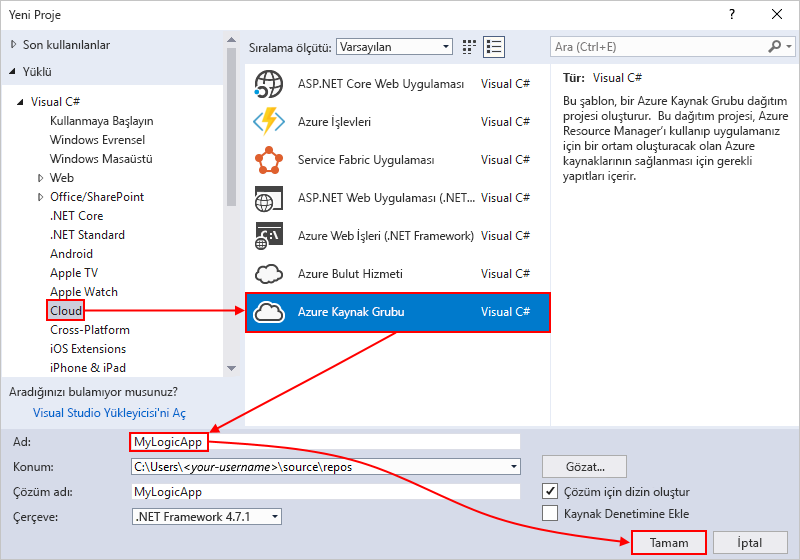
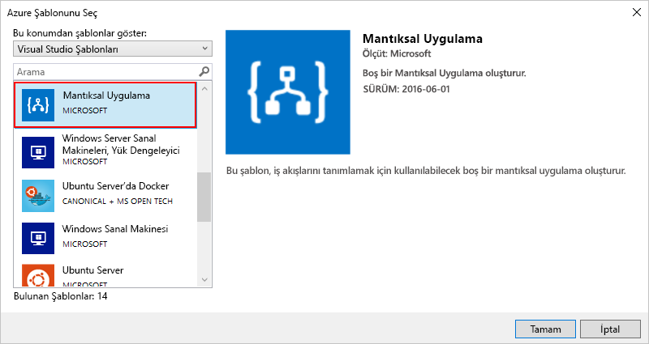
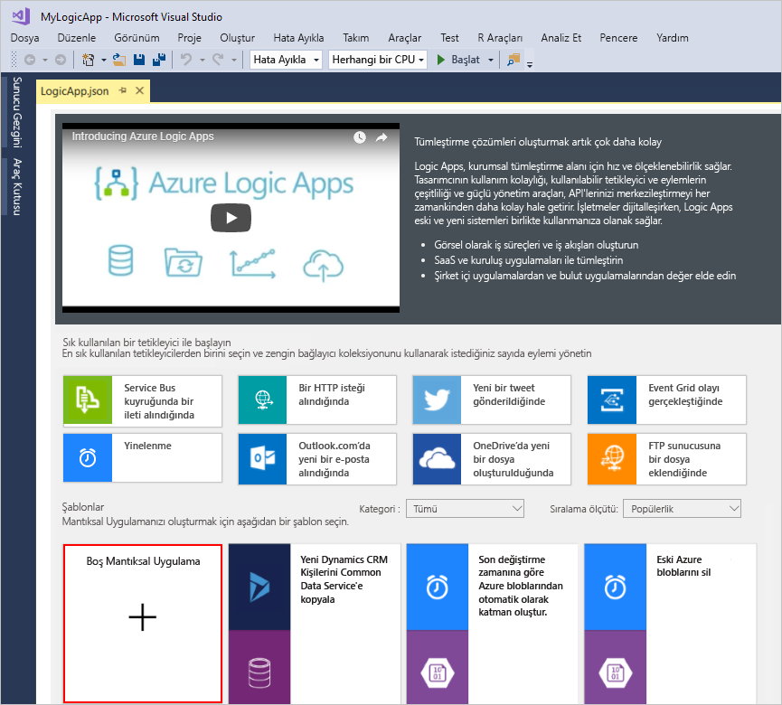

# Hızlı Başlangıç: Azure Logic Apps ile otomatik görevler, işlemler ve iş akışları oluşturma - Visual Studio

[Azure Logic Apps](../logic-apps/logic-apps-overview.md) ve Visual Studio ile, kuruluşlar ve kuruluşlar genelinde uygulamaları, verileri, sistemleri ve Hizmetleri tümleştiren görevleri ve işlemleri otomatikleştirmek için iş akışları oluşturabilirsiniz. Bu hızlı başlangıçta, Visual Studio’da mantıksal uygulamalar oluşturup bu uygulamaları Azure’a dağıtarak söz konusu iş akışlarını nasıl tasarlayıp derleyebileceğiniz gösterilmektedir. Bu görevleri Azure portal gerçekleştirmenize rağmen, Visual Studio, mantıksal uygulamalarınızı kaynak denetimine eklemenize, farklı sürümler yayımlamanıza ve farklı dağıtım ortamları için Azure Resource Manager şablonları oluşturmanıza olanak sağlar.

Azure Logic Apps yeni başladıysanız ve yalnızca temel kavramları istiyorsanız, [Azure Portal bir mantıksal uygulama oluşturmaya yönelik hızlı](../logic-apps/quickstart-create-first-logic-app-workflow.md)başlangıcı deneyin. Logic App Designer, hem Azure portal hem de Visual Studio 'da benzer şekilde çalışır.

Bu hızlı başlangıçta, Azure portal hızlı başlangıç olarak Visual Studio ile aynı mantıksal uygulamayı oluşturacaksınız. Ayrıca, [Visual Studio Code bir örnek uygulama oluşturmayı](quickstart-create-logic-apps-visual-studio-code.md)ve [Azure Command-Line ARABIRIMI (Azure CLI) aracılığıyla mantıksal uygulamalar oluşturup yönetmenizi](quickstart-logic-apps-azure-cli.md)da öğrenebilirsiniz. Bu mantıksal uygulama, bir Web sitesinin RSS akışını izler ve söz konusu akıştaki her yeni öğe için e-posta gönderir. Tamamlanmış mantıksal uygulamanız şu üst düzey iş akışı gibi görünür:

## Önkoşullar

* Bir Azure hesabı ve aboneliği Aboneliğiniz yoksa, [ücretsiz bir Azure hesabı için kaydolun](https://azure.microsoft.com/free/). Azure Kamu aboneliğiniz varsa, [Azure Kamu Bulutu Için Visual Studio 'yu ayarlamak](#azure-government)için aşağıdaki ek adımları izleyin.

* Henüz yoksa şu araçları indirip yükleyin:

  * [Visual Studio 2019, 2017 veya 2015-Community sürümü veya üzeri](https://aka.ms/download-visual-studio). Bu hızlı başlangıçta Visual Studio Community 2017 kullanılmaktadır.

    > [!IMPORTANT]
    > Visual Studio 2019 veya 2017 yüklediğinizde, **Azure geliştirme** iş yükünü seçtiğinizden emin olun.

  * [.NET için Microsoft Azure SDK (2.9.1 veya üzeri)](https://azure.microsoft.com/downloads/). [Azure SDK for .NET](/dotnet/azure/dotnet-tools?tabs=vs) hakkında daha fazla bilgi edinin.

  * [Azure PowerShell](https://github.com/Azure/azure-powershell#installation)

  * İstediğiniz sürüme yönelik Visual Studio uzantısı için en son Azure Logic Apps araçları:

    * [Visual Studio 2019](https://aka.ms/download-azure-logic-apps-tools-visual-studio-2019)

    * [Visual Studio 2017](https://aka.ms/download-azure-logic-apps-tools-visual-studio-2017)

    * [Visual Studio 2015](https://aka.ms/download-azure-logic-apps-tools-visual-studio-2015)
  
    Azure Logic Apps Araçlarını doğrudan Visual Studio Market’ten indirip yükleyebilir veya [bu uzantıyı Visual Studio’nun içinden yükleme](/visualstudio/ide/finding-and-using-visual-studio-extensions) hakkında bilgi edinebilirsiniz. Yükleme işlemini tamamladıktan sonra Visual Studio’yu yeniden başlattığınızdan emin olun.

* Ekli Mantıksal Uygulama Tasarımcısı kullanılırken web erişimi

  Tasarımcı Azure 'da kaynak oluşturmak ve mantıksal uygulamanızdaki bağlayıcılardan özellikleri ve verileri okumak için bir internet bağlantısı gerektirir.

* Microsoft 365, Outlook.com veya Gmail için Outlook gibi Logic Apps tarafından desteklenen bir e-posta hesabı. Diğer sağlayıcılar için [buradaki bağlayıcılar listesini](/connectors/)gözden geçirin. Bu örnekte Office 365 Outlook kullanılmaktadır. Farklı bir sağlayıcı kullanıyorsanız genel adımlar aynıdır, ancak kullanıcı arabirimi biraz farklı olabilir.

  > [!IMPORTANT]
  > Gmail bağlayıcısını kullanmak istiyorsanız, mantıksal uygulamalarda kısıtlama olmadan yalnızca G-Suite iş hesapları bu bağlayıcıyı kullanabilir. Gmail tüketicisi hesabınız varsa, bu bağlayıcıyı yalnızca belirli Google onaylı hizmetlerle kullanabilirsiniz veya [Gmail Bağlayıcınız ile kimlik doğrulaması için kullanmak üzere bir Google istemci uygulaması oluşturabilirsiniz](/connectors/gmail/#authentication-and-bring-your-own-application). Daha fazla bilgi için, bkz. [Azure Logic Apps Google bağlayıcıları Için veri güvenliği ve gizlilik ilkeleri](../connectors/connectors-google-data-security-privacy-policy.md).

## Azure Kamu için Visual Studio’yu ayarlama

### Visual Studio 2017

[Visual Studio Market](https://marketplace.visualstudio.com/items?itemName=SteveMichelotti.AzureEnvironmentSelector)indirebileceğiniz ve yükleyebileceğiniz [Azure ortam Seçicisi Visual Studio uzantısı](https://devblogs.microsoft.com/azuregov/introducing-the-azure-environment-selector-visual-studio-extension/)' nı kullanabilirsiniz.

### Visual Studio 2019

Azure Logic Apps Azure Kamu abonelikleriyle çalışmak için, [Visual Studio 'Ya Azure Kamu Bulutu için bir bulma uç noktası eklemeniz](../azure-government/documentation-government-connect-vs.md)gerekir. Ancak, *Azure Kamu hesabınızla Visual Studio 'da oturum açmadan önce* , aşağıdaki adımları izleyerek bulma uç noktasını ekledikten sonra oluşturulan json dosyasını yeniden adlandırmanız gerekir:

1. Visual Studio’yu kapatın.

1. Bu konumda adlı oluşturulan JSON dosyasını bulun `Azure U.S. Government-A3EC617673C6C70CC6B9472656832A26.Configuration` :

   `%localappdata%\.IdentityService\AadConfigurations`
 
1. JSON dosyasını olarak yeniden adlandırın `AadProvider.Configuration.json` .

1. Visual Studio’yu yeniden başlatın.

1. Azure Kamu hesabınızla oturum açmak için gereken adımlarla devam edin.

Bu kurulumu dönmek için, aşağıdaki konumdaki JSON dosyasını silin ve Visual Studio 'Yu yeniden başlatın:

`%localappdata%\.IdentityService\AadConfigurations\AadProvider.Configuration.json`

## Azure kaynak grubu projesi oluşturma

Başlamak için bir [Azure Kaynak Grubu projesi](../azure-resource-manager/templates/create-visual-studio-deployment-project.md) oluşturun. [Azure kaynak grupları ve kaynakları](../azure-resource-manager/management/overview.md) hakkında daha fazla bilgi edinin.

1. Visual Studio’yu çalıştırın. Azure hesabınızla oturum açın.

1. **Dosya** menüsünde **Yeni** > **Proje** ’yi seçin. (Klavye: CTRL + SHIFT + N)

   

1. **Yüklü** altında **Visual C#** veya **Visual Basic** ’i seçin. **Bulut**  >  **Azure Kaynak grubu** ' nu seçin. Projenizi adlandırın, örneğin:

   

   > [!NOTE]
   > Kaynak grubu adları yalnızca harf, sayı, nokta ( `.` ), alt çizgi ( `_` ), kısa çizgi ( `-` ) ve parantez ( `(` ,) içerebilir `)` , ancak nokta *end* () ile bitemez `.` .
   >
   > **Bulut** veya **Azure Kaynak grubu** görünmezse, VISUAL Studio için Azure SDK 'yi yüklediğinizden emin olun.

   Visual Studio 2019 kullanıyorsanız, şu adımları izleyin:

   1. **Yeni proje oluştur** kutusunda, Visual C# veya Visual Basic Için **Azure Kaynak grubu** projesi ' ni seçin. **İleri** ’yi seçin.

   1. Kullanmak istediğiniz Azure Kaynak grubu için bir ad ve diğer proje bilgilerini girin. **Oluştur** ’u seçin.

1. Şablon listesinden **mantıksal uygulama** şablonu ' nu seçin. **Tamam** ’ı seçin.

   

   Visual Studio projenizi oluşturduktan sonra, Çözüm Gezgini açılır ve çözümünüzü gösterir. Çözümünüzde, dosyadaki **LogicApp.js** yalnızca mantıksal uygulama tanımınızı depolamaz, ancak dağıtım için kullanabileceğiniz bir Azure Resource Manager şablonudur.

   

## Boş mantıksal uygulama oluşturma

Azure Kaynak grubu projeniz olduğunda, mantıksal uygulamanızı **boş mantıksal uygulama** şablonuyla oluşturun.

1. Çözüm Gezgini, dosyanın kısayol menüsündeki **LogicApp.js** açın. **Mantıksal Uygulama Tasarımcısı ile Aç** ’ı seçin. (Klavye: Ctrl + L)

   

   > [!TIP]
   > Visual Studio 2019 ' de bu komuta sahip değilseniz, Visual Studio için en son güncelleştirmelere sahip olup olmadığınızı kontrol edin.

   Visual Studio, mantıksal uygulamanız ve bağlantılarınız için kaynak oluşturmak ve dağıtmak üzere Azure aboneliğiniz ve bir Azure Kaynak grubu için sizi uyarır.

1. **Abonelik** için Azure aboneliğinizi seçin. **Kaynak grubu** Için **Yeni oluştur** ' u seçerek başka bir Azure Kaynak grubu oluşturun.

   

   | Ayar | Örnek değer | Açıklama |
   | ------- | ------------- | ----------- |
   | Kullanıcı hesabı | Fabrikam   sophia-owen@fabrikam.com | Visual Studio 'da oturum açtığınızda kullandığınız hesap |
   | **Abonelik** | Kullandıkça Öde   (sophia-owen@fabrikam.com) | Azure aboneliğinizin ve ilişkili hesabın adı |
   | **Kaynak Grubu** | MyLogicApp-RG   (Batı ABD) | Mantıksal uygulamanızın kaynaklarını depolamaya ve dağıtmaya yönelik Azure Kaynak grubu ve konumu |
   | **Konum** | **Kaynak grubuyla aynı** | Mantıksal uygulamanızı dağıtmaya yönelik konum türü ve belirli bir konum. Konum türü bir Azure bölgesi veya var olan bir [tümleştirme hizmeti ortamıdır (ISE)](connect-virtual-network-vnet-isolated-environment.md). 
Bu hızlı başlangıçta konum türünü **bölge** olarak ve konum ' u **kaynak grubuyla aynı** olarak ayarlanmış halde tutun. 
**Note** : kaynak grubu projenizi oluşturduktan sonra [konum türünü ve konumunu değiştirebilirsiniz](manage-logic-apps-with-visual-studio.md#change-location), ancak farklı bir konum türü mantıksal uygulamanızı çeşitli yollarla etkiler. |
   ||||

1. Logic Apps tasarımcı, bir giriş videosunu ve yaygın olarak kullanılan Tetikleyicileri gösteren bir sayfa açar. Videoyu ve Tetikleyicileri **şablonlara** göre aşağı kaydırın ve **boş mantıksal uygulama** ' yı seçin.

   

## Mantıksal uygulama iş akışı derleme

Sonra, yeni bir akış öğesi göründüğünde harekete çıkan bir RSS [tetikleyicisi](../logic-apps/logic-apps-overview.md#logic-app-concepts) ekleyin. Her mantıksal uygulama, belirli bir ölçüt karşılandığında tetiklenen bir tetikleyici ile başlar. Tetikleyici her etkinleştirildiğinde Logic Apps altyapısı iş akışınızı çalıştıran bir mantıksal uygulama örneği oluşturur.

1. Mantıksal uygulama Tasarımcısı ' nda, arama kutusunda, **Tümü** ' nü seçin. Arama kutusuna "RSS" yazın. Tetikleyiciler listesinden şu tetikleyiciyi seçin: **bir akış öğesi yayımlandığında**

   

1. Tetikleyici tasarımcıda görüntülendikten sonra, [Azure Portal Hızlı](../logic-apps/quickstart-create-first-logic-app-workflow.md#add-rss-trigger)başlangıcı ' nda iş akışı adımlarını izleyerek mantıksal uygulamayı oluşturmayı tamamladıktan sonra bu makaleye geri dönün. İşiniz bittiğinde mantıksal uygulamanız şu örnekteki gibi görünür:

   

1. Visual Studio çözümünüzü kaydedin. (Klavye: Ctrl + S)

## Mantıksal uygulamanızı Azure'a dağıtma

Mantıksal uygulamanızı çalıştırıp test etmeden önce, uygulamayı Visual Studio 'dan Azure 'a dağıtın.

1. Çözüm Gezgini, projenizin kısayol menüsünde Yeni **Dağıt** ' ı seçin  >  **New** . Sorulursa Azure hesabınızla oturum açın.

   

1. Bu dağıtım için, varsayılan Azure aboneliğini, kaynak grubunu ve diğer ayarları koruyun. **Dağıt** 'ı seçin.

   

1. **Parametreleri Düzenle** kutusu görüntülenirse, mantıksal uygulamanız için bir kaynak adı girin. Ayarlarınızı kaydedin.

   

   Dağıtım başladığında uygulamanızın dağıtım durumu Visual Studio **Çıktı** penceresinde görünür. Durum görünmezse **Çıktıyı göster** listesini açıp Azure kaynak grubunuzu seçin.

   

   Seçili bağlayıcılarınızın sizin için giriş yapması gerekiyorsa, arka planda bir PowerShell penceresi açılır ve gerekli parola veya gizli anahtar tuşları ister. Bu bilgileri girdikten sonra dağıtım işlemi devam eder.

   

   Dağıtım bittikten sonra mantıksal uygulamanız Azure portal canlı olur ve belirtilen zamanlamada (dakikada bir) çalışır. Tetikleyici yeni akış öğeleri bulursa, mantıksal uygulamanızın eylemlerini çalıştıran bir iş akışı örneği oluşturan tetikleyici ateşlenir. Mantıksal uygulamanız her yeni öğe için e-posta gönderir. Aksi takdirde, tetikleyici yeni öğeler bulamazsa, tetikleyici harekete geçmez ve "atlar" iş akışını yeniden oluşturmaz. Mantıksal uygulamanız, denetlemeden önce bir sonraki aralığa kadar bekler.

   Bu mantıksal uygulamanın gönderdiği örnek e-postalar aşağıda verilmiştir. E-posta gelmezse istenmeyen e-posta klasörüne bakın.

   

Tebrikler, mantıksal uygulamanızı Visual Studio ile başarıyla derlediniz ve dağıttınız. Mantıksal uygulamanızı yönetmek ve çalıştırma geçmişini gözden geçirmek için bkz. [Visual Studio ile mantıksal uygulamaları yönetme](../logic-apps/manage-logic-apps-with-visual-studio.md).

## Yeni mantıksal uygulama ekle

Mevcut bir Azure Kaynak grubu projeniz varsa, JSON ana hattı penceresini kullanarak bu projeye yeni bir boş mantıksal uygulama ekleyebilirsiniz.

1. Çözüm Gezgini ' de dosyayı açın `<logic-app-name>.json` .

1. **Görünüm** menüsünde **diğer Windows**  >  **JSON ana hattı** ' nı seçin.

1. Şablon dosyasına bir kaynak eklemek için JSON ana hattı penceresinin üst kısmında **Kaynak Ekle** ' yi seçin. Ya da JSON ana hattı penceresinde, **kaynaklar** kısayol menüsünü açın ve **Yeni Kaynak Ekle** ' yi seçin.

   

1. **Kaynak Ekle** iletişim kutusunda, arama kutusunda, mantıksal uygulama ' yı bulun `logic app` ve seçin. **Logic App** Mantıksal uygulamanızı adlandırın ve **Ekle** ' yi seçin.

   

## Kaynakları temizleme

Mantıksal uygulamanızı tamamladığınızda, mantıksal uygulamanızı ve ilgili kaynakları içeren kaynak grubunu silin.

1. Mantıksal uygulamanızı oluşturmak için kullandığınız hesapla [Azure portalında](https://portal.azure.com) oturum açın.

1. Azure portal menüsünde, **kaynak grupları** ' nı seçin veya herhangi bir sayfadan **kaynak grupları** arayın ve seçin. Mantıksal uygulamanızın kaynak grubunu seçin.

1. **Genel bakış** sayfasında, **kaynak grubunu sil** ' i seçin. Kaynak grubu adını onay olarak girin ve **Sil** ' i seçin.

   

1. Visual Studio çözümünü yerel bilgisayarınızdan silin.

## Sonraki adımlar

Bu makalede Visual Studio kullanarak mantıksal uygulamanızı derlediniz, dağıttınız ve çalıştırdınız. Visual Studio ile mantıksal uygulamalar için gelişmiş dağıtımı yönetme ve gerçekleştirme hakkında bilgi edinmek için şu makalelere bakın:

> [!div class="nextstepaction"]
> [Visual Studio ile mantıksal uygulamaları yönetme](../logic-apps/manage-logic-apps-with-visual-studio.md)
