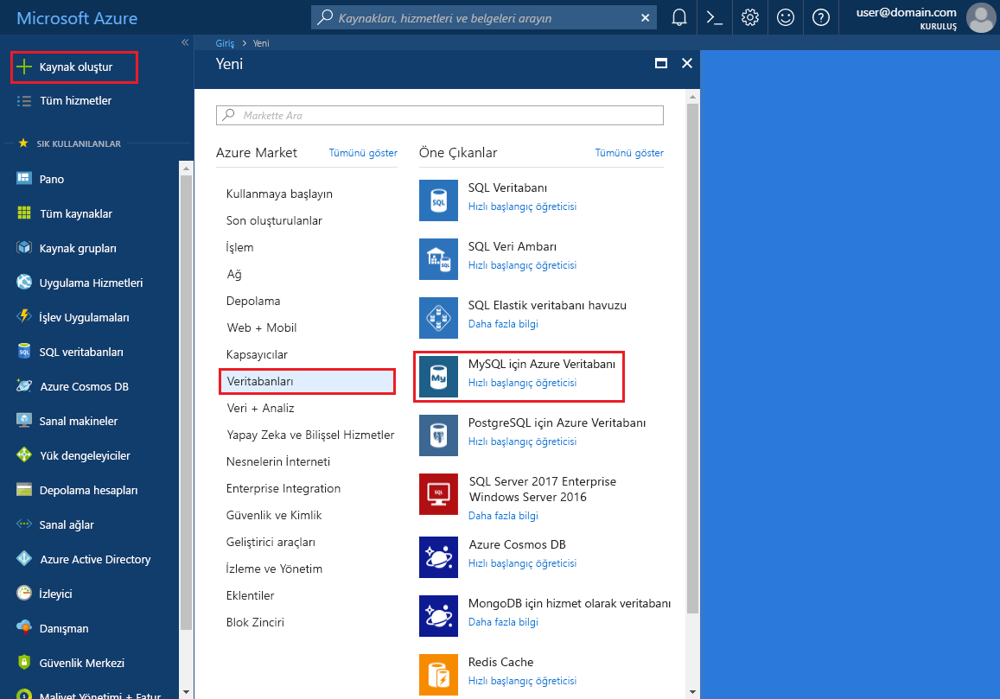
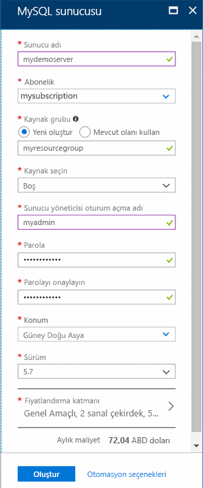
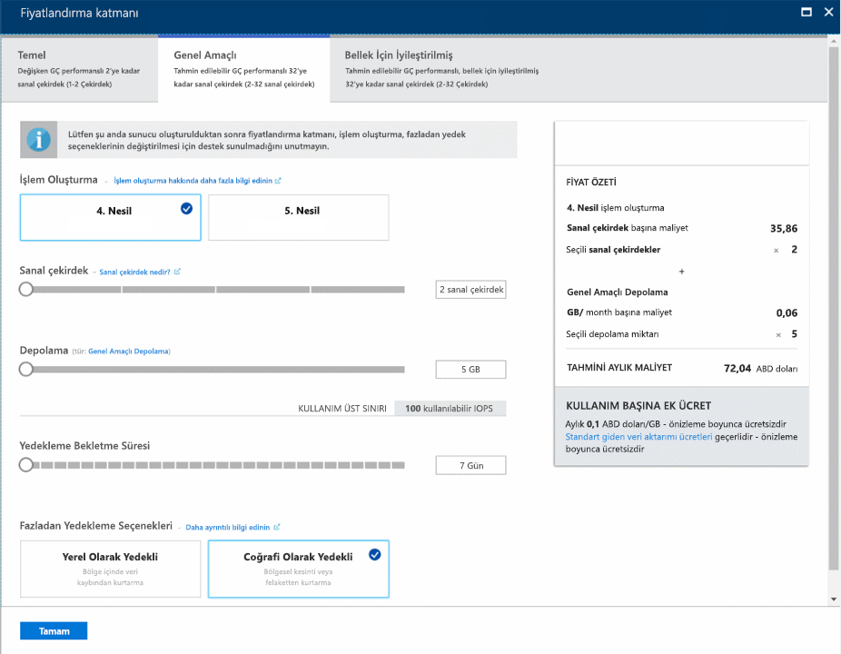

# <a name="create-an-azure-database-for-mysql-server-by-using-the-azure-portal"></a>Azure portalını kullanarak MySQL için Azure Veritabanı sunucusu oluşturma

MySQL için Azure Veritabanı, bulutta yüksek oranda kullanılabilir olan MySQL veritabanları çalıştırmak, yönetmek ve ölçeklendirmek için kullanılan, yönetilen bir hizmettir. Bu Hızlı Başlangıçta, Azure portalını kullanarak yaklaşık beş dakikada nasıl MySQL için Azure Veritabanı sunucusu oluşturacağınız gösterilir.  

Azure aboneliğiniz yoksa başlamadan önce [ücretsiz bir Azure hesabı](https://azure.microsoft.com/free/) oluşturun.

## <a name="sign-in-to-the-azure-portal"></a>Azure portalında oturum açın
Web tarayıcınızı açın ve [Azure portalına](https://portal.azure.com/) gidin. Portalda oturum açmak için kimlik bilgilerinizi girin. Varsayılan görünüm hizmet panonuzu içerir.

## <a name="create-an-azure-database-for-mysql-server"></a>MySQL için Azure Veritabanı sunucusu oluşturma
MySQL için Azure Veritabanı sunucusu, tanımlı bir dizi [işlem ve depolama kaynağı](./concepts-compute-unit-and-storage.md) ile oluşturulur. Sunucu, [Azure kaynak grubu](../azure-resource-manager/resource-group-overview.md) içinde oluşturulur.

MySQL için Azure veritabanı sunucusu oluşturmak üzere şu adımları uygulayın:

1. Portalın sol üst köşesinde bulunan **Kaynak oluştur** düğmesini (+) seçin.

2. **Veritabanları** > **MySQL için Azure Veritabanı**’nı seçin. Hizmeti ayrıca arama kutusuna **MySQL** yazarak da bulabilirsiniz.

   

3. Yeni sunucu ayrıntıları formunu aşağıdaki bilgilerle doldurun:
   
   

    **Ayar** | **Önerilen değer** | **Alan açıklaması** 
    ---|---|---
    Sunucu adı | Benzersiz sunucu adı | Azure veritabanınızı MySQL sunucusuna tanıtan benzersiz bir ad seçin. Örneğin, demosunucum. Girdiğiniz sunucu adına *.mysql.database.azure.com* etki alanı adı eklenir. Sunucu adı yalnızca küçük harf, sayı ve kısa çizgi (-) karakterini içerebilir. 3 ila 63 karakter arası içermelidir.
    Abonelik | Aboneliğiniz | Sunucunuz için kullanmak istediğiniz Azure aboneliğini seçin. Birden fazla aboneliğiniz varsa kaynağın faturalandığı aboneliği seçin.
    Kaynak grubu | *myresourcegroup* | Yeni veya mevcut bir kaynak grubu adı girin.    Kaynak grubu|*myresourcegroup*| Yeni bir kaynak grubu adı veya aboneliğinizde var olan bir kaynak grubu.
    Kaynak seçme | *Boş* | Sıfırdan yeni bir sunucu oluşturmak için *Boş*’u seçin. (Mevcut bir MySQL için Azure Veritabanı sunucusunun bir coğrafi yedeğinden bir sunucu oluşturuyorsanız, *Yedek* seçeneğini belirleyin).
    Sunucu yöneticisi oturum açma | myadmin | Sunucuya bağlanırken kullanılacak oturum açma hesabı. Yönetici oturum açma adı **azure_superuser**, **admin**, **administrator**, **root**, **guest** veya **public** olamaz.
    Parola | *Tercih ettiğiniz* | Sunucu yönetici hesabı için yeni bir parola girin. 8 ila 128 karakter arası içermelidir. Parolanız şu üç kategoride yer alan karakterlerden oluşmalıdır: İngilizce büyük ve küçük harfler, sayılar (0-9) ve alfasayısal olmayan karakterler (!, $, #, %, vb.).
    Parolayı onayla | *Tercih ettiğiniz*| Yönetici hesabı parolasını onaylayın.
    Konum | *Kullanıcılarınıza en yakın bölge*| Kullanıcılarınıza veya diğer Azure uygulamalarınıza en yakın konumu seçin.
    Sürüm | *En son ana sürüm*| En son ana sürüm (başka bir sürüm gerektiren belirli gereksinimleriniz yoksa).
    Fiyatlandırma katmanı | **Genel Amaçlı**, **Gen 4**, **2 sanal çekirdek**, **5 GB**, **7 gün**, **Coğrafi Olarak Yedeklemeli** | Yeni sunucunuz için işlem, depolama ve yedekleme yapılandırmaları. **Fiyatlandırma katmanı**'nı seçin. Ardından, **Genel Amaçlı** sekmesini seçin. *Gen 4*, *2 sanal çekirdek*, *5 GB* ve *7 gün*; **İşlem Nesli**, **Sanal Çekirdek**, **Depolama** ve **Yedekleme Bekletme Dönemi** için varsayılan değerlerdir. Bu kaydırıcıları olduğu gibi bırakabilirsiniz. Coğrafi olarak yedekli depolamada sunucu yedeklerinizi etkinleştirmek için, **Fazladan Yedek Seçenekleri**’nde **Coğrafi Olarak Yedeklemeli**’yi seçin. Bu fiyatlandırma katmanı seçimini kaydetmek için **Tamam**’ı seçin. Sonraki ekran görüntüsü bu seçimleri yakalar.
  
    > [!IMPORTANT]
    > Burada belirttiğiniz sunucu yöneticisi kullanıcı adı ve parolası, bu Hızlı Başlangıcın sonraki bölümlerinde sunucuda ve veritabanlarında oturum açmak için gereklidir. Bu bilgileri daha sonra kullanmak üzere aklınızda tutun veya kaydedin.
    > 

   

4.  Sunucuyu sağlamak için **Oluştur**’u seçin. Hazırlama işlemi 20 dakika kadar sürebilir.
   
5.  Araç çubuğunda **Bildirimler**’i (zil simgesi) seçip dağıtım işlemini izleyin.
   
  Varsayılan olarak, sunucunuz altında aşağıdaki veritabanları oluşturulur: **information_schema**, **mysql**, **performance_schema** ve **sys**.

## <a name="configure-a-server-level-firewall-rule"></a>Sunucu düzeyinde güvenlik duvarı kuralı oluşturma

MySQL için Azure Veritabanı hizmeti, sunucu düzeyinde bir güvenlik duvarı oluşturur. Bu güvenlik duvarı, belirli IP adresleri için güvenlik duvarını açmak üzere bir güvenlik duvarı kuralı oluşturulmadıkça, dış uygulama ve araçların sunucuya ve sunucu üzerindeki herhangi bir veritabanına bağlanmasını engeller. 

1.   Dağıtım tamamlandıktan sonra sunucunuzu bulun. Gerekirse arama yapabilirsiniz. Örneğin sol taraftaki menüden **Tüm Kaynaklar**’ı seçin. Ardından yeni oluşturduğunuz sunucuyu aramak için sunucu adını (**demosunucum** örneğindeki gibi) yazın. Arama sonuçları listesinden sunucu adını seçin. Sunucunuzun **Genel bakış** sayfası açılır ve daha fazla yapılandırma seçenekleri sunulur.

2. Sunucu sayfasında **Bağlantı güvenliği**’ni seçin.

3.  **Güvenlik Duvarı kuralları** başlığı altında, güvenlik duvarı kuralı oluşturmaya başlamak için **Kural Adı** sütunundaki boş metin kutusunu seçin. Bu sunucuya erişecek istemcilerin IP’lerinin tam aralığını girin.
   
   


4. **Bağlantı güvenliği** sayfasının üst araç çubuğunda **Kaydet**’i seçin. Devam etmeden önce güncelleştirmenin başarıyla tamamlandığını belirten bildirim görünene kadar bekleyin. 

   > [!NOTE]
   > MySQL için Azure Veritabanı bağlantıları 3306 bağlantı noktası üzerinden iletişim kurar. Kurumsal ağ içinden bağlanmaya çalışıyorsanız, 3306 numaralı bağlantı noktası üzerinden giden trafiğe izin verilmiyor olabilir. Bu durumda, BT departmanınız 3306 numaralı bağlantı noktasını açmadığı sürece sunucunuza bağlanamazsınız.
   > 

## <a name="get-the-connection-information"></a>Bağlantı bilgilerini alma
Veritabanı sunucusuna bağlanmak için tam sunucu adı ve yönetici oturum açma kimlik bilgileri gerekir. Bu değerleri Hızlı Başlangıç makalesinde daha önce not almış olabilirsiniz. Aksi takdirde, Azure portalındaki sunucuya **Genel Bakış** sayfasında veya **Özellikler** sayfasında sunucu adını ve oturum açma bilgilerini kolayca bulabilirsiniz.

Bu değerleri bulmak için aşağıdaki adımları takip edin: 

1. Sunucunuzun **Genel Bakış** sayfasını açın. **Sunucu adını** ve **Sunucu yöneticisi oturum açma adını** not edin. 

2. İmlecinizi her bir alanın üzerine getirin, metnin sağ tarafında Kopyala simgesi görünür. Değerleri kopyalamak için gerektiği şekilde Kopyala simgesini seçin.

Bu örnekte sunucu adı **demosunucum.mysql.database.azure.com**, sunucu yöneticisi oturum açma bilgileri ise **myadmin@mydemoserver** şeklindedir.

## <a name="connect-to-mysql-by-using-the-mysql-command-line-tool"></a>MySQL komut satırı aracını kullanarak sunucuya bağlanma
MySQL sunucusu için Azure veritabanınıza çeşitli uygulamalar kullanarak bağlanabilirsiniz. 

İlk olarak sunucuya nasıl bağlanılacağını göstermek için [mysql](https://dev.mysql.com/doc/refman/5.7/en/mysql.html) komut satırı aracını kullanalım. Burada açıklandığı şekliyle bir web tarayıcısını ve Azure Cloud Shell’i herhangi bir ek yazılım yüklemeniz gerekmeden kullanabilirsiniz. Yerel olarak yüklü mysql yardımcı programınız varsa, oradan da bağlanabilirsiniz.

1. Azure portalı web sayfasının sağ üst tarafındaki terminal simgesi aracılığıyla (**>_**) Azure Cloud Shell’i başlatın.


2.  Azure Cloud Shell, tarayıcınızda açılarak bash kabuk komutları yazmanıza olanak verir.

   

3. Cloud Shell isteminde, mysql komut satırını yazarak MySQL için Azure Veritabanı sunucunuza bağlanın.

    mysql yardımcı programıyla MySQL için Azure Veritabanı sunucusuna bağlanmak için aşağıdaki biçim kullanılır:

    ```bash
    mysql --host <fully qualified server name> --user <server admin login name>@<server name> -p
    ```

    Örneğin, aşağıdaki komut örnek sunucumuza bağlanır:

    ```azurecli-interactive
    mysql --host mydemoserver.mysql.database.azure.com --user myadmin@mydemoserver -p
    ```

    mysql parametresi |Önerilen değer|Açıklama
    ---|---|---
    --host | *Sunucu adı* | MySQL sunucusu için Azure Veritabanını oluştururken kullandığınız sunucu adı değeri. Örnek sunucumuz: **demosunucum.mysql.database.azure.com**. Örnekte gösterildiği gibi tam etki alanı adını (**\*.mysql.database.azure.com**) kullanın. Sunucu adınızı anımsamıyorsanız bağlantı bilgilerini almak için bir önceki bölümdeki adımları izleyin. 
    --kullanıcı | *Sunucu yöneticisi oturum açma adı* |MySQL sunucusu için Azure Veritabanını oluştururken girdiğiniz sunucu yöneticisi oturum açma kullanıcı adı. Kullanıcı adını anımsamıyorsanız bağlantı bilgilerini almak için bir önceki bölümdeki adımları izleyin. Biçim şöyledir: *username@servername*.
    -p | *İstenene kadar bekleyin* |İstendiğinde, sunucuyu oluştururken belirttiğiniz parolayı yazın. Yazılan parola karakterlerinin yazılırken bash isteminde gösterilmeyeceğini unutmayın. Parolanızı girdikten sonra **Enter** tuşuna basın.

   Bağlantı kurulduğunda, mysql yardımcı programı komut yazabileceğiniz bir `mysql>` istemi gösterir. 

   Örnek mysql çıktısı aşağıdadır:

    ```bash
    Welcome to the MySQL monitor.  Commands end with ; or \g.
    Your MySQL connection id is 65505
    Server version: 5.6.26.0 MySQL Community Server (GPL)
    
    Copyright (c) 2000, 2017, Oracle and/or its affiliates. All rights reserved.
    
    Oracle is a registered trademark of Oracle Corporation and/or its
    affiliates. Other names may be trademarks of their respective
    owners.

    Type 'help;' or '\h' for help. Type '\c' to clear the current input statement.
    
    mysql>
    ```
    > [!TIP]
    > Güvenlik duvarı Azure Cloud Shell IP adreslerine izin verecek biçimde yapılandırılmamışsa aşağıdaki hata oluşur:
    >
    > HATA 2003 (28000): 123.456.789.0 IP adresli istemcinin sunucuya erişmesine izin verilmiyor.
    >
    > Hatayı gidermek için sunucu yapılandırmasının makalenin “Sunucu düzeyinde güvenlik duvarı kuralı yapılandırma” bölümünde yer alan adımlarla eşleştiğinden emin olun.

4. Bağlantının kurulduğundan emin olmak için mysql> isteminde `status` yazarak sunucu durumunu görüntüleyin.

    ```sql
    status
    ```

   > [!TIP]
   > Ek komutlar için bkz. [MySQL 5.7 Başvuru Kılavuzu--Bölüm 4.5.1](https://dev.mysql.com/doc/refman/5.7/en/mysql.html).

5.  Aşağıdaki komutu yazarak **mysql>** isteminde boş bir veritabanı oluşturun:
    ```sql
    CREATE DATABASE quickstartdb;
    ```
    Komutun tamamlanması birkaç dakika sürebilir. 

    MySQL sunucusu için Azure Veritabanı içinde bir veya birden fazla veritabanı oluşturabilirsiniz. Tüm kaynakları kullanmak için sunucu başına tek bir veritabanı oluşturmayı veya kaynakları paylaşmak için birden çok veritabanı oluşturmayı seçebilirsiniz. Sınırsız sayıda veritabanı oluşturabilirsiniz, ancak birden fazla veritabanı aynı sunucu kaynağını paylaşır. 

6. Aşağıdaki komutu yazarak **mysql>** isteminde veritabanlarını listeleyin:

    ```sql
    SHOW DATABASES;
    ```

7.  `\q` yazın ve ardından **Enter** tuşuna basarak mysql aracından çıkın. İşlem tamamlanınca Azure Cloud Shell’i kapatabilirsiniz.

Böylece Azure Veritabanını MySQL sunucusuna bağladınız ve boş bir kullanıcı veritabanı oluşturdunuz. Benzer bir alıştırma için sonraki bölüme geçin. Sonraki alıştırmada aynı sunucuya başka bir genel araç, MySQL Workbench kullanılarak bağlanacağız.

## <a name="connect-to-the-server-by-using-the-mysql-workbench-gui-tool"></a>MySQL Workbench GUI aracını kullanarak sunucuya bağlanma
MySQL Workbench GUI aracını kullanarak sunucuya bağlanmak için aşağıdaki adımları gerçekleştirin:

1.  İstemci bilgisayarınızda MySQL Workbench uygulamasını açın. MySQL Workbench uygulamasını [MySQL Workbench’i İndir](https://dev.mysql.com/downloads/workbench/) bağlantısını kullanarak indirip yükleyebilirsiniz.

2. Yeni bağlantı oluşturun. **MySQL Connections** (MySQL Bağlantıları) başlığının yanındaki artı (+) simgesine tıklayın.

3. **Setup New Connection** (Yeni Bağlantı Oluştur) iletişim kutusundaki **Parameters** (Parametreler) sekmesine sunucunuzun bağlantı bilgilerini girin. Yer tutucu değerleri örnek olarak gösterilmiştir. Ana Bilgisayar Adı, Kullanıcı Adı ve Parola yerine kendi değerlerinizi yazın.

   

    |Ayar |Önerilen değer|Alan açıklaması|
    |---|---|---|
     Bağlantı adı | Tanıtım bağlantısı | Bu bağlantı için bir etiket. |
    Bağlantı yöntemi | Standart (TCP/IP) | Standart (TCP/IP) yeterlidir. |
    Ana Bilgisayar Adı | *Sunucu adı* | MySQL sunucusu için Azure Veritabanını oluştururken kullandığınız sunucu adı değeri. Örnek sunucumuz: **demosunucum.mysql.database.azure.com**. Örnekte gösterildiği gibi tam etki alanı adını (**\*.mysql.database.azure.com**) kullanın. Sunucu adınızı anımsamıyorsanız bağlantı bilgilerini almak için bir önceki bölümdeki adımları izleyin.|
     Bağlantı noktası | 3306 | MySQL sunucusu için Azure Veritabanına bağlanılırken kullanılacak bağlantı noktası. |
    Kullanıcı adı |  *Sunucu yöneticisi oturum açma adı* | MySQL sunucusu için Azure Veritabanını oluştururken girdiğiniz sunucu yöneticisi oturum açma bilgileri. Bizim örnek kullanıcı adımız **myadmin@mydemoserver**. Kullanıcı adını anımsamıyorsanız bağlantı bilgilerini almak için bir önceki bölümdeki adımları izleyin. Biçim şöyledir: *username@servername*.
    Parola | *Parolanız* | Parolayı kaydetmek için **Kasada Depola...** düğmesini seçin. |

4. Tüm parametrelerin doğru yapılandırılıp yapılandırılmadığını test etmek için **Bağlantıyı Sına**’yı seçin. Ardından bağlantıyı kaydetmek için **Tamam**’a tıklayın. 

    > [!NOTE]
    > SSL, sunucunuzda varsayılan olarak zorunlu kılınmıştır ve başarıyla bağlanması için ek yapılandırma gerektirir. Daha ayrıntılı bilgi için bkz. [MySQL için Azure Veritabanı'na güvenli bir şekilde bağlanmak üzere uygulamanızda SSL bağlantısını yapılandırma](./howto-configure-ssl.md). Bu Hızlı Başlangıçta SSL'yi devre dışı bırakmak için Azure portalına gidin. Ardından **SSL’yi Zorunlu Kıl** bağlantı düğmesini devre dışı bırakmak için Bağlantı güvenliği sayfasını seçin.

## <a name="clean-up-resources"></a>Kaynakları temizleme
Hızlı başlangıç bölümünde oluşturduğunuz kaynakları iki şekilde temizleyebilirsiniz. Kaynak grubundaki tüm kaynakları içeren [Azure kaynak grubunu](../azure-resource-manager/resource-group-overview.md) silebilirsiniz. Diğer kaynakları korumak istiyorsanız yalnızca bir sunucu kaynağını silin.

> [!TIP]
> Bu koleksiyondaki diğer Hızlı Başlangıçlar, bu Hızlı Başlangıcı temel alır. Hızlı başlangıçlarla çalışmaya devam etmeyi planlıyorsanız bu hızlı başlangıçta oluşturulan kaynakları temizlemeyin. Devam etmeyi planlamıyorsanız, bu Hızlı Başlangıçta oluşturduğunuz tüm kaynakları silmek için aşağıdaki adımları kullanın.
>

Yeni oluşturulan sunucu dahil olmak üzere kaynak grubunun tamamını silmek için aşağıdaki adımları takip edin:

1.  Azure portalında kaynak grubunuzu bulun. Sol taraftaki menüden, **Kaynak grupları**'nı ve ardından kaynak grubunuzun adını (örneğimizdeki **myresourcegroup** gibi) seçin.

2.  Kaynak grubunuzun sayfasında **Sil**’i seçin. Ardından kaynak grubunuzun adını (örneğimizdeki **myresourcegroup** gibi) kutuya yazarak silmeyi onaylayın ve **Sil**’e tıklayın.

Yalnızca yeni oluşturulan sunucuyu silmek için aşağıdaki adımları gerçekleştirin:

1.  Sunucunuz zaten açık değilse Azure portalında sunucuyu bulun. Azure Portal'ın sol tarafındaki menüden **Tüm kaynaklar**’ı seçin. Ardından, oluşturduğunuz sunucuyu arayın.

2.  **Genel Bakış** sayfasında **Sil**’i seçin. 

   

3.  Silmek istediğiniz sunucu adını onaylayın ve altındaki etkilenen veritabanlarını gösterin. Kutuya sunucu adını (örneğimizdeki **demosunucum** gibi) yazın. **Sil**’i seçin.

## <a name="next-steps"></a>Sonraki adımlar

> [!div class="nextstepaction"]
> [İlk MySQL için Azure Veritabanınızı tasarlama](./tutorial-design-database-using-portal.md)

