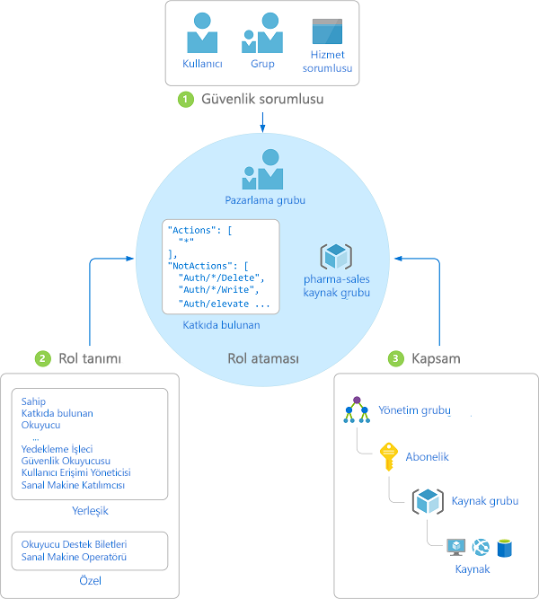

# Azure rol tabanlı erişim denetimi (Azure RBAC) nedir?

Bulut kaynakları için erişim yönetimi, bulutu kullanan tüm kuruluşlar için kritik öneme sahip bir işlevdir. Azure rol tabanlı erişim denetimi (Azure RBAC), Azure kaynaklarına kimlerin erişebileceğini, bu kaynaklarla neler yapabileceğini ve hangi alanların erişebileceğini yönetmenize yardımcı olur.

Azure RBAC, Azure kaynakları üzerinde ayrıntılı erişim yönetimi sağlayan [Azure Resource Manager](../azure-resource-manager/management/overview.md) yerleşik bir yetkilendirme sistemidir.

Bu videoda, Azure RBAC 'e hızlı bir genel bakış sunulmaktadır.

>[!VIDEO https://www.youtube.com/embed/Dzhm-garKBM]

## Azure RBAC ile ne yapabilirim?

Azure RBAC ile yapabilecekleriniz için bazı örnekler şunlardır:

- Bir kullanıcıya abonelikteki sanal makineleri yönetme, başka bir kullanıcıya ise sanal ağları yönetme izni verme
- Bir DBA grubuna abonelikteki SQL veritabanlarını yönetme izni verme
- Bir kullanıcının sanal makineler, web siteleri ve alt ağlar gibi bir kaynak grubundaki tüm kaynakları yönetmesine izin verme
- Bir uygulamaya bir kaynak grubundaki tüm kaynaklara erişim izni verme

## Azure RBAC nasıl çalışmaktadır

Azure RBAC kullanarak kaynaklara erişimi denetlemenize olanak sağlamak, Azure rollerini atamadır. Bu, anlaşılması için önemli bir kavramdır. Bu, izinlerin nasıl zorlandığını öğrenin. Rol ataması üç öğeden oluşur: güvenlik sorumlusu, rol tanımı ve kapsam.

### Güvenlik sorumlusu

*Güvenlik sorumlusu*, Azure kaynakları için erişim isteyen kullanıcıyı, grubu, hizmet sorumlusunu veya yönetilen kimliği temsil eden bir nesnedir. Bu güvenlik sorumlularının herhangi birine bir rol atayabilirsiniz.

### Rol tanımı

*Rol tanımı*, izinlerden oluşan bir koleksiyondur. Genellikle bir *rol* olarak adlandırılır. Rol tanımı; okuma, yazma ve silme gibi gerçekleştirilebilecek işlemleri listeler. Roller sahip gibi üst düzey veya sanal makine okuyucusu gibi sınırlı olabilir.

Azure, kullanabileceğiniz çeşitli [yerleşik roller](built-in-roles.md) içerir. Örneğin [Sanal Makine Katılımcısı](built-in-roles.md#virtual-machine-contributor) rolü, kullanıcının sanal makine oluşturmasını ve yönetmesini sağlar. Yerleşik roller kuruluşunuzun belirli ihtiyaçlarını karşılamıyorsa, kendi [Azure özel rollerinizi](custom-roles.md)de oluşturabilirsiniz.

Bu videoda, yerleşik roller ve özel roller hakkında hızlı bir genel bakış sunulmaktadır.

>[!VIDEO https://www.youtube.com/embed/I1mefHptRgo]

Azure 'da bir nesne içindeki verilere erişim izni vermenizi sağlayan veri işlemleri vardır. Örneğin kullanıcının bir depolama hesabında verileri okuma erişimi varsa bu kullanıcı ilgili depolama hesabındaki blobları veya iletileri okuyabilir.

Daha fazla bilgi için bkz. [Azure rol tanımlarını anlama](role-definitions.md).

### Kapsam

*Kapsam* , erişimin uygulandığı kaynak kümesidir. Bir rol atadığınızda kapsam tanımlayarak izin verilen eylemleri sınırlandırabilirsiniz. Bu, birine bir [Web sitesi katılımcısı](built-in-roles.md#website-contributor)yapmak istiyorsanız ancak yalnızca bir kaynak grubu için yararlıdır.

Azure 'da, dört düzeyde bir kapsam belirtebilirsiniz: [Yönetim grubu](../governance/management-groups/overview.md), abonelik, [kaynak grubu](../azure-resource-manager/management/overview.md#resource-groups)veya kaynak. Kapsamlar üst-alt ilişkisiyle yapılandırılmıştır. Bu kapsam düzeylerinden herhangi birine roller atayabilirsiniz.

Kapsam hakkında daha fazla bilgi için bkz. [kapsamı anlama](scope-overview.md).

### Rol atamaları

*Rol ataması* , erişim vermek amacıyla belirli bir kapsamdaki Kullanıcı, Grup, hizmet sorumlusu veya yönetilen kimliğe bir rol tanımı ekleme işlemidir. Erişim, rol ataması oluşturularak sağlanır ve rol ataması kaldırıldığında iptal edilir.

Aşağıdaki diyagramda rol ataması örneği gösterilmektedir. Bu örnekte Marketing grubuna pharma-sales kaynak grubu için [Katkıda bulunan](built-in-roles.md#contributor) rolü atanmıştır. Bu da Marketing grubundaki kullanıcıların pharma-sales kaynak grubunda tüm Azure kaynaklarını oluşturma veya yönetme işlemlerini gerçekleştirebileceği anlamına gelir. Başka bir rol atamasına sahip olmayan Marketing kullanıcılarının pharma-sales kaynak grubu dışındaki kaynaklara erişimi yoktur.

Azure portal, Azure CLı, Azure PowerShell, Azure SDK 'Ları veya REST API 'Lerini kullanarak roller atayabilirsiniz.

Daha fazla bilgi için bkz. [Azure rolü atama adımları](role-assignments-steps.md).

## Çoklu rol atamaları

Birden çok çakışan rol atamalarınız varsa ne olur? Azure RBAC, bir eklenebilir modeldir, bu nedenle etkili izinleriniz rol atamalarınızın toplamıdır. Bir kullanıcıya, abonelik kapsamında katkıda bulunan rolü ve bir kaynak grubundaki okuyucu rolü verildiğinde aşağıdaki örneği göz önünde bulundurun. Katkıda bulunan izinlerinin ve okuyucu izinlerinin toplamı, kaynak grubu için katkıda bulunan roldür. Bu nedenle, bu durumda okuyucu rolü atamasının hiçbir etkisi yoktur.

## Reddetme atamaları

Daha önce, Azure RBAC reddetme olmayan bir izin verme modelidir, ancak artık Azure RBAC, atamaları sınırlı bir şekilde reddetme olanağı desteklemektedir. Bir rol atamasına benzer şekilde, *reddetme atama* , erişimi reddetmek amacıyla belirli bir kapsamdaki bir Kullanıcı, Grup, hizmet sorumlusu veya yönetilen kimliğe reddetme eylemleri kümesi iliştirir. Bir rol ataması *izin* verilen bir dizi eylemi tanımlar, ancak reddetme ataması *izin verilmeyen* bir dizi eylemi tanımlar. Başka bir deyişle, reddetme atamaları kullanıcıların belirtilen eylemleri gerçekleştirmesini (rol ataması izin vermiş olsa bile) engeller. Reddetme atamaları rol atamalarından daha önceliklidir.

Daha fazla bilgi için bkz. [Azure reddetme atamalarını anlama](deny-assignments.md).

## Azure RBAC, bir kullanıcının kaynağa erişip erişemeyeceğini nasıl belirler

Aşağıda, Azure RBAC 'in yönetim düzleminde bir kaynağa erişiminizin olup olmadığını belirlemede kullandığı üst düzey adımlar verilmiştir. Bunları anlamak, bir erişim sorununu gidermeye çalışırken işinize yarayabilir.

1. Kullanıcı (veya hizmet sorumlusu) Azure Resource Manager için bir belirteç alır.

    Belirteç kullanıcının grup üyeliğini (geçişli grup üyelikleri de dahil) içerir.

1. Kullanıcı, belirteci de ekleyerek Azure Resource Manager'a bir REST API çağrısı yapar.

1. Azure Resource Manager, üzerinde eylem gerçekleştirilen kaynak için geçerli olan tüm rol atamalarını ve reddetme atamalarını alır.

1. Azure Resource Manager, rol atamalarını bu kullanıcıya veya onun grubuna uygulananlarla daraltır ve kullanıcının bu kaynak için hangi role sahip olduğunu saptar.

1. Azure Resource Manager, API çağrısındaki eylemin bu kaynak için kullanıcının sahip olduğu rollere eklenip eklenmediğini saptar.

1. Kullanıcının istenen kapsamda eyleme sahip bir rolü yoksa erişime izin verilmez. Aksi takdirde, Azure Resource Manager bir reddetme atamasının geçerli olup olmadığını denetler.

1. Reddetme ataması geçerliyse, erişim engellenir. Aksi takdirde erişim izni verilir.

## Lisans gereksinimleri

[!INCLUDE [Azure AD free license](../../includes/active-directory-free-license.md)]

## Sonraki adımlar

- [Azure portal kullanarak Azure rolleri atama](role-assignments-portal.md)
- [Farklı rolleri anlama](rbac-and-directory-admin-roles.md)
- [Bulut benimseme çerçevesi: Azure 'da kaynak erişim yönetimi](/azure/cloud-adoption-framework/govern/resource-consistency/resource-access-management)
