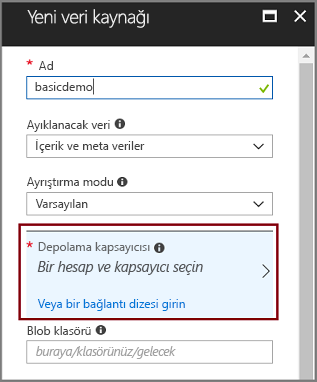
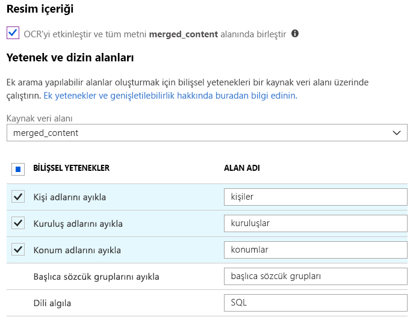
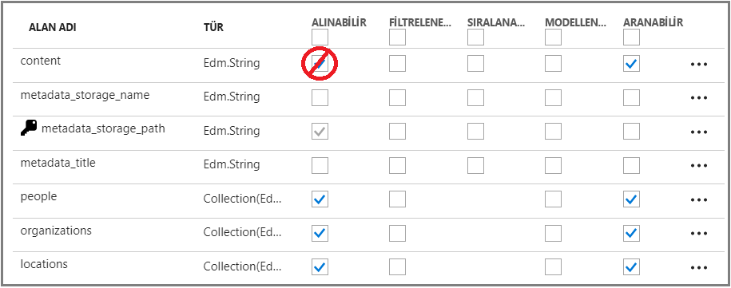

# Hızlı başlangıç: Azure portalında Bir Azure Bilişsel Arama bilişsel becerileri oluşturun

Skillset, büyük farklılaşmamış metin veya resim dosyalarından bilgi ve yapı ayıklayan ve Azure Bilişsel Arama'da tam metin arama sorguları için dizine ve aranabilir hale getiren bir AI özelliğidir. 

Bu hızlı başlangıçta, becerileri oluşturmak için Azure bulutundaki hizmetleri ve verileri birleştirirsiniz. Her şey yerli yerine oturtuktan sonra, hepsini bir araya getirmek için portaldaki **Alma veri** sihirbazını çalıştıracaksınız. Sonuç, portalda sorgulayabildiğiniz AI işleme tarafından oluşturulan verilerle doldurulan ve[(Arama gezgini)](search-explorer.md)aranabilir bir dizindir.

Azure aboneliğiniz yoksa, başlamadan önce [ücretsiz](https://azure.microsoft.com/free/?WT.mc_id=A261C142F) bir hesap oluşturun.

## Hizmet oluşturma ve veri yükleme

Bu hızlı başlangıç, AI için Azure Bilişsel Arama, [Azure Blob depolama](https://docs.microsoft.com/azure/storage/blobs/)ve [Azure Bilişsel Hizmetleri'ni](https://azure.microsoft.com/services/cognitive-services/) kullanır. 

İş yükü çok küçük olduğundan, Bilişsel Hizmetler 20'ye kadar işlem için ücretsiz işleme sağlamak için arka planda dokunulmaktadır. Bu kadar küçük bir veri kümesi için, Bilişsel Hizmetler kaynağı oluşturmayı veya eklemeyi atlayabilirsiniz.

1. Farklı türlerden oluşan küçük bir dosya kümesini içeren [örnek verileri indirin](https://1drv.ms/f/s!As7Oy81M_gVPa-LCb5lC_3hbS-4). Dosyaların zip'ini aç.

1. [Bir Azure depolama hesabı oluşturun](https://docs.microsoft.com/azure/storage/common/storage-quickstart-create-account?tabs=azure-portal) veya [varolan bir hesabı bulun.](https://ms.portal.azure.com/#blade/HubsExtension/BrowseResourceBlade/resourceType/Microsoft.Storage%2storageAccounts/) 

   Bant genişliği ücretlerinden kaçınmak için Azure Bilişsel Arama ile aynı bölgeyi seçin. 
   
   Bilgi deposu özelliğini daha sonra başka bir izbinde denemek istiyorsanız StorageV2 (genel amaçlı V2) hesap türünü seçin. Aksi takdirde, herhangi bir tür seçin.

1. Blob hizmetleri sayfalarını açın ve bir kapsayıcı oluşturun. Varsayılan genel erişim düzeyini kullanabilirsiniz. 

1. Kapsayıcıda, ilk adımda indirdiğiniz örnek dosyaları yüklemek için **Yükle'yi** tıklatın. Tam metin yerel biçimlerinde aranmaz görüntüler ve uygulama dosyaları da dahil olmak üzere içerik türleri geniş bir yelpazede olduğuna dikkat edin.

   

1. [Bir Azure Bilişsel Arama hizmeti oluşturun](search-create-service-portal.md) veya [varolan bir hizmeti bulun.](https://ms.portal.azure.com/#blade/HubsExtension/BrowseResourceBlade/resourceType/Microsoft.Search%2FsearchServices) Bu hızlı başlangıç için ücretsiz bir hizmet kullanabilirsiniz.

Artık Veri Aktar sihirbazı üzerinde hareket etmeye hazırsınız.

## Veri Aktar sihirbazını çalıştır

Arama hizmetigenel bakış sayfasında, bilişsel zenginleştirmeyi dört adımda ayarlamak için komut çubuğundaki **verileri içe aktar'ı** tıklatın.

  

### Adım 1 - Veri kaynağı oluşturma

1. **Verilerinize Bağlan'da** **Azure Blob depolama alanını**seçin, Oluşturduğunuz Depolama hesabını ve kapsayıcıyı seçin. Veri kaynağına bir ad verin ve geri kalanı için varsayılan değerleri kullanın. 

   

    Sonraki sayfaya devam edin.

### Adım 2 - Bilişsel beceri ler ekle

Ardından, OCR, görüntü çözümlemesi ve doğal dil işleme çağırmak için AI zenginleştirme yapılandırın. 

1. Bu hızlı başlangıç için, **Ücretsiz** Bilişsel Hizmetler kaynağını kullanıyoruz. Örnek veriler 14 dosyadan oluşur, bu nedenle Bilişsel Hizmetler'de 20 işlemin ücretsiz tahsisi bu hızlı başlangıç için yeterlidir. 

   

1. Genişlet **zenginleştirmeler ekleyin** ve dört seçim yapın. 

   Sihirbaz sayfasına görüntü çözümleme becerileri eklemek için OCR'yi etkinleştirin.

   Metni daha küçük parçalara ayırmak için sayfalar için parçalı olarak ayarlayın. Çeşitli metin becerileri 5-KB girişleri ile sınırlıdır.

   Varlık tanıma (kişiler, kuruluşlar, konumlar) ve görüntü analizi becerilerini seçin.

   

   Sonraki sayfaya devam edin.

### Adım 3 - Dizini yapılandır

Bir dizin aranabilir içeriğinizi içerir ve **Alma veri** sihirbazı genellikle veri kaynağını örnekleyerek sizin için şema oluşturabilir. Bu adımda, oluşturulan şema gözden geçirin ve potansiyel olarak herhangi bir ayarları gözden geçirin. Aşağıda demo Blob veri kümesi için oluşturulan varsayılan şema olduğunu.

Bu hızlı başlangıç, makul varsayılanlar ayarlanması konusunda iyi bir iş çıkarır:  

+ Varsayılan alanlar, varolan lekelerin yanı sıra zenginleştirme çıktısı `people`(örneğin, `organizations` `locations`, , . Veri türleri meta verilerden ve veri örneklemesinden çıkarılır.

+ Varsayılan belge anahtarı *metadata_storage_path* (alan benzersiz değerler içerdiğinden seçilir).

+ Varsayılan öznitelikler **Alınabilir** ve **Aranabilir'** dir. **Aranabilir** tam metin arama bir alan sağlar. **Alınabilen,** alan değerlerinin sonuçlarda döndürülebileceği anlamına gelir. Sihirbaz, bu alanları bir beceri yoluyla oluşturduğunuz için alınabilir ve aranabilir olmasını istediğinizi varsayar.

  

Alan tarafından **Alınabilen** öznitelik üzerinde grev ve `content` soru işareti ne dikkat edin. Metin ağırlıklı blob belgeleri `content` için alan, dosyanın büyük bir kısmını içerir ve binlerce satıra aktareder. Böyle bir alan arama sonuçlarında hantal ve bu demo için dışlamanız gerekir. 

Ancak, dosya içeriğini istemci koduna geçirmeniz gerekiyorsa, **Alınabilen'in** seçili kaldığından emin olun. Aksi takdirde, çıkarılan `content` öğelerin `people`(, , `organizations`, `locations`vb.) yeterli olup olmadığını bu özniteliği temizlemeyi düşünün.

Bir alanı **Alınabilir** olarak işaretleme, alanın arama sonuçlarında bulunması *gerektiği* anlamına gelmez. Hangi alanların dahil $select sorgu **parametresini** kullanarak arama sonuçları kompozisyonunu tam olarak denetleyebilirsiniz. Gibi metin ağırlıklı `content`alanlar **için, $select** parametresi, istemci kodunun **Geri Alınabilir** öznitelik aracılığıyla ihtiyaç duyduğu tüm bilgilere erişmesini sağlarken, uygulamanızın insan kullanıcılarına yönetilebilir arama sonuçları sağlamak için çözümdür.
  
Sonraki sayfaya devam edin.

### Adım 4 - Dizinleyiciyi yapılandır

Dizin oluşturucu, dizin oluşturma işlemini destekleyen, yüksek düzeyli bir kaynaktır. Veri kaynağı adını, hedef dizini ve yürütme sıklığını belirtir. **İçe Aktarma verisi** sihirbazı birkaç nesne oluşturur ve bunların her zaman art arda çalıştırabileceğiniz bir dizin oluşturucusudur.

1. **Dizin Leyici** sayfasında, varsayılan adı kabul edebilir ve hemen çalıştırmak için **Once** zamanlama seçeneğini tıklatabilirsiniz. 

   

1. Dizin oluşturup aynı anda çalıştırmak için **Gönder'i** tıklatın.

## Monitör durumu

Bilişsel beceri dizini nindeksi tipik metin tabanlı indeksleme, özellikle OCR ve görüntü analizi daha tamamlamak için daha uzun sürer. İlerlemeyi izlemek için Genel Bakış sayfasına gidin ve sayfanın ortasında **Dizin Leyiciler'i** tıklatın.

  

Çok çeşitli içerik türleri göz önüne alındığında uyarılar normaldir. Bazı içerik türleri belirli beceriler için geçerli değildir ve alt katmanlarda [dizinleyici sınırlarıyla](search-limits-quotas-capacity.md#indexer-limits)karşılaşmak için ortak tır. Örneğin, 32.000 karakterlik kesilme bildirimleri, Serbest katmanda bir dizin oluşturma sınırıdır. Bu demoya daha yüksek bir katmanda çalıştırdıysanız, birçok kesilme uyarısı ortadan kaldırırdı.

Uyarıları veya hataları denetlemek için, Yürütme Geçmişi sayfasını açmak için Dizinleyiciler listesindeki Uyarı durumuna tıklayın.

Bu sayfada, aşağıda gösterilene benzer uyarılar listesini görüntülemek için Uyarı durumunu yeniden tıklatın. 

  

Belirli bir durum satırına tıkladığınızda ayrıntılar görüntülenir. Bu uyarı, maksimum eşiğe ulaştıktan sonra birleştirme nin durdurulduğunu söylüyor (bu özel PDF büyüktür).

  

## Arama gezgininde sorgulama

Bir dizin oluşturulduktan sonra, sonuçları döndürmek için sorguları çalıştırabilirsiniz. Portalda, bu görev için **Arama gezginini** kullanın. 

1. Arama hizmeti panosu sayfasında, komut çubuğundaki **Arama gezginini** tıklatın.

1. Oluşturduğunuz dizini seçmek için üst kısımdaki **Dizini değiştir**'e tıklayın.

1. Dizin sorgusu için bir arama `search=Microsoft&$select=people,organizations,locations,imageTags`dizesi girin, gibi .

Sonuçlar, özellikle Azure lekelerinden kaynaklanan büyük belgelerde ayrıntılı ve okunması zor olan JSON olarak döndürülür. Bu araçta arama yapmak için bazı ipuçları aşağıdaki teknikleri içerir:

+ Sonuçlara `$select` hangi alanların dahil ediletini belirtmek için ek. 
+ Belirli özellikler veya terimler için JSON içinde arama yapmak için CTRL-F'yi kullanın.

Sorgu dizeleri büyük/küçük harf duyarlıdır, bu nedenle "bilinmeyen alan" iletisi alırsanız, ad ve büyük/küçük harf doğrulamak için **Alanları** veya **Dizin Tanımını (JSON)** denetleyin. 

  

## Paketler

Şimdi ilk beceri nizi oluşturdunuz ve kendi verilerinizi kullanarak zenginleştirilmiş bir arama çözümünüzü prototiplemek için yararlı olan önemli kavramları öğrendiniz.

Topladığınız bazı temel kavramlar, Azure veri kaynaklarına bağımlılık içerir. Bir skillset bir dizinleyiciye bağlıdır ve dizinleyiciler Azure'dur ve kaynağa özgüdür. Bu hızlı başlangıçta Azure Blob depolama kullanılsa da, başka Azure veri kaynakları da mümkündür. Daha fazla bilgi için [Azure Bilişsel Arama'da Dizin Leyiciler'e](search-indexer-overview.md)bakın. 

Bir diğer önemli kavram da becerilerin içerik türleri üzerinde çalışması ve heterojen içerikle çalışırken bazı girdilerin atlanacağıdır. Ayrıca, büyük dosyalar veya alanlar hizmet katmanınızın dizin leyici sınırlarını aşabilir. Bu olaylar meydana geldiğinde uyarıları görmek normaldir. 

Çıktı bir arama dizinine yönlendirilir ve dizin oluşturma sırasında oluşturulan ad değeri çiftleri ile dizininizdeki tek tek alanlar arasında bir eşleme vardır. Dahili olarak portal, [ek açıklamalar](cognitive-search-concept-annotations-syntax.md) ayarlar ve işlemlerin sırasını ve genel akışı oluşturan bir [beceri kümesini](cognitive-search-defining-skillset.md) tanımlar. Bu adımlar portalda gizlenir, ancak kod yazmaya başladığınızda bu kavramlar önemli hale gelir.

Son olarak, dizin sorgulayarak içeriği doğrulayabilirsiniz öğrendim. Sonuç olarak, Azure Bilişsel Arama'nın sağladığı, [basit](https://docs.microsoft.com/rest/api/searchservice/simple-query-syntax-in-azure-search) veya tamamen genişletilmiş [sorgu sözdizimini](https://docs.microsoft.com/rest/api/searchservice/lucene-query-syntax-in-azure-search)kullanarak sorgulayabileceğiniz aranabilir bir dizinidir. Zenginleştirilmiş alanlar içeren bir dizin de diğerlerine benzer. Standart veya [özel çözümleyiciler,](search-analyzers.md) [puanlama profilleri,](https://docs.microsoft.com/rest/api/searchservice/add-scoring-profiles-to-a-search-index) [eşanlamlı filtreler,](search-synonyms.md) [yönlü filtreler,](search-filters-facets.md)coğrafi arama veya başka bir Azure Bilişsel Arama özelliği ni dahil etmek istiyorsanız, bunu kesinlikle yapabilirsiniz.

## Kaynakları temizleme

Kendi aboneliğinizde çalışırken, projenin sonunda oluşturduğunuz kaynaklara hala ihtiyacınız olup olmadığını belirlemek iyi bir fikirdir. Çalışır durumda bırakılan kaynaklar maliyetlerinizin artmasına neden olabilir. Kaynakları teker teker silebilir veya tüm kaynak grubunu silerek kaynak kümesinin tamamını kaldırabilirsiniz.

Sol navigasyon bölmesindeki **Tüm kaynaklar** veya **Kaynak grupları** bağlantısını kullanarak portaldaki kaynakları bulabilir ve yönetebilirsiniz.

Ücretsiz bir hizmet kullanıyorsanız, üç dizin, dizin ve veri kaynağıyla sınırlı olduğunuzu unutmayın. Sınırın altında kalmak için portaldaki tek tek öğeleri silebilirsiniz. 

## Sonraki adımlar

Portalı, .NET SDK'yı veya REST API'yi kullanarak beceri ler oluşturabilirsiniz. Bilginizi ilerletmek için Postacı ve daha fazla örnek veri kullanarak REST API'yi deneyin.

> [!div class="nextstepaction"]
> [Öğretici: REST API'leri kullanarak JSON blobs metin ve yapı ayıklayın](cognitive-search-tutorial-blob.md)

> [!Tip]
> Bu alıştırmayı tekrarlamak veya farklı bir AI zenginleştirme gözden geçirme denemek istiyorsanız, portaldaki dizinleyiciyi silin. Dizinleyicinin silmesi, Bilişsel Hizmetler işleme için ücretsiz günlük işlem sayacını sıfırlar.