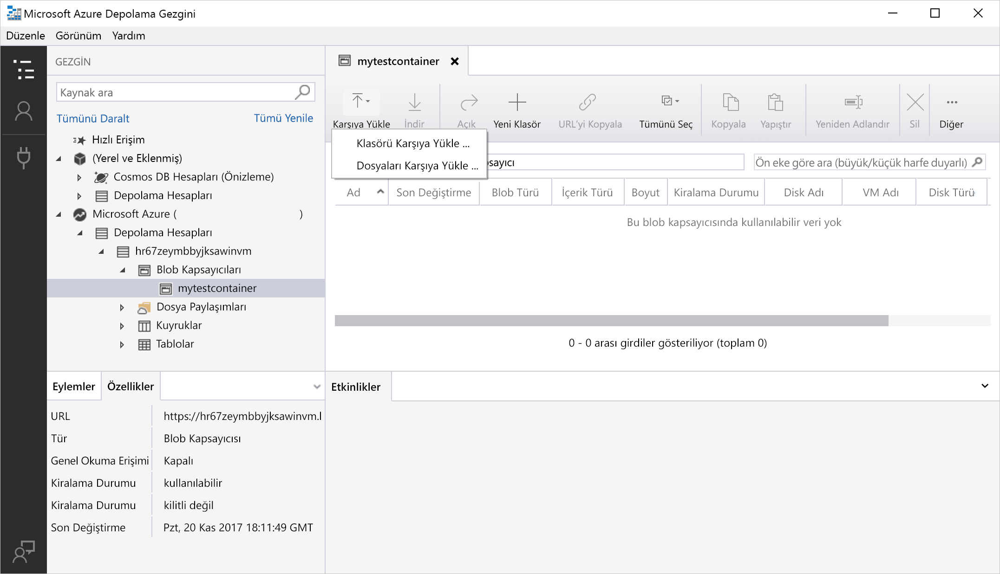
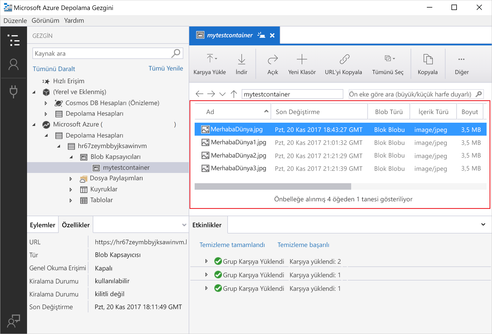

# Hızlı Başlangıç: Nesne depolamada blob oluşturma için Azure Depolama Gezgini'ni kullanma

Bu hızlı başlangıçta nasıl kullanılacağını öğrenin [Azure Depolama Gezgini](https://azure.microsoft.com/features/storage-explorer/) bir dizin ve blob oluşturmak için. Ardından, nasıl blob yerel bilgisayarınıza indirin ve tüm blobların bir dizinde görüntüleme öğrenin. Ayrıca bir blobun anlık görüntüsünü oluşturma, dizin erişim ilkelerini yönetmenize ve paylaşılan erişim imzası oluşturma hakkında bilgi edinin.

## Önkoşullar

[!INCLUDE [storage-quickstart-prereq-include](../../../includes/storage-quickstart-prereq-include.md)]

Bu hızlı başlangıç Azure Depolama Gezgini'ni yüklemenizi gerektirir. Windows, Macintosh veya Linux işletim sisteminde Azure Depolama Gezgini’ni yüklemek için bkz. [Azure Depolama Gezgini](https://azure.microsoft.com/features/storage-explorer/).

## Depolama Gezgini oturumu açma

Uygulamayı ilk kez başlattığınızda **Microsoft Azure Depolama Gezgini - Bağlan** penceresi görüntülenir. Depolama Gezgini depolama hesaplarına bağlamak için birçok yol sağlar ancak yalnızca bir yolu şu anda ACL'leri yönetmek için desteklenir.

|Görev|Amaç|
|---|---|
|Azure Hesabı ekleme | Azure'da kimlik doğrulaması gerçekleştirmek için kuruluşunuzun oturum açma sayfasını açar. Yönetme ve ACL'ler ayarlamak istiyorsanız şu anda bu tek desteklenen kimlik doğrulama yöntemidir. |

**Azure Hesabı Ekle**'yi seçip **Oturum açın**'a tıklayın. Azure hesabınızda oturum açmak için ekrandaki talimatları izleyin.

Bağlantı kurulduğunda Azure Depolama Gezgini yüklenir ve **Gezgin** sekmesi gösterilir. Bu görünümde tüm Azure depolama hesaplarınıza ek olarak [Azure Depolama Öykünücüsü](../common/storage-use-emulator.md?toc=%2fazure%2fstorage%2fblobs%2ftoc.json), [Cosmos DB](../../cosmos-db/storage-explorer.md?toc=%2fazure%2fstorage%2fblobs%2ftoc.json) hesapları veya [Azure Stack](../../azure-stack/user/azure-stack-storage-connect-se.md?toc=%2fazure%2fstorage%2fblobs%2ftoc.json) ortamları üzerinden yapılandırılan yerel depolama alanlarını görebilirsiniz.

## Bir dosya sistemi oluşturun

Bloblar her zaman bir dizine yüklenir. Bu, blob gruplarını bilgisayarınızdaki dosyaları klasörler halinde düzenlediğiniz gibi düzenleyebilmenizi sağlar.

Bir dizin oluşturmak için önceki adımda oluşturduğunuz depolama hesabını genişletin. Seçin **Blob kapsayıcısı**seçin ve sağ tıklatıp **oluşturma Blob kapsayıcısı**. Dosya sistemi için bir ad girin. İşlem tamamlandığında basın **Enter** dosya sistemi oluşturmak için. Blob dizini başarıyla oluşturulduktan sonra altında gösterilir **Blob kapsayıcısı** seçili depolama hesabı için bir klasör.

## Dizine blobları karşıya yüklemek

Blob depolama blok blobları, ekleme bloblarını ve sayfa bloblarını destekler. IaaS VM’lerini yedeklemek için kullanılan VHD dosyaları sayfa bloblarıdır. Ekleme blobları, bir dosyaya yazıp daha sonradan daha fazla bilgi eklemek istediğiniz durumlarda günlüğe kaydetme için kullanılır. Blob depolamada depolanan çoğu dosya blok blobudur.

Dizin Şerit üzerinde seçin **karşıya**. Bu işlemi kullanarak klasör veya dosya yükleyebilirsiniz.

Yüklenecek dosyaları veya klasörü seçin. **Blob türü**'nü seçin. **Ekleme**, **Sayfa** veya **Blok** bloblarını seçebilirsiniz.

.vhd veya .vhdx dosyası yüklüyorsanız **.vhd/.vhdx dosyalarını sayfa blobları olarak yükle (önerilen)** seçeneğini belirleyin.

İçinde **karşıya yükleme (isteğe bağlı) klasörü** dosyaları depolamak için bir klasör adı veya dizin altında klasörlerin alan. Hiçbir klasör seçilmezse dosyalar doğrudan dizininin altına yüklenir.

**Tamam**'ı seçtiğinizde dosyalar yüklenmek üzere kuyruğa alınır ve tüm dosyalar yüklenir. Yükleme işlemi tamamlandığında sonuçlar **Etkinlikler** penceresinde gösterilir.

## Bir dizin blob'larda görüntüle

İçinde **Azure Depolama Gezgini** uygulama dizininin altında bir depolama hesabı seçin. Ana bölmede, Seçili dizinde blobların listesi gösterilir.

## Blob’ları indirme

**Azure Depolama Gezgini**'ni kullanarak blobları indirmek için istediğiniz blobu seçtikten sonra şeritteki **İndir**'e tıklayın. Açılan dosya iletişim kutusuna dosya adı girebilirsiniz. Blobu yerel konuma indirmeye başlamak için **Kaydet**'i seçin.

## Sonraki adımlar

Bu hızlı başlangıçta, dosyaları **Azure Depolama Gezgini** kullanarak yerel bir disk ve Azure Blob depolama arasında aktarmayı öğrendiniz. ACL, dosyaları ve dizinleri ayarlama hakkında bilgi edinmek için konu ile ilgili bizim nasıl yapılır devam edin.

> [!div class="nextstepaction"]
> [ACL'ler dosyaları ve dizinleri ayarlama](data-lake-storage-how-to-set-permissions-storage-explorer.md)
