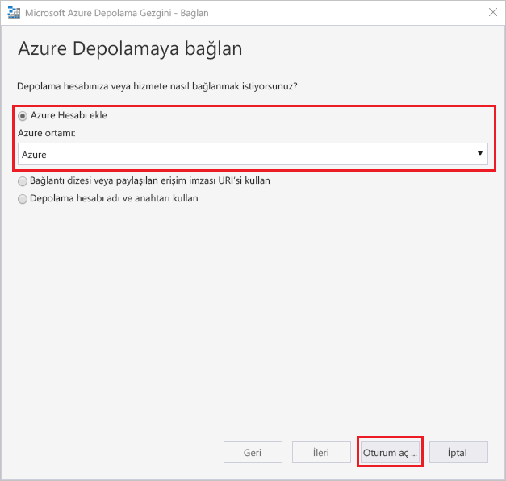
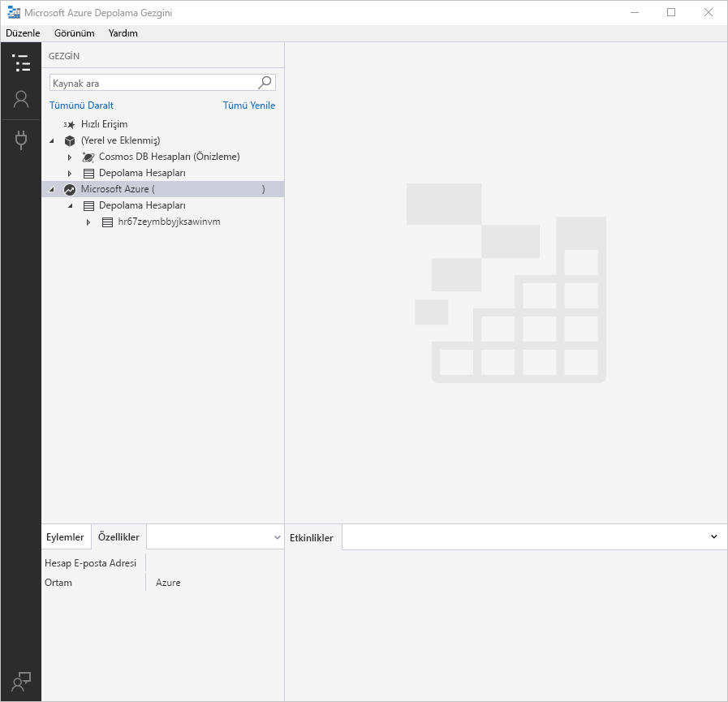

# Azure Data Lake Storage 2. Nesil’de dizinleri, dosyaları ve ACL’leri yönetmek için Azure Depolama Gezgini’ni kullanma

Bu makalede, hiyerarşik ad alanı (HNS) etkin olan depolama hesaplarında Dizin, dosya ve izinleri oluşturmak ve yönetmek için [Azure Depolama Gezgini](https://azure.microsoft.com/features/storage-explorer/) nasıl kullanılacağı gösterilmektedir.

## Önkoşullar

> [!div class="checklist"]
> * Azure aboneliği. Bkz. [Azure ücretsiz deneme sürümü edinme](https://azure.microsoft.com/pricing/free-trial/).
> * Hiyerarşik ad alanı (HNS) etkin olan bir depolama hesabı. Bir tane oluşturmak için [Bu](../common/storage-account-create.md) yönergeleri izleyin.
> * Yerel bilgisayarınızda yüklü Azure Depolama Gezgini. Windows, Macintosh veya Linux işletim sisteminde Azure Depolama Gezgini’ni yüklemek için bkz. [Azure Depolama Gezgini](https://azure.microsoft.com/features/storage-explorer/).

## Depolama Gezgini oturum açın

Depolama Gezgini’ni ilk kez başlattığınızda **Microsoft Azure Depolama Gezgini - Bağlan** penceresi görüntülenir. Depolama Gezgini depolama hesaplarına bağlanmak için çeşitli yollar sağladığından, ACL 'Leri yönetmek için şu anda yalnızca bir yol desteklenir.

|Görev|Amaç|
|---|---|
|Azure Hesabı ekleme | Sizi Azure 'da kimlik doğrulaması yapmak için kuruluşunuzun oturum açma sayfasına yönlendirir. ACL 'Leri yönetmek ve ayarlamak istiyorsanız şu anda desteklenen tek kimlik doğrulama yöntemidir.|
|Bağlantı dizesi veya paylaşılan erişim imzası URI'si kullanma | SAS belirteci veya paylaşılan bağlantı dizesiyle doğrudan bir kapsayıcıya veya depolama hesabına erişmek için kullanılabilir. |
|Depolama hesabı adını ve anahtarını kullanma| Azure depolama alanına bağlanmak için depolama hesabı adını ve anahtarını kullanın.|

**Azure hesabı ekle** ' yi seçin ve **oturum aç**' a tıklayın... Azure hesabınızda oturum açmak için ekrandaki istemleri izleyin.

Bağlantı kurulduğunda Azure Depolama Gezgini yüklenir ve **Gezgin** sekmesi gösterilir. Bu görünüm, tüm Azure depolama hesaplarınızın yanı sıra [Azurıite depolama öykünücüsü](../common/storage-use-azurite.md?toc=%2fazure%2fstorage%2fblobs%2ftoc.json), [Cosmos DB](../../cosmos-db/storage-explorer.md?toc=%2fazure%2fstorage%2fblobs%2ftoc.json) hesapları veya [Azure Stack](/azure-stack/user/azure-stack-storage-connect-se?toc=%2fazure%2fstorage%2fblobs%2ftoc.json) ortamları aracılığıyla yapılandırılan yerel depolama hakkında bilgi verir.

## Kapsayıcı oluşturma

Kapsayıcı dizinleri ve dosyaları barındırır. Bir tane oluşturmak için, devam adımında oluşturduğunuz depolama hesabını genişletin. **Blob Kapsayıcıları**'nı ve ardından **Blob Kapsayıcısı Oluştur**'u seçin. Kapsayıcının adını girin. Adlandırma kapsayıcılarındaki kuralların ve kısıtlamaların listesi için [kapsayıcı oluşturma](storage-quickstart-blobs-dotnet.md#create-a-container) bölümüne bakın. Tamamlandığında, kapsayıcıyı oluşturmak için **ENTER** tuşuna basın. Kapsayıcı başarıyla oluşturulduktan sonra, seçili depolama hesabı için **BLOB kapsayıcıları** klasörü altında görüntülenir.

## Dizin oluşturma

Bir dizin oluşturmak için, devam adımında oluşturduğunuz kapsayıcıyı seçin. Kapsayıcı şeridinde **Yeni klasör** düğmesini seçin. Dizininizin adını girin. Tamamlandığında, dizini oluşturmak için **ENTER** tuşuna basın. Dizin başarıyla oluşturulduktan sonra düzenleyici penceresinde görünür.

## Blob 'ları dizine yükleme

Dizin şeridinde **karşıya yükle** düğmesini seçin. Bu işlemi kullanarak klasör veya dosya yükleyebilirsiniz.

Yüklenecek dosyaları veya klasörü seçin.

**Tamam**'ı seçtiğinizde dosyalar yüklenmek üzere kuyruğa alınır ve tüm dosyalar yüklenir. Yükleme işlemi tamamlandığında sonuçlar **Etkinlikler** penceresinde gösterilir.

## Blob 'ları bir dizinde görüntüleme

**Azure Depolama Gezgini** uygulamasında, depolama hesabı altında bir dizin seçin. Ana bölmede, seçili dizindeki Blobların bir listesi gösterilir.

## Blob’ları indirme

**Azure Depolama Gezgini** kullanarak dosyaları indirmek için, bir dosya seçiliyken şeritten **İndir** ' i seçin. Açılan dosya iletişim kutusuna dosya adı girebilirsiniz. Yerel konuma bir dosyanın indirilmesini başlatmak için **Kaydet** ' i seçin.

## Erişimi yönetme

Kapsayıcının kökündeki izinleri ayarlayabilirsiniz. Bunu yapmak için, tek yapmanız gereken haklara sahip Azure Depolama Gezgini oturum açmanız gerekir (bağlantı dizesi ile aksine). Kapsayıcıya sağ tıklayın ve Izinleri **Yönet iletişim kutusunu** getirerek **izinleri yönet**' i seçin.

**Izni Yönet** iletişim kutusu, sahip ve sahipler grubu için izinleri yönetmenizi sağlar. Ayrıca, izinleri yönetebilmeniz için erişim denetim listesine yeni kullanıcılar ve gruplar eklemenize olanak tanır.

Erişim denetim listesine yeni bir kullanıcı veya grup eklemek için **Kullanıcı veya Grup Ekle** alanını seçin.

Listeye eklemek istediğiniz karşılık gelen Azure Active Directory (AAD) girişini girin ve **Ekle**' yi seçin.

Kullanıcı veya grup artık **Kullanıcılar ve gruplar:** alanında görünür ve bu da izinlerini yönetmeye başlamanızı sağlar.

> [!NOTE]
> AAD 'de bir güvenlik grubu oluşturmak ve tek kullanıcılar yerine grupta izinleri sürdürmek için en iyi uygulamadır ve önerilir. Bu öneriye ilişkin ayrıntılar ve diğer en iyi uygulamalar için bkz. [Data Lake Storage 2. için en iyi uygulamalar](data-lake-storage-best-practices.md).

Atayabileceğiniz iki izin kategorisi vardır: erişim ACL 'Leri ve varsayılan ACL 'Ler.

* **Erişim**: ACL denetim erişimi bir nesneye erişin. Dosya ve dizinlerin her ikisi de erişim ACL 'Lerine sahiptir.

* **Varsayılan**: Bu dizin altında oluşturulan tüm alt öğeler Için erişim ACL 'lerini belirleyen bir dizinle ilişkili ACL 'lerin bir şablonu. Dosyaların varsayılan ACL 'Leri yok.

Bu kategorilerin her ikisinde de, dosyalara veya dizinlere atayabileceğiniz üç izin vardır: **okuma**, **yazma** ve **yürütme**.

>[!NOTE]
> Burada seçimler yapıldığında, dizin içindeki mevcut olan herhangi bir öğe için izinler ayarlanmamaktadır. Dosya zaten varsa, her bir öğeye gitmeniz ve izinleri el ile ayarlamanız gerekir.

Tek tek dizinlerde ve tek tek dosyalar üzerinde izinleri yönetebilir, bu da size daha iyi erişim denetimi sağlar. Her iki dizin ve dosya için izinleri yönetme işlemi yukarıda açıklanan şekilde aynıdır. İzinlerini yönetmek istediğiniz dosya veya dizine sağ tıklayın ve aynı süreci izleyin.

## Sonraki adımlar

Data Lake Storage 2. erişim denetim listelerine öğrenin.

> [!div class="nextstepaction"]
> [Azure Data Lake Storage 2. Nesil'de Erişim Denetimi](./data-lake-storage-access-control.md)