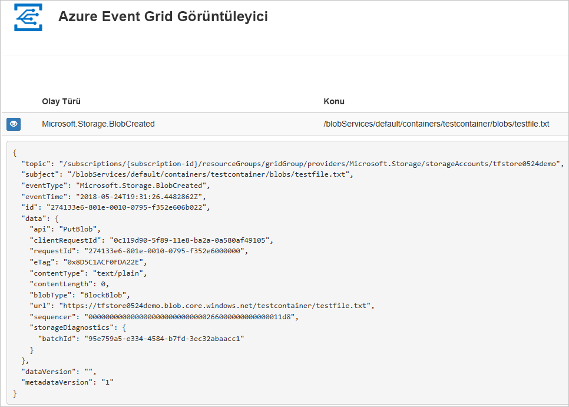
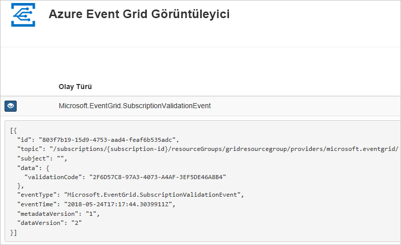

# <a name="quickstart-route-storage-events-to-web-endpoint-with-azure-cli"></a>Hızlı başlangıç: Azure CLı ile Depolama olaylarını Web uç noktasına yönlendirme

Azure Event Grid, bulut için bir olay oluşturma hizmetidir. Bu makalede, Azure CLI aracını kullanarak Blob depolama olaylarına abone olur ve sonucu görüntülemek için olayı tetiklersiniz.

Normalde olayları, olay verilerini işleyen ve eylemler gerçekleştiren bir uç noktaya gönderirsiniz. Bununla birlikte, bu makaleyi basitleştirmek için olayları iletilerin toplandığı ve görüntülendiği bir web uygulamasına gönderirsiniz.

Bu makalede açıklanan adımları tamamladıktan sonra olay verilerinin web uygulamasına gönderildiğini görürsünüz.



[!INCLUDE [quickstarts-free-trial-note.md](../../../includes/quickstarts-free-trial-note.md)]

[!INCLUDE [azure-cli-prepare-your-environment.md](../../../includes/azure-cli-prepare-your-environment.md)]

- Bu makale, Azure CLı 'nin sürüm 2.0.70 veya üstünü gerektirir. Azure Cloud Shell kullanılıyorsa, en son sürüm zaten yüklüdür.

## <a name="create-a-resource-group"></a>Kaynak grubu oluşturma

Event Grid konuları Azure kaynaklarıdır ve bir Azure kaynak grubuna yerleştirilmelidir. Kaynak grubu, Azure kaynaklarının dağıtıldığı ve yönetildiği bir mantıksal koleksiyondur.

[az group create](/cli/azure/group) komutuyla bir kaynak grubu oluşturun. 

Aşağıdaki örnek *westcentralus* konumunda `<resource_group_name>` adlı bir kaynak grubu oluşturur.  `<resource_group_name>` değerini kaynak grubunuz için benzersiz bir adla değiştirin.

```azurecli-interactive
az group create --name <resource_group_name> --location westcentralus
```

## <a name="create-a-storage-account"></a>Depolama hesabı oluşturma

Blob depolama olayları, genel amaçlı v2 depolama hesaplarında ve Blob depolama hesaplarında kullanılabilir. **Genel amaçlı v2** depolama hesapları; Bloblar, Dosyalar, Kuyruklar ve Tablolar dahil olmak üzere tüm depolama hizmetlerine yönelik tüm özellikleri destekler. **Blob depolama hesabı**, yapılandırılmamış verilerinizi bloblar (nesneler) olarak Azure Storage’da depolamanıza yönelik özel depolama hesabıdır. Blob Storage hesapları, genel amaçlı depolama hesaplarınıza benzer ve blok blobları ve ilave blobları için %100 API tutarlığı dahil günümüzde kullandığınız tüm harika dayanıklılık, kullanılabilirlik, ölçeklenebilirlik ve performans özelliklerini paylaşır. Daha fazla bilgi için bkz. [Azure depolama hesabına genel bakış](../common/storage-account-overview.md).

`<storage_account_name>` değerini depolama hesabınız için benzersiz bir ad ile ve `<resource_group_name>` değerini daha önce oluşturduğunuz kaynak grubu ile değiştirin.

```azurecli-interactive
az storage account create \
  --name <storage_account_name> \
  --location westcentralus \
  --resource-group <resource_group_name> \
  --sku Standard_LRS \
  --kind BlobStorage \
  --access-tier Hot
```

## <a name="create-a-message-endpoint"></a>İleti uç noktası oluşturma

Konuya abone olmadan önce olay iletisi için uç noktayı oluşturalım. Normalde, olay verileri temelinde uç nokta eylemleri gerçekleştirir. Bu hızlı başlangıcı basitleştirmek için, olay iletilerini görüntüleyin bir [önceden oluşturulmuş web uygulaması](https://github.com/Azure-Samples/azure-event-grid-viewer) dağıtırsınız. Dağıtılan çözüm bir App Service planı, App Service web uygulaması ve GitHub'dan kaynak kod içerir.

`<your-site-name>` değerini web uygulamanız için benzersiz bir adla değiştirin. Web uygulaması adı bir DNS girdisinin parçası olduğundan benzersiz olmalıdır.

```azurecli-interactive
sitename=<your-site-name>

az deployment group create \
  --resource-group <resource_group_name> \
  --template-uri "https://raw.githubusercontent.com/Azure-Samples/azure-event-grid-viewer/master/azuredeploy.json" \
  --parameters siteName=$sitename hostingPlanName=viewerhost
```

Dağıtımın tamamlanması birkaç dakika sürebilir. Dağıtım başarıyla gerçekleştirildikten sonra, web uygulamanızı görüntüleyip çalıştığından emin olun. Web tarayıcısında şu adrese gidin: `https://<your-site-name>.azurewebsites.net`

Şu anda iletilerin görüntülenmediği siteyi görüyor olmalısınız.

[!INCLUDE [event-grid-register-provider-cli.md](../../../includes/event-grid-register-provider-cli.md)]

## <a name="subscribe-to-your-storage-account"></a>Depolama hesabınıza abone olma

Event Grid’e hangi olayları izlemek istediğinizi ve bu olayların nereye gönderileceğini bildirmek için bir konuya abone olursunuz. Aşağıdaki örnek, oluşturduğunuz depolama hesabına abone olur ve web uygulamanızın URL’sini olay bildirimi için uç nokta olarak geçirir. Olay aboneliğiniz için `<event_subscription_name>` öğesini bir ad ile değiştirin. `<resource_group_name>` ve `<storage_account_name>` için daha önce oluşturduğunuz değerleri kullanın.

Web uygulamanızın uç noktası `/api/updates/` sonekini içermelidir.

```azurecli-interactive
storageid=$(az storage account show --name <storage_account_name> --resource-group <resource_group_name> --query id --output tsv)
endpoint=https://$sitename.azurewebsites.net/api/updates

az eventgrid event-subscription create \
  --source-resource-id $storageid \
  --name <event_subscription_name> \
  --endpoint $endpoint
```

Web uygulamanızı yeniden görüntüleyin ve buna bir abonelik doğrulama olayının gönderildiğine dikkat edin. Göz simgesini seçerek olay verilerini genişletin. Uç noktanın olay verilerini almak istediğini doğrulayabilmesi için Event Grid doğrulama olayını gönderir. Web uygulaması aboneliği doğrulamak için kod içerir.



## <a name="trigger-an-event-from-blob-storage"></a>Blob depolama biriminden bir olay tetikler

Şimdi, Event Grid’in iletiyi uç noktanıza nasıl dağıttığını görmek için bir olay tetikleyelim. İlk olarak, depolama hesabı için adı ve anahtarı yapılandıralım, ardından bir kapsayıcı oluşturacağız ve bir dosyayı oluşturup karşıya yükleyeceğiz. `<storage_account_name>` ve `<resource_group_name>` için yine daha önce oluşturduğunuz değerleri kullanın.

```azurecli-interactive
export AZURE_STORAGE_ACCOUNT=<storage_account_name>
export AZURE_STORAGE_ACCESS_KEY="$(az storage account keys list --account-name <storage_account_name> --resource-group <resource_group_name> --query "[0].value" --output tsv)"

az storage container create --name testcontainer

touch testfile.txt
az storage blob upload --file testfile.txt --container-name testcontainer --name testfile.txt
```

Olayı tetiklediniz ve Event Grid, iletiyi abone olurken yapılandırdığınız uç noktaya gönderdi. Az önce gönderdiğiniz olayı görmek için web uygulamanızı görüntüleyin.


```json
[{
  "topic": "/subscriptions/xxxxxxxx-xxxx-xxxx-xxxx-xxxxxxxxxxxx/resourceGroups/myrg/providers/Microsoft.Storage/storageAccounts/myblobstorageaccount",
  "subject": "/blobServices/default/containers/testcontainer/blobs/testfile.txt",
  "eventType": "Microsoft.Storage.BlobCreated",
  "eventTime": "2017-08-16T20:33:51.0595757Z",
  "id": "4d96b1d4-0001-00b3-58ce-16568c064fab",
  "data": {
    "api": "PutBlockList",
    "clientRequestId": "d65ca2e2-a168-4155-b7a4-2c925c18902f",
    "requestId": "4d96b1d4-0001-00b3-58ce-16568c000000",
    "eTag": "0x8D4E4E61AE038AD",
    "contentType": "text/plain",
    "contentLength": 0,
    "blobType": "BlockBlob",
    "url": "https://myblobstorageaccount.blob.core.windows.net/testcontainer/testblob1.txt",
    "sequencer": "00000000000000EB0000000000046199",
    "storageDiagnostics": {
      "batchId": "dffea416-b46e-4613-ac19-0371c0c5e352"
    }
  },
  "dataVersion": "",
  "metadataVersion": "1"
}]

```

## <a name="clean-up-resources"></a>Kaynakları temizleme
Bu depolama hesabı ve olay aboneliğiyle çalışmaya devam etmeyi planlıyorsanız bu makalede oluşturulan kaynakları temizlemeyin. Devam etmeyi planlamıyorsanız, aşağıdaki komutu kullanarak bu makalede oluşturduğunuz kaynakları silin.

`<resource_group_name>` değerini yukarıda oluşturduğunuz kaynak grubuyla değiştirin.

```azurecli-interactive
az group delete --name <resource_group_name>
```

## <a name="next-steps"></a>Sonraki adımlar

Artık konu oluşturma ve olay aboneliklerini öğrendiğinize göre, Blob depolama Olayları ve Event Grid’in size nasıl yardımcı olabileceği konusunda daha fazla bilgi edinebilirsiniz:

- [Blob depolama olaylarına yanıt verme](storage-blob-event-overview.md)
- [Event Grid Hakkında](../../event-grid/overview.md)
