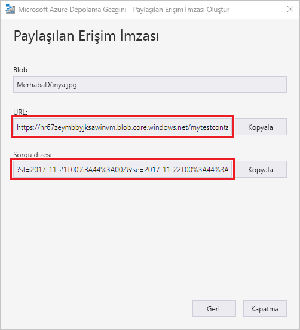

# Hızlı Başlangıç: Azure Depolama Gezgini’ni kullanarak blobları yükleme, indirme ve listeleme

[Azure Depolama Gezgini](https://azure.microsoft.com/features/storage-explorer/), depolama hesaplarınızın içeriğini yönetmek için kullanılan çok platformlu kullanıcı arabirimidir. Bu kılavuzda yerel disk ile Azure Blob depolama arasında dosyaları aktarmak için Azure Depolama Gezgini'ni kullanma hakkında ayrıntılı bilgiler sağlanmaktadır.

Azure aboneliğiniz yoksa başlamadan önce [ücretsiz bir hesap](https://azure.microsoft.com/free/?WT.mc_id=A261C142F) oluşturun.

Bu hızlı başlangıç için Azure Depolama Gezgini'nin yüklenmiş olması gerekir. Yüklemeniz gerekiyorsa [Azure Depolama Gezgini](https://azure.microsoft.com/features/storage-explorer/) sayfasını ziyaret ederek Windows, Macintosh veya Linux platformlarına yükleyebilirsiniz.

[!INCLUDE [storage-quickstart-tutorial-create-account-portal](../../../includes/storage-quickstart-tutorial-create-account-portal.md)]

## Depolama Gezgini oturumu açma

Uygulamayı ilk kez başlattığınızda **Microsoft Azure Depolama Gezgini - Bağlan** penceresi görüntülenir. Depolama Gezgini depolama hesaplarına bağlamak için birçok yol sağlar. Aşağıdaki tabloda bağlantı için kullanabileceğiniz yöntemlere yer verilmiştir:

|Görev|Amaç|
|---|---|
|Azure Hesabı ekleme | Azure'da kimlik doğrulaması gerçekleştirmek için kuruluşunuzun oturum açma sayfasını açar. |
|Bağlantı dizesi veya paylaşılan erişim imzası URI'si kullanma | SAS belirteci veya paylaşılan bağlantı dizesiyle doğrudan bir kapsayıcıya veya depolama hesabına erişmek için kullanılabilir. |
|Depolama hesabı adını ve anahtarını kullanma| Azure depolama alanına bağlanmak için depolama hesabı adını ve anahtarını kullanın.|

**Azure Hesabı Ekle**'yi seçip **Oturum açın**'a tıklayın. Azure hesabınızda oturum açmak için ekrandaki talimatları izleyin.

Bağlantı kurulduğunda Azure Depolama Gezgini yüklenir ve **Gezgin** sekmesi gösterilir. Bu görünümde tüm Azure depolama hesaplarınıza ek olarak [Azure Depolama Öykünücüsü](../common/storage-use-emulator.md?toc=%2fazure%2fstorage%2fblobs%2ftoc.json), [Cosmos DB](../../cosmos-db/storage-explorer.md?toc=%2fazure%2fstorage%2fblobs%2ftoc.json) hesapları veya [Azure Stack](../../azure-stack/user/azure-stack-storage-connect-se.md?toc=%2fazure%2fstorage%2fblobs%2ftoc.json) ortamları üzerinden yapılandırılan yerel depolama alanlarını görebilirsiniz.

## Bir kapsayıcı oluşturma

Bloblar her zaman bir kapsayıcıya yüklenir. Bu, blob gruplarını bilgisayarınızdaki dosyaları klasörler halinde düzenlediğiniz gibi düzenleyebilmenizi sağlar.

Kapsayıcı oluşturmak için önceki adımda oluşturduğunuz depolama hesabını genişletin. **Blob Kapsayıcıları**'nı ve ardından **Blob Kapsayıcısı Oluştur**'u seçin. Blob kapsayıcınızın adını girin. Blob kapsayıcılarını adlandırmayla ilgili kural ve kısıtlamaların listesi için [Kapsayıcı oluşturma ve ayarlama izinleri](storage-quickstart-blobs-dotnet.md#create-the-container-and-set-permissions) bölümüne bakın. Girişleri tamamladığınızda blob kapsayıcısını oluşturmak için **Enter**'a basın. Blob kapsayıcısı başarıyla oluşturulduktan sonra, seçili depolama hesabının **Blob Kapsayıcıları** klasörü altında gösterilir.

## Blobları kapsayıcıya yükleme

Blob depolama blok blobları, ekleme bloblarını ve sayfa bloblarını destekler. IaaS VM’lerini yedeklemek için kullanılan VHD dosyaları sayfa bloblarıdır. Ekleme blobları, bir dosyaya yazıp daha sonradan daha fazla bilgi eklemek istediğiniz durumlarda günlüğe kaydetme için kullanılır. Blob depolamada depolanan çoğu dosya blok blobudur.

Kapsayıcı şeridinde **Yükle**'yi seçin. Bu işlemi kullanarak klasör veya dosya yükleyebilirsiniz.

Yüklenecek dosyaları veya klasörü seçin. **Blob türü**'nü seçin. **Ekleme**, **Sayfa** veya **Blok** bloblarını seçebilirsiniz.

.vhd veya .vhdx dosyası yüklüyorsanız **.vhd/.vhdx dosyalarını sayfa blobları olarak yükle (önerilen)** seçeneğini belirleyin.

**Klasöre yükle (isteğe bağlı)** alanına dosyaların veya klasörlerin depolanması için kapsayıcıdaki bir klasörün adını girebilirsiniz. Klasör seçilmezse dosyalar doğrudan kapsayıcı altına yüklenir.

**Tamam**'ı seçtiğinizde dosyalar yüklenmek üzere kuyruğa alınır ve tüm dosyalar yüklenir. Yükleme işlemi tamamlandığında sonuçlar **Etkinlikler** penceresinde gösterilir.

## Blobları bir kapsayıcıda görüntüleme

**Azure Depolama Gezgini** uygulamasında depolama hesabının altındaki bir kapsayıcıyı seçin. Ana bölmede seçilen kapsayıcı içindeki blobların listesi gösterilir.

## Blob’ları indirme

**Azure Depolama Gezgini**'ni kullanarak blobları indirmek için istediğiniz blobu seçtikten sonra şeritteki **İndir**'e tıklayın. Açılan dosya iletişim kutusuna dosya adı girebilirsiniz. Blobu yerel konuma indirmeye başlamak için **Kaydet**'i seçin.

## Anlık görüntüleri yönetme

Azure Depolama Gezgini, bloblarınızın [anlık görüntülerini](storage-blob-snapshots.md) almanızı ve görüntülemenizi sağlar. Bir blobun anlık görüntüsünü almak için bloba sağ tıklayıp **Ekran Görüntüsü Yap**'ı seçin. Bir blobun anlık görüntülerini görüntülemek için bloba sağ tıklayıp **Ekran Görüntülerini Yönet**'i seçin. Geçerli sekmede blobun ekran görüntülerinin listesi gösterilir.

## Erişim ilkelerini yönetme

Depolama Gezgini, kullanıcı arabiriminde kapsayıcılar için erişim ilkelerini yönetme imkanı sunar. Hizmet düzeyi ve hesap düzeyi olmak üzere iki güvenlik erişim ilkesi (SAS) türü vardır. Hesap düzeyi SAS, depolama hesabını hedefler ve birden fazla hizmete ve kaynağa uygulanabilir. Hizmet düzeyi SAS, belirli bir hizmet altındaki kaynak için tanımlanır. Hizmet düzeyi SAS oluşturmak için kapsayıcıya sağ tıklayıp **Erişim İlkelerini Yönet...** öğesini seçin. Hesap düzeyi SAS oluşturmak için depolama hesabına sağ tıklayın.

Yeni bir erişim ilkesi eklemek ve ilkenin izinlerini tanımlamak için **Ekle**'yi seçin. İşlemi tamamladığınızda erişim ilkesini kaydetmek için **Kaydet**'i seçin. Bu ilkeyi Paylaşılan Erişim İmzası yapılandırma sırasında kullanabilirsiniz.

## Paylaşılan Erişim İmzaları ile çalışma

Paylaşılan Erişim İmzaları (SAS) Depolama Gezgini'nden alınabilir. Depolama hesabına, kapsayıcıya veya bloba sağ tıklayıp **Paylaşılan Erişim İmzası Al...** öğesini seçin. Başlangıç ve bitiş zamanını ve SAS URL izinlerini seçip **Oluştur**'a tıklayın. Sonraki ekranda sorgu dizesini içeren tam URL'nin yanı sıra sorgu dizesinin kendisi sağlanır ve bu değerler kopyalanabilir.

## Sonraki adımlar

Bu hızlı başlangıçta, dosyaları **Azure Depolama Gezgini** kullanarak yerel bir disk ve Azure Blob depolama arasında aktarmayı öğrendiniz. Blob depolamayla çalışma hakkında daha fazla bilgi edinmek için, Blob depolama nasıl yapılır öğreticisiyle devam edin.

> [!div class="nextstepaction"]
> [Blob Depolama İşlemleri Nasıl Yapılır](storage-how-to-use-blobs-powershell.md)
