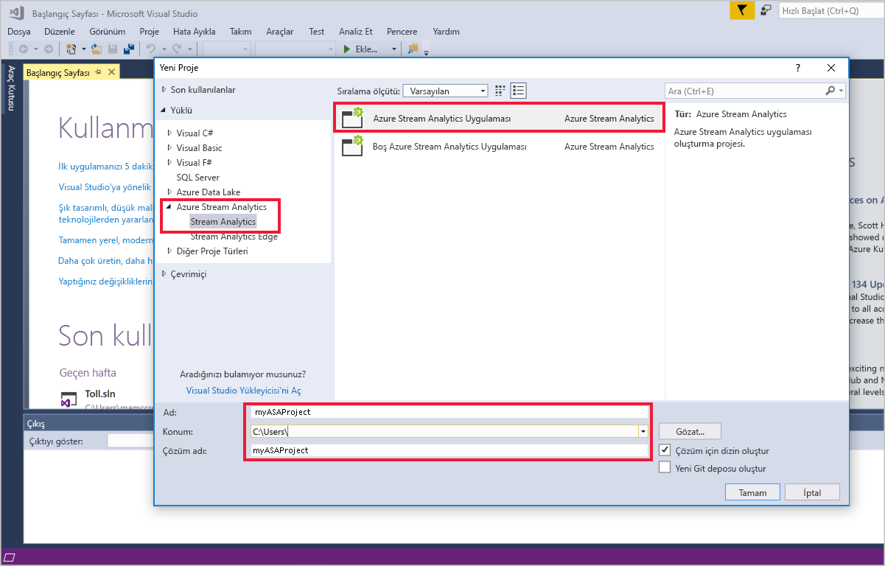
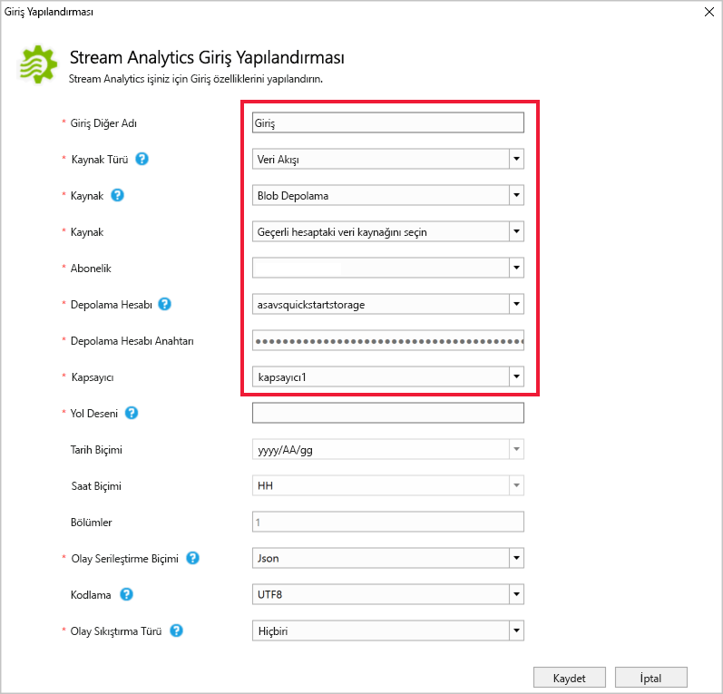
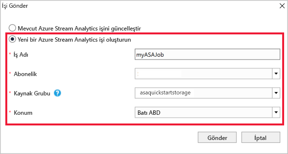
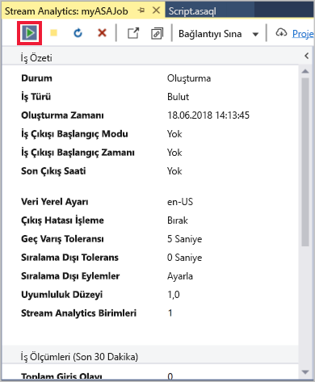
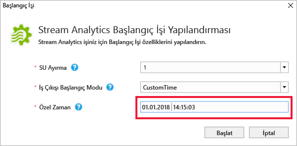

# <a name="quickstart-create-an-azure-stream-analytics-job-by-using-visual-studio"></a>Hızlı başlangıç: Visual Studio 'Yu kullanarak Azure Stream Analytics işi oluşturma

Bu hızlı başlangıçta Visual Studio için Azure Stream Analytics araçlarını kullanarak bir Stream Analytics işi oluşturma ve çalıştırma adımları gösterilmektedir. Örnek iş, bir IoT Hub cihazından akış verilerini okur. 27 ° üzerinde ortalama sıcaklığı hesaplayan ve sonuç çıktı olaylarını BLOB depolama alanındaki yeni bir dosyaya yazan bir iş tanımlarsınız.

> [!NOTE]
> Visual Studio ve Visual Studio Code araçları, Çin Doğu, Çin Kuzey, Almanya Orta ve Almanya kuzeydoğu bölgelerinde bulunan işleri desteklemez.

## <a name="before-you-begin"></a>Başlamadan önce

* Azure aboneliğiniz yoksa [ücretsiz bir hesap](https://azure.microsoft.com/free/) oluşturun.

* [Azure Portal](https://portal.azure.com/) oturum açın.

* Visual Studio 2019, Visual Studio 2015 veya Visual Studio 2013 Güncelleştirme 4 'i yükler. Enterprise (Ultimate/Premium), Professional ve Community sürümleri desteklenir. Express sürümü desteklenmez.

* [Yükleme talimatlarını](./stream-analytics-tools-for-visual-studio-install.md) izleyerek Visual Studio için Stream Analytics araçlarını yükleyin.

## <a name="prepare-the-input-data"></a>Girdi verilerini hazırlama

Stream Analytics işini tanımlamadan önce, daha sonra iş girişi olarak yapılandırılmış olan verileri hazırlamanız gerekir. İş için gereken giriş verilerini hazırlamak için aşağıdaki adımları izleyin:

1. [Azure Portal](https://portal.azure.com/) oturum açın.

2. IoT Hub **nesnelerin interneti kaynak oluştur**' u seçin  >    >  .

3. **IoT Hub** bölmesinde aşağıdaki bilgileri girin:
   
   |**Ayar**  |**Önerilen değer**  |**Açıklama**  |
   |---------|---------|---------|
   |Abonelik  | \<Your subscription\> |  Kullanmak istediğiniz Azure aboneliğini seçin. |
   |Kaynak grubu   |   asaquickstart-resourcegroup  |   **Yeni Oluştur**’u seçin ve hesabınız için yeni bir kaynak grubu adı girin. |
   |Region  |  \<Select the region that is closest to your users\> | IoT Hub barındırabileceğiniz coğrafi bir konum seçin. Kullanıcılarınıza en yakın konumu kullanın. |
   |IoT Hub adı  | MyASAIoTHub  |   IoT Hub için bir ad seçin.   |

   

4. **İleri ' yi seçin: boyut ve ölçek ayarla**.

5. **Fiyatlandırma ve ölçek katmanınızı** seçin. Bu hızlı başlangıçta, aboneliğinizde hala kullanılabiliyorsa **F1-ücretsiz** katmanını seçin. Ücretsiz katman kullanılamıyorsa, kullanılabilir en düşük katmanı seçin. Daha fazla bilgi için bkz. [IoT Hub fiyatlandırması](https://azure.microsoft.com/pricing/details/iot-hub/).

   

6. **Gözden geçir ve oluştur**’u seçin. IoT Hub bilgilerinizi gözden geçirin ve **Oluştur**' a tıklayın. IoT Hub oluşturulması birkaç dakika sürebilir. İlerleme durumunu **Bildirimler** bölmesinden izleyebilirsiniz.

7. IoT Hub gezinti menüsünde **IoT cihazları** altında **Ekle** ' ye tıklayın. Bir **CIHAZ kimliği** ekleyin ve **Kaydet**' e tıklayın.

   

8. Cihaz oluşturulduktan sonra **IoT cihazları** listesinden cihazı açın. **Bağlantı dizesini kopyalayın--birincil anahtar** ve daha sonra kullanmak için bir not defteri 'ne kaydedin.

   

## <a name="create-blob-storage"></a>BLOB depolama oluştur

1. Azure Portal sol üst köşesinden **kaynak**  >  **depolama**  >  **depolama hesabı** oluştur ' u seçin.

2. **Depolama hesabı oluştur** bölmesinde, bir depolama hesabı adı, konum ve kaynak grubu girin. Oluşturduğunuz IoT Hub aynı konum ve kaynak grubunu seçin. Ardından hesabı oluşturmak için **gözden geçir + oluştur** ' a tıklayın.

   

3. Depolama Hesabınız oluşturulduktan sonra **genel bakış** bölmesinde **Bloblar** kutucuğunu seçin.

   

4. **BLOB hizmeti** sayfasından **kapsayıcı** ' yı seçin ve Kapsayıcınız için *kapsayıcı1* gibi bir ad sağlayın. **Ortak erişim düzeyini** **özel (anonim erişim yok)** olarak bırakın ve **Tamam**' ı seçin.

   

## <a name="create-a-stream-analytics-project"></a>Stream Analytics projesi oluşturma

1. Visual Studio’yu çalıştırın.

2. **Dosya > Yeni Proje**'yi seçin.  

3. Sol taraftaki şablon listesinden **Stream Analytics**'i ve ardından **Azure Stream Analytics Uygulaması**'nı seçin.  

4. Projenin **Ad**, **Konum** ve **Çözüm adı** değerlerini girip **Tamam**'ı seçin.

   

Azure Stream Analytics projesine dahil edilen öğelere dikkat edin.

   


## <a name="choose-the-required-subscription"></a>Gerekli aboneliği seçin

1. Visual Studio'nun **Görünüm** menüsünde **Sunucu Gezgini**'ni seçin.

2. **Azure**'a sağ tıklayıp **Microsoft Azure Aboneliğine Bağlan**'ı seçin ve Azure hesabınızla oturum açın.

## <a name="define-input"></a>Girişi tanımlama

1. **Çözüm Gezgini**'nde **Girişler** düğümünü genişletin ve **Input.json** dosyasına çift tıklayın.

2. **Stream Analytics Giriş Yapılandırması**'na aşağıdaki değerleri ekleyin:

   |**Ayar**  |**Önerilen değer**  |**Açıklama**   |
   |---------|---------|---------|
   |Girdi Diğer Adı  |  Girdi   |  İşin girdisini tanımlamak için bir ad girin.   |
   |Kaynak Türü   |  Veri Akışı |  Uygun giriş kaynağını seçin: Veri Akışı veya Başvuru Verileri.   |
   |Kaynak  |  IoT Hub |  Uygun giriş kaynağını seçin.   |
   |Kaynak  | Geçerli hesaptaki veri kaynağını seçin | Verileri el ile girin veya var olan bir hesabı seçin.   |
   |Abonelik  |  \<Your subscription\>   | Oluşturduğunuz IoT Hub sahip Azure aboneliğini seçin.   |
   |IoT Hub  |  MyASAIoTHub   |  IoT Hub adını seçin veya girin. IoT Hub adları, aynı abonelikte oluşturulduklarında otomatik olarak algılanır.   |
   
3. Diğer seçenekleri varsayılan değerlerinde bırakın ve ayarları kaydetmek **Kaydet**’i seçin.  

   

## <a name="define-output"></a>Çıkışı tanımlama

1. **Çözüm Gezgini**'nde **Çıkışlar** düğümünü genişletin ve **Output.json** dosyasına çift tıklayın.

2. **Stream Analytics Çıkış Yapılandırması**'na aşağıdaki değerleri ekleyin:

   |**Ayar**  |**Önerilen değer**  |**Açıklama**   |
   |---------|---------|---------|
   |Çıktı Diğer Adı  |  Çıktı   |  İşin çıktısını tanımlamak için bir ad girin.   |
   |Havuz   |  Blob Depolama |  Uygun havuzu seçin.    |
   |Kaynak  |  Veri kaynağı ayarlarını el ile sağlayın |  Verileri el ile girin veya var olan bir hesabı seçin.   |
   |Abonelik  |  \<Your subscription\>   | Oluşturduğunuz depolama hesabını içeren Azure aboneliğini seçin. Depolama hesabı, aynı veya farklı bir abonelikte olabilir. Bu örnekte, aynı abonelikte depolama hesabı oluşturduğunuz varsayılır.   |
   |Depolama Hesabı  |  asaquickstartstorage   |  Depolama hesabının adını seçin veya girin. Depolama hesabı adları aynı abonelikte oluşturulursa otomatik olarak algılanır.   |
   |Kapsayıcı  |  kapsayıcı1   |  Depolama hesabınızda oluşturduğunuz mevcut kapsayıcıyı seçin.   |
   |Yol Deseni  |  çıkış   |  Kapsayıcıda oluşturulacak dosya yolunun adını girin.   |
   
3. Diğer seçenekleri varsayılan değerlerinde bırakın ve ayarları kaydetmek **Kaydet**’i seçin.  

   

## <a name="define-the-transformation-query"></a>Dönüşüm sorgusunu tanımlama

1. Visual Studio'da **Çözüm Gezgini**'nden **Script.asaql** dosyasını açın.

2. Aşağıdaki sorguyu ekleyin:

   ```sql
   SELECT *
   INTO Output
   FROM Input
   HAVING Temperature > 27
   ```

## <a name="submit-a-stream-analytics-query-to-azure"></a>Azure'a bir Stream Analytics sorgusu gönderme

1. **Sorgu Düzenleyicisi**'nin betik düzenleyici bölümünde **Azure'a Gönder**'i seçin.

2. **Yeni bir Azure Stream Analytics işi oluştur**'u seçip bir **İş Adı** girin. Hızlı başlangıcın başında kullandığınız **Abonelik**, **Kaynak Grubu** ve **Konum** bilgilerini seçin.

   

## <a name="run-the-iot-simulator"></a>IoT simülatörü çalıştırma

1. Yeni bir tarayıcı sekmesinde veya penceresinde [Raspberry PI Azure IoT çevrimiçi simülatörünü](https://azure-samples.github.io/raspberry-pi-web-simulator/) açın.

2. 15. satırdaki yer tutucusunu, önceki bölümde kaydettiğiniz Azure IoT Hub cihaz bağlantı dizesiyle değiştirin.

3. **Çalıştır**'a tıklayın. Çıktıda, IoT Hub gönderilen algılayıcı verileri ve iletileri gösterilmelidir.

   

## <a name="start-the-stream-analytics-job-and-check-output"></a>Stream Analytics işini başlatıp çıktıyı denetleyin

1. İşiniz oluşturulduğunda otomatik olarak iş görünümü açılır. İşi başlatmak için yeşil ok düğmesini seçin.

   

2. **İş çıkışı başlangıç modunu** **jobstarttime** olarak değiştirin ve **Başlat**' ı seçin.

   

3. İş durumunun **Çalışıyor** olarak değiştiğine ve giriş/çıkış olayları olduğuna dikkat edin. Bu birkaç dakika sürebilir.

   

4. Sonuçları görüntülemek için **Görünüm** menüsünde **Bulut Gezgini**'ni seçin ve kaynak grubunuzdaki depolama hesabına gidin. **Blob Kapsayıcıları** bölümünde **container1**'e ve ardından **output** dosya yoluna çift tıklayın.

   

## <a name="clean-up-resources"></a>Kaynakları temizleme

Artık gerekli olmadığında kaynak grubunu, akış işini ve tüm ilgili kaynakları silin. İşin silinmesi, iş tarafından kullanılan akış birimlerinin faturalanmasını önler. İşi gelecekte kullanmayı planlıyorsanız, durdurup daha sonra gerektiğinde yeniden başlatabilirsiniz. Bu işi kullanmaya devam etmeyecekseniz aşağıdaki adımları kullanarak bu hızlı başlangıçla oluşturulan tüm kaynakları silin:

1. Azure portalında sol taraftaki menüden, **Kaynak grupları**'nı ve ardından oluşturduğunuz kaynağın adını seçin.  

2. Kaynak grubu sayfanızda, **Sil**'i seçin, metin kutusuna silinecek kaynağın adını yazın ve ardından **Sil**'i seçin.

## <a name="next-steps"></a>Sonraki adımlar

Bu hızlı başlangıçta Visual Studio kullanarak basit bir Stream Analytics işi dağıttınız. Stream Analytics işlerini [Azure portalı](stream-analytics-quick-create-portal.md) ve [PowerShell](stream-analytics-quick-create-powershell.md)’i kullanarak da dağıtabilirsiniz. 

Visual Studio Azure Stream Analytics araçları hakkında bilgi edinmek için aşağıdaki makaleye ilerleyin:

> [!div class="nextstepaction"]
> [Azure Stream Analytics işleri görüntülemek için Visual Studio 'Yu kullanma](stream-analytics-vs-tools.md)