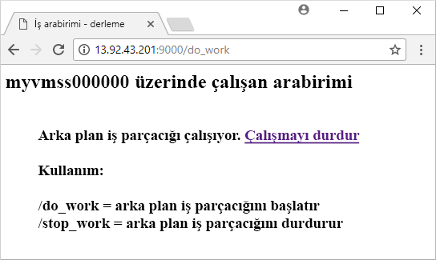

# <a name="quickstart-create-a-linux-virtual-machine-scale-set-with-an-azure-resource-manager-template"></a>Hızlı başlangıç: Azure Resource Manager şablonuyla Linux sanal makine ölçek kümesi oluşturma

Bir sanal makine ölçek kümesi, otomatik ölçeklendirme sanal makineleri kümesini dağıtmanıza ve yönetmenize olanak tanır. Ölçek kümesi içindeki sanal makine sayısını el ile ölçeklendirebilir veya CPU, bellek talebi ya da ağ trafiği gibi kaynak kullanımını temel alan otomatik ölçeklendirme kuralları tanımlayabilirsiniz. Azure Load Balancer daha sonra ölçek kümesindeki sanal makine örneklerine trafiği dağıtır. Bu hızlı başlangıçta, Azure Resource Manager şablonu ile bir sanal makine ölçek kümesi oluşturur ve örnek uygulama dağıtırsınız.

[!INCLUDE [About Azure Resource Manager](../../includes/resource-manager-quickstart-introduction.md)]

Azure aboneliğiniz yoksa başlamadan önce [ücretsiz bir hesap](https://azure.microsoft.com/free/?WT.mc_id=A261C142F) oluşturun.

## <a name="prerequisites"></a>Ön koşullar

Yok.

## <a name="create-a-scale-set"></a>Ölçek kümesi oluşturma

Azure Resource Manager şablonları, ilgili kaynak gruplarını dağıtmanızı sağlar. Tek bir şablonda sanal makine ölçek kümesi oluşturabilir, uygulamaları yükleyebilir ve otomatik ölçeklendirme kurallarını yapılandırabilirsiniz. Değişkenleri ve parametreleri kullanarak bu şablonu var olan ölçek kümelerini güncelleştirme veya yenilerini oluşturma amacıyla tekrar kullanabilirsiniz. Şablonları Azure portalı, Azure CLI veya Azure PowerShell aracılığıyla ya da sürekli tümleştirme/sürekli teslim (CI/CD) işlem hatlarından dağıtabilirsiniz.

### <a name="review-the-template"></a>Şablonu gözden geçirme

Bu hızlı başlangıçta kullanılan şablon [Azure Hızlı Başlangıç şablonlarından](https://azure.microsoft.com/resources/templates/201-vmss-bottle-autoscale/) alınmıştır.

:::code language="json" source="~/quickstart-templates/201-vmss-bottle-autoscale/azuredeploy.json" range="1-330" highlight="176-264":::

Bu kaynaklar şablonda tanımlanmıştır:

- [**Microsoft. Network/virtualNetworks**](/azure/templates/microsoft.network/virtualnetworks)
- [**Microsoft. Network/Publicıpaddresses**](/azure/templates/microsoft.network/publicipaddresses)
- [**Microsoft. Network/loadBalancers**](/azure/templates/microsoft.network/loadbalancers)
- [**Microsoft.Compute/virtualMachineScaleSets**](/azure/templates/microsoft.compute/virtualmachinescalesets)
- [**Microsoft. Insights/oto Scalesettings**](/azure/templates/microsoft.insights/autoscalesettings)

#### <a name="define-a-scale-set"></a>Ölçek kümesi tanımlama

Vurgulanan bölüm, ölçek kümesi kaynak tanımıdır. Şablonla ölçek kümesi oluşturmak için gerekli kaynakları tanımlamanız gerekir. Sanal makine ölçek kümesi kaynak türünün ana bölümleri şunlardır:

| Özellik                     | Özellik açıklaması                                  | Örnek şablon değeri                    |
|------------------------------|----------------------------------------------------------|-------------------------------------------|
| tür                         | Oluşturulacak Azure kaynağı türü                            | Microsoft.Compute/virtualMachineScaleSets |
| name                         | Ölçek kümesi adı                                       | myScaleSet                                |
| location                     | Ölçek kümesinin oluşturulacağı konum                     | Doğu ABD                                   |
| sku.name                     | Her bir ölçek kümesi örneği için VM boyutu                  | Standard_A1                               |
| sku.capacity                 | Başlangıçta oluşturulacak VM örneği sayısı           | 2                                         |
| upgradePolicy.mode           | Değişiklik yapıldığında kullanılacak VM örneği yükseltme modu              | Automatic                                 |
| imageReference               | VM örnekleri için kullanılacak platform veya özel görüntü | Canonical Ubuntu Server 16.04-LTS         |
| osProfile.computerNamePrefix | Her bir VM örneği için ad ön eki                     | myvmss                                    |
| osProfile.adminUsername      | Her bir VM örneği için kullanıcı adı                        | azureuser                                 |
| osProfile.adminPassword      | Her bir VM örneği için parola                        | P@ssw0rd!                                 |

Ölçek kümesi şablonunu özelleştirmek için VM boyutunu veya başlangıç kapasitesini değiştirebilirsiniz. Başka bir seçenek de farklı bir platform veya özel görüntü kullanmaktır.

#### <a name="add-a-sample-application"></a>Örnek uygulama ekleme

Ölçek kümenizi test etmek için temel web uygulaması yükleyin. Bir ölçek kümesini dağıttığınızda VM uzantıları uygulama yükleme gibi dağıtım sonrası yapılandırma ve otomasyon görevlerini gerçekleştirebilir. Betikler Azure depolama veya GitHub konumlarından indirilebilir ya da Azure portalına uzantı çalışma zamanında iletilebilir. Ölçek kümenize uzantı uygulamak için önceki kaynak örneğine *extensionProfile* bölümünü eklemeniz gerekir. Uzantı profili temelde aşağıdaki özellikleri tanımlar:

- Uzantı türü
- Uzantı yayımcısı
- Uzantı sürümü
- Yapılandırma veya yükleme betiklerinin konumu
- VM örneklerinde yürütülecek komutlar

Şablon, [şişe](https://bottlepy.org/docs/dev/), Python Web çerçevesi ve basıt bir http sunucusu yüklemek Için özel betik uzantısını kullanır.

**Fileuris**  -  *installserver.sh*ve *workserver.py*içinde iki komut dosyası tanımlanmıştır. Bu dosyalar GitHub 'dan indirilir, sonra da uygulamayı yüklemek ve yapılandırmak için *Komutoexecute* çalıştırmaları `bash installserver.sh` .

### <a name="deploy-the-template"></a>Şablonu dağıtma

Aşağıdaki **Azure 'A dağıt** düğmesini seçerek şablonu dağıtabilirsiniz. Bu düğme Azure portalını açar, şablonun tamamını yükler ve ölçek kümesi adı, örnek sayısı ve yönetici kimlik bilgileri gibi birkaç parametreyi sorar.

[](https://portal.azure.com/#create/Microsoft.Template/uri/https%3A%2F%2Fraw.githubusercontent.com%2FAzure%2Fazure-quickstart-templates%2Fmaster%2F201-vmss-bottle-autoscale%2Fazuredeploy.json)

Ayrıca, Azure CLı kullanarak bir Kaynak Yöneticisi şablonu dağıtabilirsiniz:

```azurecli-interactive
# Create a resource group
az group create --name myResourceGroup --location EastUS

# Deploy template into resource group
az group deployment create \
    --resource-group myResourceGroup \
    --template-uri https://raw.githubusercontent.com/Azure/azure-quickstart-templates/master/201-vmss-bottle-autoscale/azuredeploy.json
```

VM örnekleri için ölçek kümesi adı, örnek sayısı ve yönetici kimlik bilgileri istemlerini yanıtlayın. Ölçek kümesinin ve yardımcı kaynakların oluşturulması birkaç dakika sürer.

## <a name="test-the-deployment"></a>Dağıtımı test etme

Ölçek kümenizi çalışır halde görmek için bir web tarayıcısında örnek web uygulamasına erişin. Aşağıdaki adımları uygulayarak [az network public-ip list](/cli/azure/network/public-ip) ile yük dengeleyicisinin genel IP adresini alın:

```azurecli-interactive
az network public-ip list \
    --resource-group myResourceGroup \
    --query [*].ipAddress -o tsv
```

*Http: \/ /Publicıpaddress: 9000/do_work*biçiminde bir Web tarayıcısına yük dengeleyicinin genel IP adresini girin. Aşağıdaki örnekte gösterildiği gibi yük dengeleyici trafiği VM örneklerinizden birine dağıtır:



## <a name="clean-up-resources"></a>Kaynakları temizleme

Artık gerekli değilse, aşağıdaki gibi [az group delete](/cli/azure/group) komutunu kullanarak kaynak grubunu, ölçek kümesini tüm ilgili kaynakları kaldırabilirsiniz. `--no-wait` parametresi işlemin tamamlanmasını beklemeden denetimi komut istemine döndürür. `--yes` parametresi kaynakları ek bir komut istemi olmadan silmek istediğinizi onaylar.

```azurecli-interactive
az group delete --name myResourceGroup --yes --no-wait
```

## <a name="next-steps"></a>Sonraki adımlar

Bu hızlı başlangıçta, Azure şablonuyla bir Linux ölçek kümesi oluşturdunuz ve Özel Betik Uzantısı'nı kullanarak VM örneklerine basit bir Python web sunucusu yüklediniz. Daha fazla bilgi edinmek için Azure sanal makine ölçek kümelerinin nasıl oluşturulacağı ve yönetileceğine ilişkin öğreticiyle devam edin.

> [!div class="nextstepaction"]
> [Azure sanal makine ölçek kümeleri oluşturma ve yönetme](tutorial-create-and-manage-cli.md)
