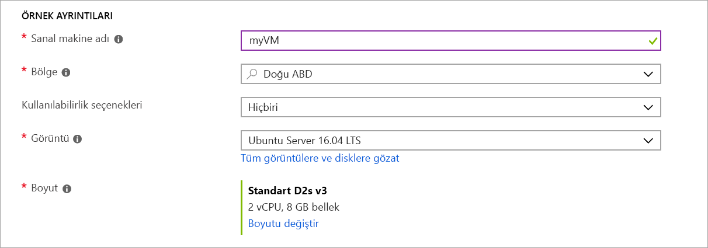

# <a name="quickstart-create-a-linux-virtual-machine-in-the-azure-portal"></a>Hızlı başlangıç: Azure portalında Linux sanal makinesi oluşturma

Azure sanal makineleri (VM’ler), Azure portalı üzerinden oluşturulabilir. Azure portal, Azure kaynakları oluşturmak için tarayıcı tabanlı bir kullanıcı arabirimidir. Bu hızlı başlangıçta, Ubuntu 18,04 LTS çalıştıran bir Linux sanal makinesini (VM) dağıtmak için Azure portal nasıl kullanılacağı gösterilmektedir. Ayrıca VM'nizin çalıştığını görmek için SSH ile VM bağlantısı kurup NGINX web sunucusunu da yükleyeceksiniz.

Azure aboneliğiniz yoksa başlamadan önce [ücretsiz bir hesap](https://azure.microsoft.com/free/?WT.mc_id=A261C142F) oluşturun.

## <a name="sign-in-to-azure"></a>Azure'da oturum açma

Henüz yapmadıysanız [Azure Portal](https://portal.azure.com) oturum açın.

## <a name="create-virtual-machine"></a>Sanal makine oluşturma

1. Aramada **sanal makineler** yazın.
1. **Hizmetler**altında **sanal makineler**' i seçin.
1. **Sanal makineler** sayfasında **Ekle**' yi seçin. **Sanal makine oluştur** sayfası açılır.
1. **Temel Bilgiler** sekmesinde, **Proje ayrıntıları** altında, doğru aboneliğin seçildiğinden emin olun, ardından **Yeni oluştur** kaynak grubunu seçin. Ad. * için *Myresourcegroup* yazın. 

    

1. **Örnek ayrıntıları**' nın altında, **sanal makine adı**için *myvm* yazın, **bölgeniz**Için *Doğu ABD* seçin ve **görüntünüz**için *Ubuntu 18,04 LTS* ' yi seçin. Diğer varsayılan değerleri bırakın.

    

1. **Yönetici hesabı**altında **SSH ortak anahtarı**' nı seçin.

1. **Kullanıcı adı** *azureuser*yazın.

1. **SSH ortak anahtar kaynağı**için varsayılan değer **Oluştur yeni anahtar çiftini**bırakın ve **anahtar çifti adı**için *MyKey* yazın.

    

1. **Gelen bağlantı noktası kuralları**  >  **Genel gelen bağlantı noktaları**altında **Seçili bağlantı noktalarına izin ver** ' i seçin ve ardından açılan listeden **SSH (22)** ve **http (80)** seçeneğini belirleyin. 

    

1. Kalan varsayılan ayarları bırakın, ardından sayfanın alt kısmındaki **Gözden geçir + oluştur** düğmesini seçin.

1. **Sanal makine oluştur** sayfasında oluşturmak üzere olduğunuz VM'nin ayrıntılarını görüntüleyebilirsiniz. Hazır olduğunuzda **Oluştur**'u seçin.

1. **Yeni anahtar çifti oluştur** penceresi açıldığında, **özel anahtarı indir ve kaynak oluştur**' u seçin. Anahtar dosyanız, **MyKey. pem**olarak indirilecek. Dosyanın nerede indirildiğini öğrendiğinizden emin olun `.pem` , bir sonraki adımda bu dosyanın yolunu kullanmanız gerekecektir.

1. Dağıtım bittiğinde **Kaynağa Git**' i seçin.

1. Yeni sanal makinenizin sayfasında genel IP adresini seçin ve panonuza kopyalayın.


    

## <a name="connect-to-virtual-machine"></a>Sanal makineye bağlanma

VM ile bir SSH bağlantısı oluşturun.

1. Mac veya Linux makineniz varsa, bir bash istemi açın. Bir Windows makineniz varsa, bir PowerShell komut istemi açın. 

1. İstemde sanal makinenize bir SSH bağlantısı açın. IP adresini sanal makinenizde bulunan ile değiştirin ve yolunu, `.pem` anahtar dosyasının indirildiği yol ile değiştirin.

```console
ssh -i .\Downloads\myKey1.pem azureuser@10.111.12.123
```

> [!TIP]
> Oluşturduğunuz SSH anahtarı, Azure 'da bir VM oluşturduğunuzda kullanılabilir. Bir VM 'yi bir sonraki sefer oluşturduğunuzda **SSH ortak anahtar kaynağı** için **Azure 'da depolanan bir anahtar kullan** seçeneğini belirleyin. Bilgisayarınızda zaten özel anahtara sahipsiniz, bu nedenle herhangi bir şey indirmeniz gerekmez.

## <a name="install-web-server"></a>Web sunucusunu yükleme

Sanal makinenizin çalıştığını görmek için NGINX web sunucusunu yükleyin. SSH oturumunuzdan paket kaynaklarınızı güncelleştirip en son NGINX paketini yükleyin.

```bash
sudo apt-get -y update
sudo apt-get -y install nginx
```

İşlemi tamamladığınızda `exit` yazarak SSH oturumunu kapatın.


## <a name="view-the-web-server-in-action"></a>Web sunucusunun çalıştığını görme

İstediğiniz web tarayıcısını kullanarak varsayılan NGINX karşılama sayfasını görüntüleyin. Web adresi olarak VM 'nin genel IP adresini yazın. Genel IP adresini VM genel bakış sayfasında veya önceden kullandığınız SSH bağlantı dizesinde bulabilirsiniz.


## <a name="clean-up-resources"></a>Kaynakları temizleme

Artık gerekli olmadığında kaynak grubunu, sanal makineyi ve tüm ilişkili kaynakları silebilirsiniz. Bunu yapmak için, sanal makinenin kaynak grubunu ve **Sil**’i seçin, ardından silinecek kaynak grubunun adını onaylayın.

## <a name="next-steps"></a>Sonraki adımlar

Bu hızlı başlangıçta basit bir sanal makine dağıttınız, bir Ağ Güvenlik Grubu ve kuralı oluşturdunuz ve temel bir web sunucusu yüklediniz. Azure sanal makineleri hakkında daha fazla bilgi için Linux VM’lerine yönelik öğreticiye geçin.

> [!div class="nextstepaction"]
> [Azure Linux sanal makine öğreticileri](./tutorial-manage-vm.md)
