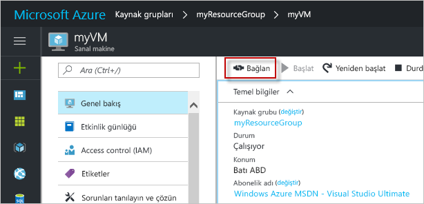

# <a name="quickstart-create-a-linux-virtual-machine-in-the-azure-portal"></a>Hızlı başlangıç: Azure portalında Linux sanal makinesi oluşturma

Azure sanal makineleri (VM’ler), Azure portalı üzerinden oluşturulabilir. Azure portal, Azure kaynakları oluşturmak için tarayıcı tabanlı bir kullanıcı arabirimidir. Bu hızlı başlangıçta, Ubuntu 18,04 LTS çalıştıran bir Linux sanal makinesini (VM) dağıtmak için Azure portal nasıl kullanılacağı gösterilmektedir. Ayrıca VM'nizin çalıştığını görmek için SSH ile VM bağlantısı kurup NGINX web sunucusunu da yükleyeceksiniz.

Azure aboneliğiniz yoksa başlamadan önce [ücretsiz bir hesap](https://azure.microsoft.com/free/?WT.mc_id=A261C142F) oluşturun.

## <a name="create-ssh-key-pair"></a>SSH anahtar çifti oluşturma

Bu hızlı başlangıcı tamamlamak için bir SSH anahtar çifti gerekir. Bir SSH anahtar çiftiniz varsa bu adımı atlayabilirsiniz.

SSH anahtar çifti oluşturmak için bir Bash kabuğu açın ve [ssh-keygen](https://www.ssh.com/ssh/keygen/) komutunu kullanın. Yerel bilgisayarınızda Bash kabuğunuz yoksa [Azure Cloud Shell](https://shell.azure.com/bash)'i kullanabilirsiniz.


1. [Azure Portal](https://portal.azure.com) oturum açın.
1. Sayfanın üst kısmındaki menüde, Cloud Shell açmak için `>_` simgesini seçin.
1. CloudShell 'in, sol üst köşedeki **Bash** 'i söylediğinizden emin olun. PowerShell 'i görürseniz, **Bash** ' i seçmek ve bash kabuğu ' nu değiştirmek için **Onayla** ' yı seçin.
1. SSH anahtarını oluşturmak için `ssh-keygen -t rsa -b 2048` yazın. 
1. Anahtar çiftinin kaydedileceği bir dosya girmeniz istenir. Parantez içinde listelenen varsayılan konuma kaydetmek için **ENTER** tuşuna basın. 
1. Bir parola girmeniz istenir. SSH anahtarınız için bir parola yazabilir veya parola olmadan devam etmek için **ENTER** tuşuna basabilirsiniz.
1. `ssh-keygen` komutu, `~/.ssh directory`varsayılan `id_rsa` adı ile ortak ve özel anahtarlar oluşturur. Komut, ortak anahtarın tam yolunu döndürür. `cat ~/.ssh/id_rsa.pub`yazarak `cat` içeriğini göstermek için ortak anahtarın yolunu kullanın.
1. Bu komutun çıkışını kopyalayın ve bu makalede daha sonra kullanmak üzere bir yere kaydedin. Bu, ortak anahtarınıza ve sanal makinenizde oturum açmak üzere yönetici hesabınızı yapılandırırken ihtiyacınız olacaktır.

## <a name="sign-in-to-azure"></a>Azure'da oturum açma

Henüz yapmadıysanız [Azure Portal](https://portal.azure.com) oturum açın.

## <a name="create-virtual-machine"></a>Sanal makine oluşturma

1. Aramada **sanal makineler** yazın.
1. **Hizmetler**altında **sanal makineler**' i seçin.
1. **Sanal makineler** sayfasında **Ekle**' yi seçin. **Sanal makine oluştur** sayfası açılır.
1. **Temel Bilgiler** sekmesinde, **Proje ayrıntıları** altında, doğru aboneliğin seçildiğinden emin olun, ardından **Yeni oluştur** kaynak grubunu seçin. Ad. * için *Myresourcegroup* yazın. 

    

1. **Örnek ayrıntıları**' nın altında, **sanal makine adı**için *myvm* yazın, **bölgeniz**Için *Doğu ABD* seçin ve **görüntünüz**için *Ubuntu 18,04 LTS* ' yi seçin. Diğer varsayılan değerleri bırakın.

    

1. **Yönetici hesabı**altında **SSH ortak anahtarı**' nı seçin, Kullanıcı adınızı yazın ve sonra ortak anahtarınızı yapıştırın. Ortak anahtarınızda varsa baştaki ve sondaki tüm boşlukları kaldırın.

    

1. **Gelen bağlantı noktası kuralları** > **Ortak gelen bağlantı noktaları** altından **Seçilen bağlantı noktalarına izin ver**'i, sonra aşağı açılan listeden **SSH (22)** ve **HTTP (80)** değerlerini seçin. 

    

1. Kalan varsayılan ayarları bırakın, ardından sayfanın alt kısmındaki **Gözden geçir + oluştur** düğmesini seçin.

1. **Sanal makine oluştur** sayfasında oluşturmak üzere olduğunuz VM'nin ayrıntılarını görüntüleyebilirsiniz. Hazır olduğunuzda **Oluştur**'u seçin.

VM'nizin dağıtılması birkaç dakika sürer. Dağıtım tamamlandıktan sonra bir sonraki bölüme geçin.

    
## <a name="connect-to-virtual-machine"></a>Sanal makineye bağlanma

VM ile bir SSH bağlantısı oluşturun.

1. VM’nizin genel bakış sayfasından **Bağlan** düğmesini seçin. 

    

2. **Sanal makineye bağlan** sayfasında, 22 numaralı bağlantı noktası üzerinden IP adresine göre bağlanmak için varsayılan seçenekleri olduğu gibi bırakın. **VM yerel hesabı kullanarak oturum açın** bölümünde bir bağlantı komutu gösterilir. Komutu kopyalamak için düğmeyi seçin. Aşağıdaki örnekte SSH bağlantı komutunun nasıl göründüğü gösterilmiştir:

    ```bash
    ssh azureuser@10.111.12.123
    ```

3. SSH anahtar çiftinizi oluşturmak için kullandığınız Bash kabuğunu kullanarak (Cloud Shell yeniden açabilir veya `>_` tekrar seçerek veya https://shell.azure.com/bash)'e giderek, SSH bağlantısı komutunu bir SSH oturumu oluşturmak için kabuğa yapıştırabilirsiniz.

## <a name="install-web-server"></a>Web sunucusunu yükleme

Sanal makinenizin çalıştığını görmek için NGINX web sunucusunu yükleyin. SSH oturumunuzdan paket kaynaklarınızı güncelleştirip en son NGINX paketini yükleyin.

```bash
sudo apt-get -y update
sudo apt-get -y install nginx
```

İşlemi tamamladığınızda `exit` yazarak SSH oturumunu kapatın.


## <a name="view-the-web-server-in-action"></a>Web sunucusunun çalıştığını görme

İstediğiniz web tarayıcısını kullanarak varsayılan NGINX karşılama sayfasını görüntüleyin. Web adresi olarak VM 'nin genel IP adresini yazın. Genel IP adresini VM genel bakış sayfasında veya önceden kullandığınız SSH bağlantı dizesinde bulabilirsiniz.


## <a name="clean-up-resources"></a>Kaynakları temizleme

Artık gerekli olmadığında kaynak grubunu, sanal makineyi ve tüm ilişkili kaynakları silebilirsiniz. Bunu yapmak için, sanal makinenin kaynak grubunu ve **Sil**’i seçin, ardından silinecek kaynak grubunun adını onaylayın.

## <a name="next-steps"></a>Sonraki adımlar

Bu hızlı başlangıçta basit bir sanal makine dağıttınız, bir Ağ Güvenlik Grubu ve kuralı oluşturdunuz ve temel bir web sunucusu yüklediniz. Azure sanal makineleri hakkında daha fazla bilgi için Linux VM’lerine yönelik öğreticiye geçin.

> [!div class="nextstepaction"]
> [Azure Linux sanal makine öğreticileri](./tutorial-manage-vm.md)
