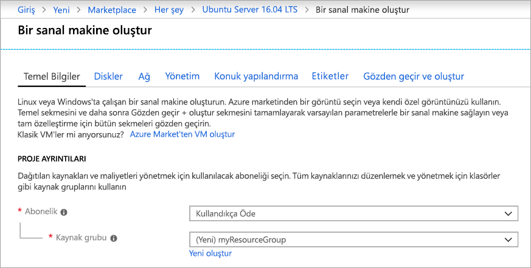
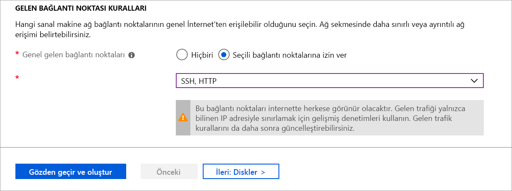

# <a name="quickstart-create-a-linux-virtual-machine-in-the-azure-portal"></a>Hızlı başlangıç: Azure portalında Linux sanal makinesi oluşturma

Azure sanal makineleri (VM’ler), Azure portalı üzerinden oluşturulabilir. Bu yöntem, sanal makineleri ve tüm ilgili kaynaklarını oluşturmaya yönelik tarayıcı tabanlı bir kullanıcı arabirimi sağlar. Bu hızlı başlangıçta Azure portalı kullanarak Azure’da Ubuntu çalıştıran bir Linux sanal makinesinin (VM) nasıl dağıtılacağı gösterilir. VM’ye SSH oluşturup NGINX web sunucusunu yükleyerek VM’nizin çalıştığını görebilirsiniz.

Azure aboneliğiniz yoksa başlamadan önce [ücretsiz bir hesap](https://azure.microsoft.com/free/?WT.mc_id=A261C142F) oluşturun.

## <a name="create-ssh-key-pair"></a>SSH anahtar çifti oluşturma

Bu hızlı başlangıcı tamamlamak için bir SSH anahtar çifti gerekir. Bir SSH anahtar çiftiniz varsa bu adımı atlayabilirsiniz.

Bir SSH anahtar çifti oluşturarak Linux VM’lerinde oturum açmak için bir Bash kabuğundan aşağıdaki komutu çalıştırın ve ekrandaki yönergeleri izleyin. Örneğin, [Azure Cloud Shell](../../cloud-shell/overview.md) veya [Linux için Windows Substem](/windows/wsl/install-win10)’i kullanabilirsiniz. Komut çıktısı genel anahtar dosyasının dosya adını içerir. Ortak anahtar dosyasının içeriğini (`cat ~/.ssh/id_rsa.pub`) panoya kopyalayın:

```bash
ssh-keygen -t rsa -b 2048
```

PuTTy kullanımı dahil olmak üzere SSH anahtar çiftlerinin oluşturulması konusunda daha ayrıntılı bilgi edinmek için bkz. [Windows ile SSH anahtarları kullanma](ssh-from-windows.md).

## <a name="log-in-to-azure"></a>Azure'da oturum açma

http://portal.azure.com adresinden Azure portalında oturum açın

## <a name="create-virtual-machine"></a>Sanal makine oluşturma

1. Azure portalının sol üst köşesinde bulunan **Kaynak oluştur** öğesini seçin.

1. Azure Market kaynaklarının listesi üzerindeki arama kutusunda, Canonical tarafından sağlanan **Ubuntu Server 16.04 LTS** işletim sistemini arayıp seçin ve ardından **Oluştur**’u seçin.

1. **Temel Bilgiler** sekmesinde, **Proje ayrıntıları** altında doğru aboneliğin seçildiğinden emin olun, ardından **Kaynak grubu** altından **Yeni oluştur**'u seçin. Açılan pencerede kaynak grubunun adı için *myResourceGroup* yazın ve **Tamam*'ı seçin. 

    

1. **Örnek ayrıntıları** altında, **Sanal makine adı** için *myVM* yazın ve **Bölge** için *East US*'yi seçin. Diğer varsayılan değerleri bırakın.

    

1. **Yönetici hesabı** altından **SSH ortak anahtarı**'nı seçin, kullanıcı adınızı yazın, sonra ortak anahtarınızı metin kutusuna yapıştırın. Ortak anahtarınızda varsa baştaki ve sondaki tüm boşlukları kaldırın.

    

1. **Gelen bağlantı noktası kuralları** > **Ortak gelen bağlantı noktaları** altından **Seçilen bağlantı noktalarına izin ver**'i, sonra aşağı açılan listeden **SSH (22)** ve **HTTP (80)** değerlerini seçin. 

    

1. Kalan varsayılan ayarları bırakın, ardından sayfanın alt kısmındaki **Gözden geçir + oluştur** düğmesini seçin.

    
## <a name="connect-to-virtual-machine"></a>Sanal makineye bağlanma

VM ile bir SSH bağlantısı oluşturun.

1. VM’nizin genel bakış sayfasından **Bağlan** düğmesini seçin. 

    

2. **Sanal makineye bağlan** sayfasında, 22 numaralı bağlantı noktası üzerinden DNS adına göre bağlanmak için varsayılan seçenekleri olduğu gibi bırakın. **VM yerel hesabı kullanarak oturum açın** bölümünde bir bağlantı komutu gösterilir. Düğmeye tıklayarak komutu kopyalayın. Aşağıdaki örnekte SSH bağlantı komutunun nasıl göründüğü gösterilmiştir:

    ```bash
    ssh azureuser@myvm-123abc.eastus.cloudapp.azure.com
    ```

3. SSH bağlantı komutunu Windows üzerine Azure Cloud Shell veya Ubuntu üzerinde Bash gibi bir kabuğa yapıştırarak bağlantıyı oluşturun. 

## <a name="install-web-server"></a>Web sunucusunu yükleyin

Sanal makinenizin çalıştığını görmek için NGINX web sunucusunu yükleyin. Paket kaynaklarını güncelleştirmek ve en son NGINX paketini yüklemek için SSH oturumunuzdan aşağıdaki komutları çalıştırın:

```bash
# update packages
sudo apt-get -y update

# install NGINX
sudo apt-get -y install nginx
```

İşiniz bittiğinde, `exit` seçeneği ile SSH oturumundan çıkıp Azure portalında VM özelliklerine geri dönün.


## <a name="view-the-web-server-in-action"></a>Web sunucusunu iş başında görün

NGINX yüklüyken ve sanal makinenizde 80 numaralı bağlantı noktası açıkken, web sunucusuna İnternet üzerinden erişilebilir. Bir web tarayıcısı açın ve VM’nin ortak IP adresini girin. Genel IP adresi VM’ye genel bakış sayfasında veya gelen bağlantı noktası kuralını eklediğiniz *Ağ* sayfasının üstünde bulunabilir.


## <a name="clean-up-resources"></a>Kaynakları temizleme

Artık gerekli olmadığında kaynak grubunu, sanal makineyi ve tüm ilişkili kaynakları silebilirsiniz. Bunu yapmak için sanal makinenin kaynak grubunu ve **Sil**’i seçip silinecek kaynak grubunun adını onaylayın.

## <a name="next-steps"></a>Sonraki adımlar

Bu hızlı başlangıçta basit bir sanal makine dağıttınız, bir Ağ Güvenlik Grubu ve kuralı oluşturdunuz ve temel bir web sunucusu yüklediniz. Azure sanal makineleri hakkında daha fazla bilgi için Linux VM’lerine yönelik öğreticiye geçin.

> [!div class="nextstepaction"]
> [Azure Linux sanal makine öğreticileri](./tutorial-manage-vm.md)
