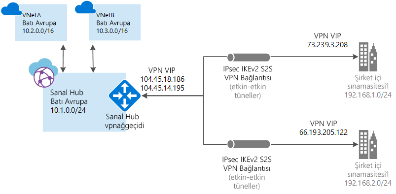

# Azure Sanal WAN nedir?

Azure Sanal WAN, Azure aracılığıyla şubeden şubeye iyileştirilmiş ve otomatik bağlantı sağlayan bir ağ hizmetidir. Sanal WAN, Azure ile iletişim kurmak için dal cihazlarını bağlamanızı ve yapılandırmanızı sağlar. Bunu el ile veya bir Sanal WAN iş ortağı aracılığıyla tercih edilen iş ortağı cihazlarını kullanarak gerçekleştirebilirsiniz. Ayrıntılar için bkz. [Tercih edilen iş ortakları](https://go.microsoft.com/fwlink/p/?linkid=2019615) makalesi. Tercih edilen iş ortağı cihazlarının kullanılması, size kullanım kolaylığı, basitleştirilmiş bağlantı ve yapılandırma yönetimi sağlar. Azure WAN yerleşik panosu, zaman kazanmanıza yardımcı olabilecek anında sorun giderme içgörüleri sağlar ve geniş ölçekli bağlantıyı görüntülemek için kolay bir yol sunar.

Bu makalede, Azure ve Azure dışı iş yüklerinizin ağ bağlantısına hızlı bir bakış sağlanır. Sanal WAN şu avantajları sunar:

* **Merkezde ve uçta tümleşik bağlantı çözümleri:** Şirket içi sitelerle Azure hub'ı arasında Siteden Siteye yapılandırmasını ve bağlantısını otomatik hale getirin.
* **Otomatik uç kurulumu ve yapılandırması:** Sanal ağlarınızı ve iş yüklerinizi Azure hub'ına rahatça bağlayın.
* **Sezgisel sorun giderme:** Azure'un içinde uçta uca akışı görebilir ve bu bilgiyi kullanarak gerekli eylemleri gerçekleştirebilirsiniz.

## Siteden siteye bağlantılar

Sanal WAN kullanarak Siteden Siteye bağlantı oluşturmak için, [Sanal WAN iş ortağı](https://go.microsoft.com/fwlink/p/?linkid=2019615) üzerinden ilerleyebilir veya bağlantıyı el ile oluşturabilirsiniz.

### Sanal WAN iş ortağıyla çalışma

Bir Sanal WAN iş ortağıyla çalıştığınızda süreç şu şekilde işler:

1. Dal cihazı (VPN/SDWAN) denetleyicisinin, [Azure Hizmet Sorumlusu](../azure-resource-manager/resource-group-create-service-principal-portal.md) kullanarak site merkezli bilgileri Azure’a aktarmak için kimliği doğrulanır.
2. Dal cihazı (VPN/SDWAN) denetleyicisi Azure bağlantı yapılandırmasını alır ve yerel cihazı güncelleştirir. Bu, şirket içi VPN cihazının yapılandırma indirme, düzenleme ve güncelleştirme işlemlerini otomatikleştirir.
3. Cihazda doğru Azure yapılandırması olduktan sonra, Azure WAN’a bir siteden siteye bağlantısı (iki etkin tünel) kurulur. Azure hem IKEv1’i hem de IKEv2'yi destekler. BGP isteğe bağlıdır.

Tercih edilen bir iş ortağı kullanmak istemiyorsanız bağlantıyı el ile yapılandırabilirsiniz, bkz: [Sanal WAN ile siteden siteye bağlantı oluşturma](virtual-wan-site-to-site-portal.md).

## Noktadan siteye bağlantıları (Önizleme)

Bağlantıyı el ile oluşturmak için bkz. [Sanal WAN ile noktadan siteye bağlantı oluşturma](https://go.microsoft.com/fwlink/p/?linkid=2020051&clcid).

## ExpressRoute bağlantıları (Önizleme)

Bağlantıyı el ile oluşturmak için bkz. [Sanal WAN ile ExpressRoute bağlantısı oluşturma](https://go.microsoft.com/fwlink/p/?linkid=2020148&clcid).

## Sanal WAN kaynakları

Uçtan uca sanal WAN'yi yapılandırmak için şu kaynakları oluşturursunuz:

* **virtualWAN:** virtualWAN kaynağı Azure ağınızdaki sanal bir katmanı temsil eder ve birden fazla kaynağı içeren bir koleksiyondur. Sanal WAN’de bulunmasını istediğiniz tüm sanal hub'larınızın bağlantılarını içerir. Sanal WAN kaynakları birbirinden yalıtılmıştır ve ortak bir hub içeremezler. Sanal WAN’daki Sanal Hub'lar birbiriyle iletişim kurmaz. 'Dallar arası trafiğe izin verme' özelliği, VPN’den ExpressRoute hizmeti etkinleştirilmiş sitelere gidenin yanı sıra VPN siteleri arasındaki trafiği de mümkün kılar. Azure Sanal WAN’daki ExpressRoute hizmetinin şu anda önizlemede olduğunu unutmayın.

* **Site:** vpnsite olarak bilinen site kaynağı şirket içi VPN cihazını ve bu cihazın ayarlarını temsil eder. Sanal WAN iş ortağıyla çalıştığınızda, bu bilgileri otomatik olarak Azure’a aktarmak için yerleşik bir çözümünüz olur.

* **Hub:** Sanal hub Microsoft tarafından yönetilen bir sanal ağdır. Hub'da, şirket içi ağınızdan (vpnsite) gelen bağlantıyı etkinleştirmek için çeşitli hizmet uç noktaları bulunur. Hub, bir bölgedeki ağınızın merkezidir. Her Azure bölgesinde tek bir hub bulunabilir. Azure portalı kullanarak bir hub oluşturduğunuzda, bir sanal hub VNet’i ve vpngateway sanal hub'ı oluşturulur.

  Hub ağ geçidi, ExpressRoute ve VPN Gateway için kullandığınız sanal ağ geçidiyle aynı değildir. Örneğin, Sanal WAN kullanırken şirket içi sitenizden doğrudan Sanal Ağınıza bir Siteden Siteye bağlantı oluşturmazsınız. Bunun yerine, hub'a Siteden Siteye bağlantısı oluşturursunuz. Trafik her zaman hub ağ geçidi üzerinden gider. Başka bir deyişle, Sanal Ağlarınızın kendi sanal ağ geçitlerine gerek kalmaz. Sanal WAN, Sanal Ağlarınızın sanal hub ve sanal hub ağ geçidi aracılığıyla ölçeklemeden kolayca yararlanmasına olanak tanır. 

* **Hub sanal ağ bağlantısı:** Hub'ı sorunsuzca sanal ağınıza bağlamak için bir hub sanal ağ bağlantı kaynağı kullanılır. Şu anda, yalnızca aynı hub bölgesi içinde yer alan sanal ağlara bağlanabilirsiniz.

* **Hub rota tablosu:** Bir sanal hub rotası oluşturarak rotayı sanal hub rota tablosuna uygulayabilirsiniz. Sanal hub rota tablosuna birden fazla rota uygulayabilirsiniz.

## SSS

[!INCLUDE [Virtual WAN FAQ](../../includes/virtual-wan-faq-include.md)]

## Sonraki adımlar

* [Sanal WAN iş ortakları ve konumları](https://aka.ms/virtualwan) görüntüleyin