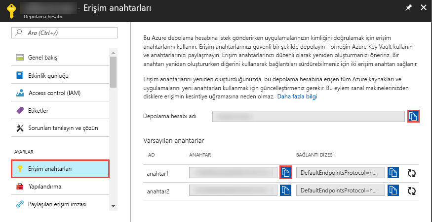

## <a name="prerequisites"></a>Ön koşullar

### <a name="azure-subscription"></a>Azure aboneliği
Azure aboneliğiniz yoksa başlamadan önce [ücretsiz](https://azure.microsoft.com/free/) bir hesap oluşturun.

### <a name="azure-roles"></a>Azure rolleri
Data Factory örnekleri oluşturmak için, Azure’da oturum açarken kullandığınız kullanıcı hesabı, **katkıda bulunan** veya **sahip** rollerinin üyesi ya da bir Azure aboneliğinin **yöneticisi** olmalıdır. Abonelikte sahip olduğunuz izinleri görüntülemek için Azure portalında sağ üst köşedeki **kullanıcı adınıza** tıklayın ve **İzinler**’i seçin. Birden çok aboneliğe erişiminiz varsa uygun aboneliği seçin. Bir role kullanıcı eklemeye ilişkin örnek yönergeler için [Rol ekleme](../articles/billing/billing-add-change-azure-subscription-administrator.md) makalesine bakın.

### <a name="azure-storage-account"></a>Azure Depolama Hesabı
Bu hızlı başlangıçta, genel amaçlı Azure Depolama Hesabı'nı (özel olarak Blob Depolama) hem **kaynak** hem de **hedef** veri deposu olarak kullanırsınız. Genel amaçlı bir Azure depolama hesabınız yoksa oluşturma bilgileri için bkz. [Depolama hesabı oluşturma](../articles/storage/common/storage-create-storage-account.md#create-a-storage-account). 

#### <a name="get-storage-account-name-and-account-key"></a>Depolama hesabı adını ve hesap anahtarını alma
Bu hızlı başlangıçta, Azure depolama hesabınızın adını ve anahtarını kullanırsınız. Aşağıdaki yordam, depolama hesabınızın adını ve anahtarını alma adımlarını sağlar. 

1. Web tarayıcısını açın ve [Azure Portal](https://portal.azure.com)'a gidin. Azure kullanıcı adınız ve parolanızla oturum açın. 
2. Sol taraftaki menüde **Diğer hizmetler >** öğesine tıklayın, **Depolama** anahtar sözcüğüyle filtreleyin ve **Depolama hesapları**'nı seçin.

    
3. Depolama hesapları listesinde, depolama hesabınız için filtre uygulayın (gerekirse) ve ardından **depolama hesabınızı** seçin. 
4. **Depolama hesabı** sayfasında, menüden **Erişim anahtarları**'nı seçin.

    
5. **Depolama hesabı adı** ve **key1** alanlarının değerlerini panoya kopyalayın. Bunları not defterine veya başka bir düzenleyici yapıştırın ve kaydedin. Bunları daha sonra bu hızlı başlangıçta kullanacaksınız.   

#### <a name="create-input-folder-and-files"></a>Giriş klasörünü ve dosyaları oluşturma
Bu bölümde, Azure blob depolamanızda **adftutorial** adlı bir blob kapsayıcısı oluşturursunuz. Ardından, kapsayıcıda **giriş** adlı bir klasör oluşturur ve giriş klasörüne örnek bir dosya yüklersiniz. 

1. **Depolama hesabı** sayfasında **Genel Bakış**’a geçin ve sonra **Bloblar**’a tıklayın. 

    
2. **Blob hizmeti** sayfasında, araç çubuğundaki **+ Kapsayıcı**’ya tıklayın. 

        
3. **Yeni kapsayıcı** iletişim kutusunda ad olarak **adftutorial** girin ve **Tamam**’a tıklayın. 

    
4. Kapsayıcılar listesinde **adftutorial** seçeneğine tıklayın. 

    
1. **Kapsayıcı** sayfasında araç çubuğundaki **Karşıya Yükle** öğesine tıklayın.  

    
6. **Blobu karşıya yükleme** sayfasında **Gelişmiş**’e tıklayın.

    
7. **Not Defteri**’ni başlatın ve şu içeriğe sahip **emp.txt** adlı bir dosya oluşturun: **c:\ADFv2QuickStartPSH** klasörüne kaydedin: Henüz yoksa **ADFv2QuickStartPSH** klasörünü oluşturun.
    
    ```
    John, Doe
    Jane, Doe
    ```    
8. Azure portalında **Blobu karşıya yükleme** sayfasından **Dosyalar** alanı için **emp.txt** dosyasına göz atıp seçin. 
9. **Klasöre yükle** değeri olarak **input** girin. 

        
10. Klasörün **input**, dosyanın ise **emp.txt** olduğunu onaylayıp **Karşıya Yükle**’ye tıklayın.
11. Listede **emp.txt** dosyasını ve karşıya yükleme durumunu görmeniz gerekir. 
12. Köşedeki **X** simgesine tıklayarak **Blobu karşıya yükleme** sayfasını kapatın. 

    
1. **Kapsayıcı** sayfasını açık tutun. Bu hızlı başlangıcın sonundaki çıktıyı doğrulamak için bu sayfayı kullanırsınız.