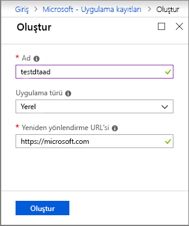

>[!NOTE]
>Bu bölümde [Azure AD uygulama kaydı](https://docs.microsoft.com/azure/active-directory/develop/quickstart-register-app)için yönergeler sağlanmaktadır.

1. [Azure Portal](https://portal.azure.com), Genişletilebilir sol menüden **Azure Active Directory** açın ve **uygulama kayıtları** bölmesini açın. 

    

1. **+ Yeni kayıt** düğmesini seçin.

    

1. **Ad** kutusuna bu uygulama kaydı için kolay bir ad verin. 

    1. **Yeniden yönlendirme URI 'si (isteğe bağlı)** bölümünde `https://microsoft.com` , metin kutusuna yazın.     

    1. Azure Active Directory uygulamanız tarafından hangi hesapların ve kiracıların desteklendiğini doğrulayın.

    1. **Kaydol**’u seçin.

    

1. **Kimlik doğrulama** dikey penceresi, önemli kimlik doğrulama yapılandırma ayarlarını belirtir. 

    1. **+ Platform Ekle**' ye tıklayarak **yeniden yönlendirme URI 'Leri** ekleyin ve **erişim belirteçlerini** yapılandırın.

    1. Uygulamanın **ortak bir istemci**olduğunu belirtmek için **Evet** ' i seçin.

    1. Azure Active Directory uygulamanız tarafından hangi hesapların ve kiracıların desteklendiğini doğrulayın.

    

1. Uygun platformu seçtikten sonra, **yeniden yönlendirme URI** 'larınızı ve yan paneldeki **erişim belirteçlerinizi** Kullanıcı arabiriminin sağına yapılandırın.

    1. **Yeniden yönlendirme URI 'leri** , kimlik doğrulama isteği tarafından sağlanan adresle eşleşmelidir:

        * Yerel bir geliştirme ortamında barındırılan uygulamalar için **ortak istemci (mobil & Masaüstü)** öğesini seçin. **Ortak Istemciyi** **Evet**olarak ayarladığınızdan emin olun.
        * Azure App Service barındırılan tek sayfalı uygulamalar için **Web**' i seçin.

    1. **Oturum kapatma URL 'sinin** uygun olup olmadığını belirleme.

    1. **Erişim belirteçlerini** veya **kimlik belirteçlerini**denetleyerek örtük izin akışını etkinleştirin.
                
    

    **Yapılandır**' a ve ardından **Kaydet**' e tıklayın.

1.  Kayıtlı uygulamanızın **genel bakış** bölmesini açın ve aşağıdaki varlıkların değerlerini geçici bir dosyaya kopyalayın. Aşağıdaki bölümlerde örnek uygulamanızı yapılandırmak için bu değerleri kullanacaksınız.

    - **Uygulama (istemci) kimliği**
    - **Dizin (kiracı) kimliği**

    

1. Uygulama kaydınız için **API izinleri** bölmesini açın. **+ Izin Ekle** düğmesini seçin. **API Izinleri iste** bölmesinde **Kuruluşumun kullandığı API 'leri** seçin ve ardından aşağıdakilerden birini arayın:
    
    1. `Azure Digital Twins`. **Azure dijital TWINS** API 'sini seçin.

        

    1. Alternatif olarak, araması `Azure Smart Spaces Service`yapın. **Azure akıllı boşluklar hizmeti** API 'sini seçin.

        

    > [!IMPORTANT]
    > Görüntülenecek Azure AD API adı ve KIMLIĞI, kiracınıza bağlı olarak değişir:
    > * Test kiracısı ve müşteri hesapları için `Azure Digital Twins`arama yapılmalıdır.
    > * Diğer Microsoft hesapları için `Azure Smart Spaces Service`arama yapılmalıdır.

1. Her iki API de aynı **istek API 'si izinleri** bölmesinde seçildikten sonra **Azure dijital TWINS** olarak görünür. **Oku** açılan seçeneğini belirleyin ve ardından **oku. yazma** onay kutusunu seçin. **Izin Ekle** düğmesini seçin.

    

1. Kuruluşunuzun ayarlarına bağlı olarak, bu API 'ye yönetici erişimi sağlamak için ek adımlar gerçekleştirmeniz gerekebilir. Daha fazla bilgi için yöneticinize başvurun. Yönetici erişimi onaylandıktan sonra, **API izinleri** bölmesindeki **yönetici onayı gerekli** sütunu, izinlerinizi görüntüler. 

    

    **Azure dijital TWINS** 'in göründüğünü doğrulayın.
